## 3.1 浏览器

想必有很多人使用电脑的目的就是上网。互联网上有海量的资源，可以帮助我们的学习、生活和娱乐，也能将人们更好地联系起来。

电脑上用于连接到互联网的应用程序称为**浏览器**。此后介绍的几乎所有常用软件的使用都要求先学会使用浏览器（想玩游戏，例如要下载Steam，也要求如此），所以我们将浏览器放在常用软件的Top 1，以示其重要性。

>[!IMPORTANT]
>在学习此部分之前，确保你对于文件系统已经有了基本的了解。请确保已经学习过系统部分的2.1~2.8节。同时，请在学习本节后再学习其他常用软件。

### 3.1.1 浏览器的选择

有以下常见浏览器：

- Microsoft Edge：Windows真正的狗皮膏药，但是用起来也还行，Bing搜索相对清爽。缺点是偶发严重Bug（例如，游戏助手）。

 

- Chrome：即谷歌浏览器。没啥好说的，均衡就对了。

- Firefox：即火狐浏览器。开源，多端，轻便，推荐。但是目前（2025年9月）Firefox**账号**（不是浏览器本体）在中国大陆停止运营，浏览记录同步等功能不再可用。浏览器正常可用且可正常收到更新。

这其中，通常正版的Windows系统自带Microsoft Edge。而对于普通用户而言，Chrome可能更为常用。

不论你使用的是一台新电脑，还是一台其他人使用过的电脑，你通常都能在桌面上以上图标中的一个，因为它们很常用。如果找不到，可以尝试在任务栏搜索框搜索Microsoft Edge。

>[!TIP]
>如果你使用的是Windows7以下版本，那么系统会自带Internet Explorer，即IE浏览器，而非Microsoft Edge。但由于微软已在2022年停用IE浏览器，它有很多安全漏洞，也不支持很多网页的显示格式。无论如何，我们建议你使用更新的操作系统，例如Windows11。

### 3.1.2 起步

由于Windows系统自带Microsoft Edge，我们将使用它来起步。此后我们也会学习如何下载谷歌浏览器等其他浏览器。它们的使用方法都是类似的。

首先请打开Microsoft Edge。

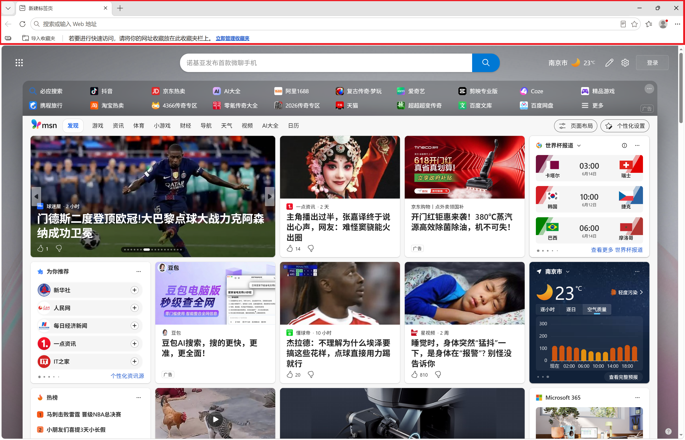

你的页面可能和这里显示的很不一样，这没关系。我们只需要关注最上方用红框标注的区域即可。接下来，我们将介绍一些浏览器的基本操作。

#### 3.1.2.1 标签页

浏览器最上方的这个部分称为标签页栏，这里显示了不同的标签页。每个标签页里会显示一个网页。假如你同时打开了很多网页，你可以通过点击标签页来快速前往一个已经打开过的网页，这在搜索资料时很有效。

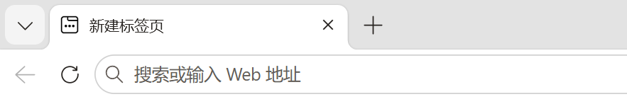

点击已存在的标签页右侧的加号可以新建一个标签页，这个标签页会像这样显示。

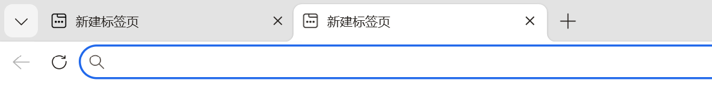

此时点击左侧那个标签页就可以返回最初始的标签页。

要关闭一个标签页，单击标签页最右侧的叉号即可。

#### 3.1.2.2 网址栏、刷新与返回

标签页栏下方有一个输入框，这里可以输入网址来跳转到对应的网站。例如，现在请你在输入框里输入如下网址：`baidu.com`，注意不要大写，且用英文点号，就像这样：

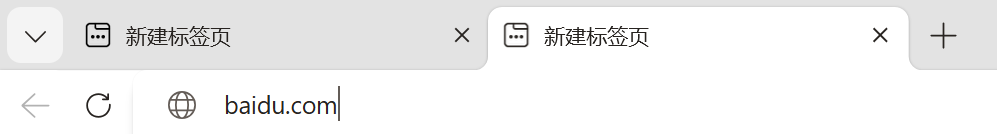

接下来请按下键盘上的`Enter`键（就像黑客电影里常见的那样），这将跳转到对应的网站。正如网址所示，这个网站是百度搜索。

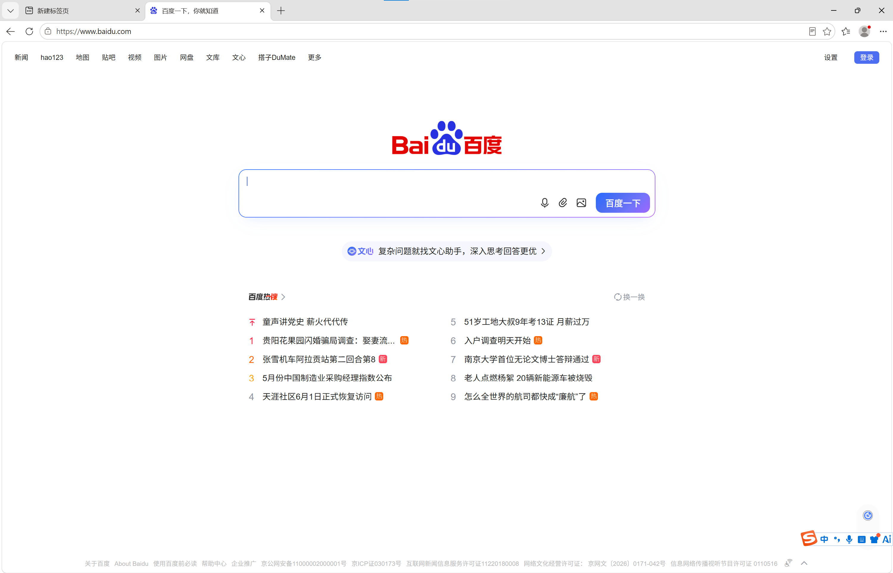

如果你也打开了这样的界面，那么恭喜你成功打开了第一个网站！

这时，注意到标签栏发生了一些变化。

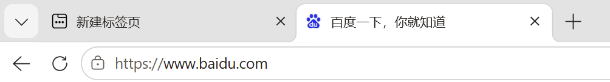

首先是当前标签页的名称变成了对应网站的名称，这能方便你在打开很多标签页时快速寻找一个打开过的标签页。接着是最左侧的左箭头由灰色变成了黑色，这表示现在可以点击它。请点击一下看看。

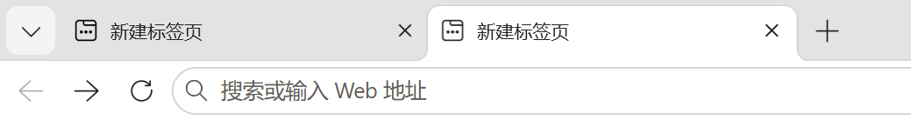

你会发现页面退回到了跳转百度之前，这就是左箭头的作用：退回上一个网页。而现在出现了一个新的右箭头，你也许能猜到它的作用：前进到刚刚打开的网站。这样，在一个标签页内就可以查看这个标签页中打开过的所有网页。

在这些箭头右边有一个环状的箭头，它被称作**刷新**。如果网页卡死，你可以点击这个箭头重新加载网页，有概率能将它加载出来。

#### 3.1.2.3 收藏、历史记录与设置

在上方栏的最右侧，你会看到一个星号。

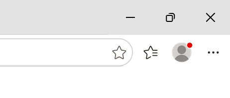

单击它能将当前网页放到收藏夹栏里，这样你就可以单击收藏栏而不输入网址的方式来快速地访问网站。例如，在刚刚打开的百度页面点击收藏，就能在新建标签页时看到百度显示在收藏夹栏里。

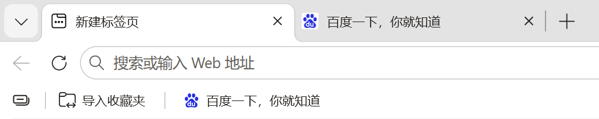

此时点击收藏夹栏里的百度就可以快速地跳转过去。

稍后我们会介绍一些常用网站，你可以把它们收藏起来，这样就不用每次输入网址了。

单击最右侧的三个点号，会打开如下列表。

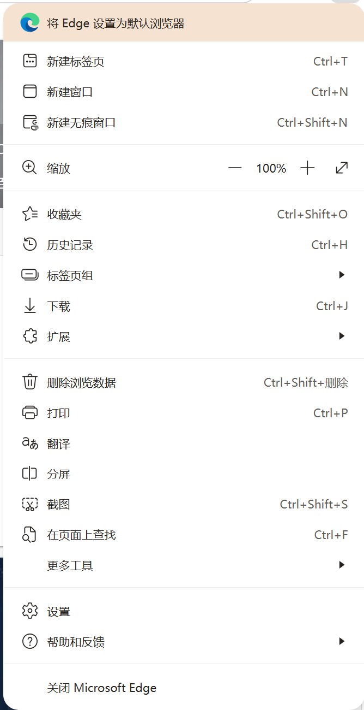

其中，我们主要关注两项：

- **历史记录：** 单击它会显示所有最近打开的网页的列表；
- **设置：** 单击它会打开浏览器设置页面。

现在鉴于你刚刚入门，我们暂时不会介绍如何对浏览器进行设置。这里介绍一下只是为了以后你能够知道在哪里设置浏览器。

>[!TIP]
>非常有趣的一点是，你电脑里的不同浏览器会互相争抢，想让你把它设为默认浏览器，就像这个列表最上面十分显眼的一项一样。如果你使用谷歌浏览器而未将它设为默认浏览器，它也会这样提示你。
>
>默认浏览器是电脑默认用于打开网址的浏览器，当你在其他软件中单击网址时电脑会使用默认浏览器打开这个网页。在[2.8.2.1.1 - 查看和调整默认应用](..\系统\设置、个性化与激活(Windows10版).md)中能够查看和调整默认浏览器。

### 3.1.3 搜索引擎

回到刚才打开的百度页面。你会发现在百度网页里还有一个输入框，如下。

它和刚刚介绍的网址输入框有什么区别呢？

网址输入框可以用来：

- 访问网站：如果你想要访问一个网站（例如：`baidu.com`），通常在浏览器最上方的地址栏输入网址并回车即可访问。
- 搜索内容：如果你输入的不是网址，那么它会使用默认搜索引擎（在[默认搜索引擎](#314-调整默认搜索引擎)中介绍）进行搜索。
- 打开浏览器特殊界面：例如 chrome://dino、edge://surf。只在对应浏览器中生效。

网页中的输入框（例如这里百度的输入框）可以用来：

- 搜索内容：使用搜索引擎对你输入的内容进行搜索，**无法直接访问网址**。

像百度这样的网站称为搜索引擎。搜索引擎是能够根据用户需求与一定算法，运用特定策略从互联网检索出指定信息反馈给用户一些网站，通过它们你可以搜索到很多信息。其他常用的搜索引擎还有微软必应（网址`bing.com`）。

>[!TIP]
>输入百度网址后，你会发现浏览器在网址前面补上了一段字符`https://www.`，组成完整的网址。通常，无需输入这段字符，只需要输入其后的字符即可打开网站。这两段字符是什么意思呢？
>
>`https`是超文本传输安全协议（英文：Hypertext Transfer Protocol Secure）的简称，这个名字颇为中二。它是以安全为目标的HTTP（超文本传输协议，一个简单的请求-响应协议）通道，在HTTP的基础上通过传输加密和身份认证保证了传输过程的安全性。
>
>`www`是万维网（英文：World Wide Web）的简称，它是基于互联网构建的分布式超媒体信息系统。在这种模型下，用户通过浏览器等客户端软件发起请求，服务器则根据协议返回相应的资源。

### 3.1.4 下载软件

在系统部分中，我们学习了如何彻底删除软件。那么，如何下载软件呢？比较传统的方法就是通过浏览器找到这个软件的**官网**，从**官网**下载。这里我们以下载谷歌浏览器为例教学。

>[!CAUTION]
>如果你使用的不是自己的电脑，请确保电脑的所有者允许你下载，因为这涉及电脑里文件的更改。
>
>如果你发现这台电脑里已经有了谷歌浏览器，再下载一次也没有关系，这相当于更新了一下软件。

首先，在网址输入栏输入谷歌（中国）的**官网**下载页面网址：`google.cn/chrome/`，这可能需要加载一会儿。如果过了一分钟还没有加载出来，请检查你的网络连接，并刷新页面（在[3.1.2 - 起步](#312-起步)中介绍过）。最终出现这样的页面：

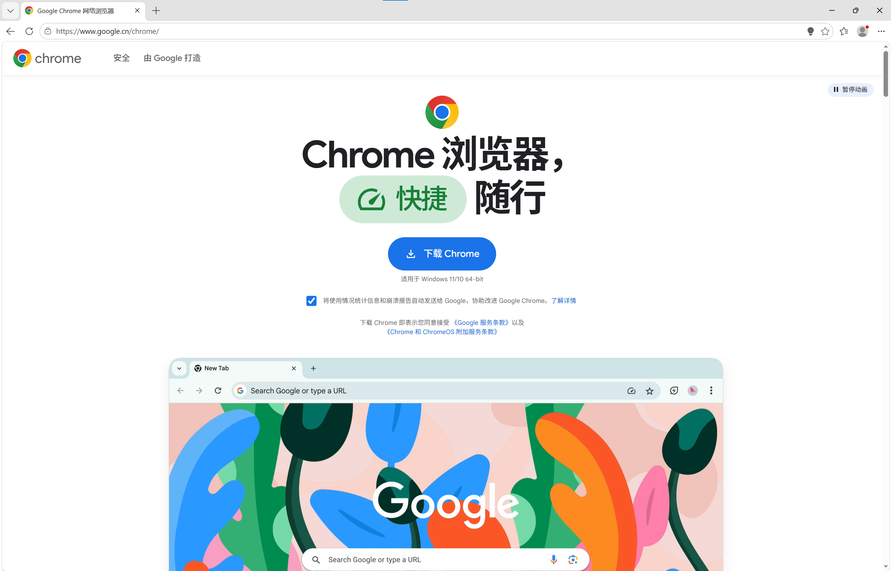

在页面中间有一个醒目的 **“下载Chrome”** 按钮，单击它即可下载最新的谷歌浏览器。此后稍等片刻，会跳转到下载完成的界面。

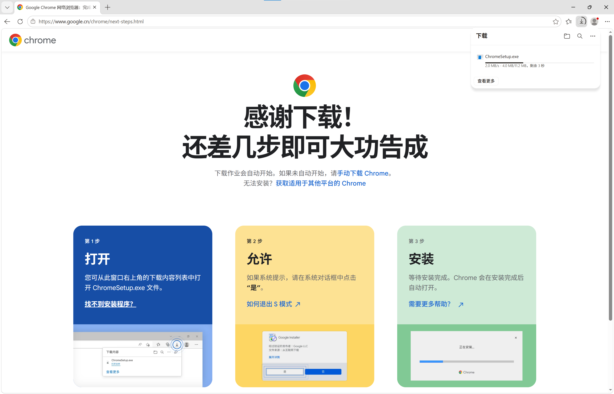

同时，你会注意到右上角弹出了一个下载进度条。等待进度条走完，点击文件名右侧的文件夹图标，在文件夹中打开。

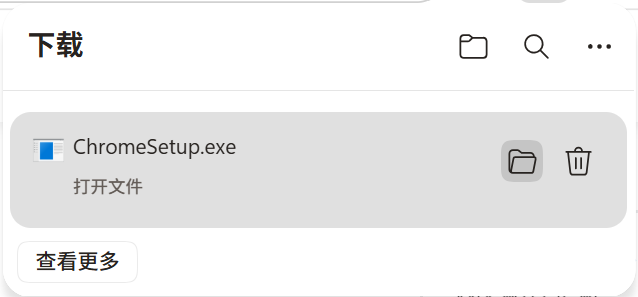

这会打开默认的下载地址，通常是`C:\Users\【USER】\Downloads`（其中【USER】处为你的Windows用户名。在这个文件夹里你能够看到刚刚下载的安装程序`ChromeSetup.exe`。

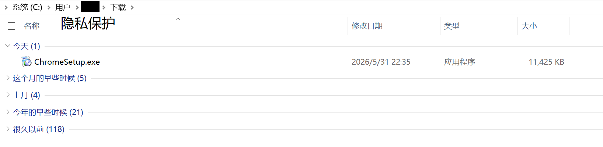

双击它即可运行安装程序。这会把谷歌浏览器安装在安装程序默认设定的位置（通常是`C:\Program Files\Google\Chrome`）。

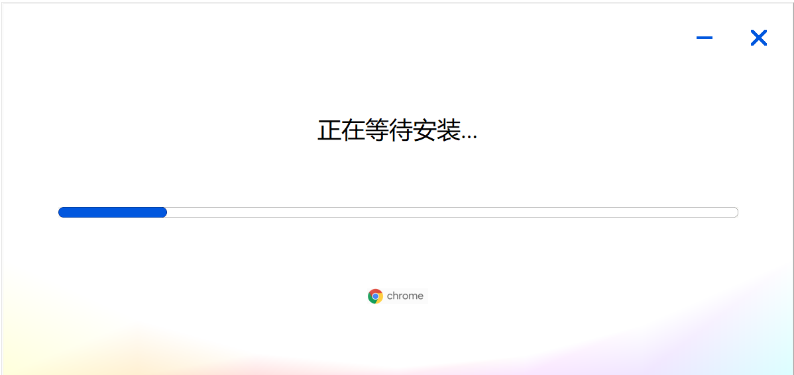

等待进度条走完，就完成了安装。此时看看你的桌面，应该已经出现了谷歌浏览器的快捷方式，双击即可运行它。此时你可以把它设置为默认浏览器，因为通常谷歌浏览器更好用。

能从互联网下载的软件当然不止谷歌浏览器，接下来列出一些常用软件**官网**下载的网址，要访问时，请在浏览器最上方的网址输入框输入这个网站对应的网址。

>[!TIP]
>如果要下载下列某个软件，打开下载页面后通常能看到一个显眼的下载按钮（除了一些网站，例如B站`bilibili.com`的客户端下载在页面顶端中间偏左处，这是因为B站网站本身就有看视频的功能，而非专门供下载用）。或者，有一些软件分不同系统版本，按选择Windows版本即可。

|网站|网址|
|----|----|
|谷歌浏览器**官网**|https://google.cn/chrome/|
|搜狗拼音输入法**官网**|https://shurufa.sogou.com/|
|WPS**官网**|https://www.wps.cn/|
|微信**官网**|https://weixin.qq.com/|
|QQ**官网**|https://im.qq.com/|
|7zip**官网**|https://www.7-zip.org/|
|Bandizip**官网**|https://www.bandisoft.com/bandizip/|
|百度网盘**官网**|https://pan.baidu.com/disk/base/semdownload/|
|Bilibili**官网**|https://www.bilibili.com/|

网站也不止有下载功能，下面提供一些非下载用的网址，可以访问看看。本章最后收集了一份更全的网站列表。

|网站|网址|
|----|----|
|百度（搜索引擎）|https://www.baidu.com/|
|必应（搜索引擎）|https://www.bing.com/|
|微软（中国）**官网**|https://www.microsoft.com/zh-cn/|
|苹果（中国）**官网**|https://www.apple.com.cn/|

>[!CAUTION]
>以下是输入网址和使用浏览器时的注意事项：
>
>- 请**完整**、**正确**且**不多余**地输入网址；
>- 请**不要**输入不能信任的网站，例如街上捡到的小纸条上的网站；
>- 请**总是**在**官方**网站下载软件，例如上述网站。**不要信任**任何**非官方**下载渠道。

>[!TIP]
>你没必要特意背网址，可以在使用过程中熟悉。但是，**一定**要确保输入**正确**的网址，全部小写，使用英文点号、斜杠和冒号。可以通过搜索确保网址正确，搜索方法会在之后介绍。

>[!IMPORTANT]
>本章所有的 **“官网”** 二字全部做了加粗处理，这是为了强调使用**官网**的重要性。你可能会问：为什么一定要在**官网**下载应用？
>
>这是因为：
>
>- **非官网**下载的软件可能过时；
>- **非官网**下载的软件可能被插入了病毒；
>- **非官网**下载的软件可能带有捆绑包，在安装后会附带一堆不相干的软件，占用电脑存储空间和拖慢运行速度，并且难以彻底清除，例如臭名昭著的360全家桶（如下）；
>
>
>
>- 甚至，有的**非官方**网站只要访问，就会导致电脑被攻击。
>
>当你使用浏览器的技术逐渐熟练后，你将能够熟练辨别哪些是官网，以及哪些网站下载的软件是安全的。

>[!IMPORTANT]
>网址的后缀和网站的性质以及国家有关。例如，商业性质的网站后缀为`.com`（commercial的缩写），它也最常见。此外还有`.cn`（China的缩写）、`.org`（organization的缩写）等。
>
>我们最常见到的网站后缀是`.com`，但不要因此认为所有**官网**的后缀都是`.com`。例如，2026年初，有不法分子注册了网站`7zip.com`欺骗用户下载含有木马病毒的应用程序，而7zip的真正**官网**网址是`7zip.org`（此为英文**官网**，前文表格里的是中文**官网**）。

>[!TIP]
>部分网站在国内无法正常访问，例如谷歌搜索引擎**官网**`https://www.google.com/`，这很正常。

这几个提示框可能吓到你了。但它们的信息很重要。总之，在使用浏览器时，一定要**注意安全**！

### 3.1.5 巧用搜索引擎

搜索是需要技巧的，而且搜索引擎中充满了无效内容和广告。所以，巧用搜索引擎非常重要。

#### 3.1.5.1 选择搜索引擎

搜索专业性较强的内容：推荐Bing，内容更综合。网址：https://www.bing.com/

搜索实时性要求高的内容：推荐百度，贴近生活。网址：https://www.baidu.com/

认准这两个即可，其他的不建议使用，这里不作避雷。

#### 3.1.5.2 搜索方法

你是否在使用手机百度、微信或抖音、B站、小红书等软件时搜索过一些东西？如果是，你可以将这些经验运用在搜索引擎搜索上。

这里介绍几条搜索引擎搜索方法和原则：

- 搜索内容不应当过长。
- 在搜索信息、资料时，建议多使用关键词进行搜索，可以略去一些不重要的条件，也不必拘泥格式和标点规范，最好不要用问句。例如，要搜索“《红楼梦》中贾府大观园的平面图是什么样的？”，可以在搜索框中输入“红楼梦大观园平面图”，因为显然《红楼梦》里只有一个大观园，“贾府”条件可以略去。
- 也可以采用“缩短法”：先尽可能详细描述自己的问题，以求获取最贴合的答案；如果没有，则逐步删去一些细枝末节的关键词，尝试寻找相似的内容。
- 在搜索步骤、指南时则可以使用问句，但不用加问号。例如“如何恢复删除的微信聊天记录”。
- 在搜索**官网**以下载软件时，最好在软件名后加上“**官网**下载”四字。例如“谷歌浏览器**官网**下载”。

**不要怕麻烦，多搜搜总会有结果的。**

#### 3.1.5.3 躲避广告内容

认准含“官方”标签的网页。现在搜索引擎公司支持广告，只要某网站在搜索引擎公司打广告，搜索引擎就会把这个网站放在搜索中比较靠前的位置，甚至会把**官网**挤到后面，就像这样：

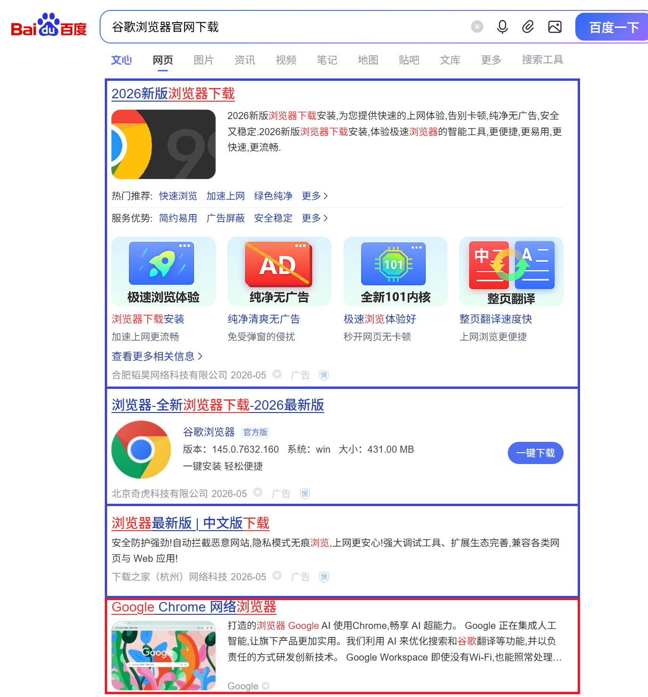

上图中，排在前几个的蓝色框条目全部都是广告，最后红框中的才是真正的**官网**，也就是刚刚我们下载谷歌浏览器的网站。如何辨别广告？搜索引擎会在广告条目下方显示公司名，并在旁边标注“广告”。如果你看到一个不认识的公司，那么这个条目大概率是广告。如果遇到非常花里胡哨的条目，一般也是广告。

搜索引擎通常会在**官网**旁边标注“官方”，就像这样：

正是因为难以辨别广告和**官网**，我们才在之前的小节里直接提供下载网址，而非用搜索引擎搜索。

>[!TIP]
>既然搜索引擎的使用方法和手机搜索相似，为什么还要学习使用电脑搜索？
>
>因为有一些网页只支持电脑打开，有一些软件也只支持从浏览器下载并在电脑上安装，手机上无法使用，例如Steam客户端、Minecraft PCL启动器，以及一些专业办公、编程软件等。要下载它们，必须学会使用搜索引擎。

>[!TIP]
>~~也许算是个推销（？）~~
>
>使用Bing搜索，并且登录自己的微软账号，可以获得积分。17925个积分可以换100元的消费券。作者团队中有一人断断续续攒了一年半，目前有14000个积分。
>
>下图分别是搜索界面的积分与兑换列表的一部分。
>
>
>
>

### 3.1.6 调整默认搜索引擎

这个部分用谷歌浏览器Chrome演示。Chrome的默认搜索引擎为Google，但国内并没有办法正常访问Google，导致打开谷歌浏览器后需要手动输入`baidu.com`跳转到能用的搜索引擎，很麻烦。这时就需要调整默认搜索引擎。

不同浏览器的操作可能略有不同，但整体上思路一致。下面以Chrome浏览器演示。

右上角“三个点”图标 --> 选择设置

侧边栏找到“搜索引擎”，在打开的界面中调整你想要的搜索引擎。（推荐百度/Bing）

### 3.1.7 什么是Cookie？

在进入某些网站时，网站会提示你需要同意使用Cookie。

Cookie本质上就是一串字符串，在人眼中看不出任何意义，对于服务器而言是用于跟踪/匹配的信息。

Cookie由服务器下发，存储在用户的计算机内，并且在用户再次访问同一网址（由Cookie定义“同一”的范围）的时候将Cookie再次返回给服务器进行校验。包括“记住我”、长时间登录在内的很多功能都由Cookie提供支持。

Cookie有时效性，而且Cookie是明文（未加密）。所以会发生登录状态失效，也会有人通过浏览器盗号。

>[!CAUTION]
> 不要给任何人提供你的Cookie！

### 3.1.8 更多网站

这里列出一些网站：