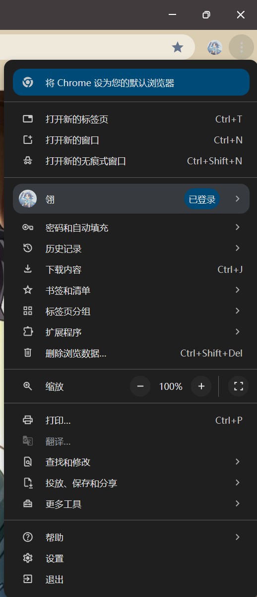
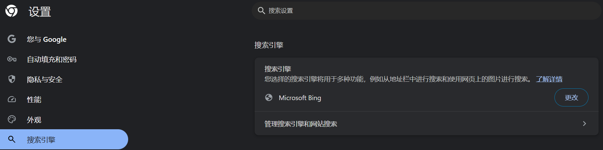
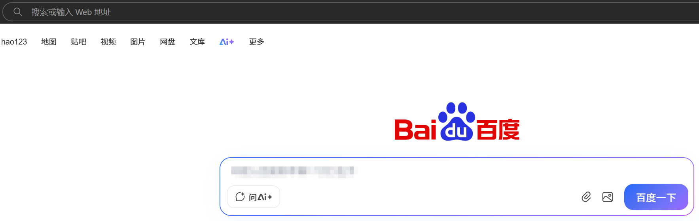
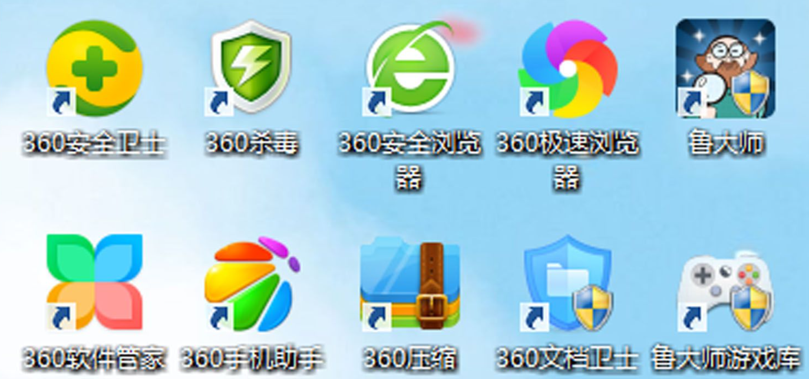
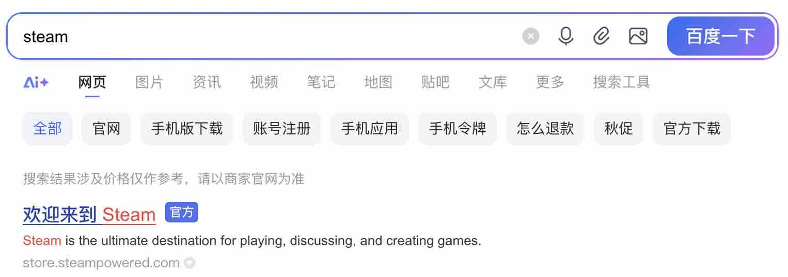

## 3.1 浏览器

用电脑肯定会用到网络（无论内网还是外网），用网络肯定会用到浏览器。

所以，我们将浏览器放在常用软件的Top 1，以示其重要性。

### 3.1.1 浏览器的选择

我们推荐以下浏览器：

- Edge：Windows真正的狗皮膏药，但是用起来也还行，Bing搜索相对清爽。缺点是偶发严重Bug（例如，游戏助手）。
- Chrome：没啥好说的，均衡就对了。记得调整默认搜索引擎。
- Firefox：开源，多端，轻便，推荐。但是目前（2025年9月）Firefox**账号**（不是浏览器本体）在中国大陆停止运营，浏览记录同步等功能不再可用。浏览器正常可用且可正常收到更新。

 

### 3.1.2 调整默认搜索引擎

Chrome的默认搜索引擎为Google，但由于众所周知的原因，国内并没有办法正常访问Google。那么就需要调整默认搜索引擎。

不同浏览器的操作可能略有不同，但整体上思路一致。下面以Chrome浏览器演示。

右上角“三个点”图标 --> 选择设置

侧边栏找到“搜索引擎”，在打开的界面中调整你想要的搜索引擎。（推荐百度/Bing）

### 3.1.3 怎么输入网址？怎么搜索内容？

在打开一个浏览器之后，你一般会看到2个可以输入的地方：一个在浏览器最上方，一个在网页里面。

浏览器最上方的输入框可以用来：
- 访问网站：如果你想要访问一个网站（例如：www.baidu.com ），则你需要且**只能**在该输入框中输入网址并直接访问。
- 搜索内容：如果你输入的不是网址，那么他会使用[默认搜索引擎](#312-调整默认搜索引擎)进行搜索。
- 打开浏览器特殊界面：例如chrome://dino , edge://surf。只在对应浏览器中生效。

网页中的输入框可以用来：
- 搜索内容：使用搜索引擎对你输入的内容进行搜索。无法直接访问网址。

这里列出一些常用网站或常用软件**官网**的网址，要访问时，请在浏览器最上方的输入框输入这个网站对应的网址。

>[!TIP]
>通常，无需输入`https://www.`，只需要输入其后的字符即可打开网站。
>
>如果要下载下列某个网站对应的软件，打开该页面后会看到一个显眼的下载按钮，按系统版本选择即可。

|网站|网址|
|----|----|
|百度（搜索引擎）|https://www.baidu.com/|
|必应（搜索引擎）|https://www.bing.com/|
|谷歌（中国）官网|https://www.google.cn/|
|微软（中国）官网|https://www.microsoft.com/zh-cn/|
|苹果（中国）官网|https://www.apple.com.cn/|
|搜狗拼音输入法|https://shurufa.sogou.com/|
|WPS官网|https://www.wps.cn/|
|微信官网|https://weixin.qq.com/|
|QQ官网|https://im.qq.com/|
|7zip官网|https://sparanoid.com/lab/7z/|
|Bandzip官网|https://www.bandisoft.com/bandizip/|
|Bilibili|https://www.bilibili.com/|

>[!CAUTION]
>以下是输入网址和使用浏览器时的注意事项：
>
>- 请**完整**、**正确**且**不多余**地输入网址；
>- 请**不要**输入不能信任的网站，例如街上捡到的小纸条上的网站；
>- 请**总是**在官方网站下载软件，例如上述网站，不要信任任何非官方下载渠道。

>[!TIP]
>你没必要故意背网址，可以在使用中熟悉。但是，**一定**要确保输入**正确**的网址。可以通过搜索确保网址正确。

>[!IMPORTANT]
>你可能会问：为什么一定要在官网下载应用？
>
>这是因为：
>- 非官网下载的软件可能过时；
>- 非官网下载的软件可能被插入了病毒；
>- 非官网下载的软件可能带有捆绑包，在安装后会附带一堆不相干的软件，占用电脑存储空间和拖慢运行速度，并且难以彻底清除，例如臭名昭著的360全家桶（如下）；
>
>
>
>- 甚至，有的非官方网站只要访问，就会导致电脑被攻击。

>[!IMPORTANT]
>网址的后缀和网站的性质以及国家有关。例如，商业性质的网站后缀为`.com`（commercial的缩写），它也最常见。此外还有`.cn`（China的缩写）、`.org`（organization的缩写）。
>
>我们最常见到的网站后缀是`.com`，但不要因此认为所有官网的后缀都是`.com`。例如，2026年初，有黑客利用网站`7zip.com`欺骗用户下载含有木马病毒的应用程序，而7zip的真正官网网址是`7zip.org`（此为英文官网，前文表格里的是中文官网）。

这几个提示框可能吓到你了。但它们的信息很重要。总之，在使用浏览器时，一定要**注意安全**！

### 3.1.4 巧用搜索引擎

搜索引擎中充满了无效内容和广告。巧用搜索引擎非常重要。

#### 3.1.4.1 选择搜索引擎

搜索专业性较强的内容：推荐Bing，内容更综合。

搜索实时性要求高的内容：推荐百度，贴近生活。

其他搜索引擎不推荐，这里也不做避雷。

#### 3.1.4.2 注意使用关键词

搜索内容不应当过长，建议多使用关键词进行搜索。

采用“缩短法”最为合理：先尽可能详细描述自己的问题，以求获取最贴合的答案；如果没有，则逐步删去一些细枝末节的关键词，尝试寻找相似的内容。

**不要怕麻烦，多搜搜总会有结果的。**

#### 3.1.4.3 躲避广告内容

认准含“官方”标签的网页。

广告内容一般会出现在最上方，在角落的位置使用淡灰色字体标注“广告”。如果遇到非常花里胡哨的条目，一般是广告。

推荐跳过部分第一页的内容以躲避广告的骚扰。

### 3.1.5 搜索也有奖

~~也许算是个推销（？）~~

使用Bing搜索，并且登录自己的微软账号，可以获得积分。17925个积分可以换100元的消费券。鄙人断断续续攒了一年半，目前有14000个积分。

下图分别是搜索界面的积分与兑换列表的一部分。

### 3.1.6 什么是Cookie？

Cookie本质上就是一串字符串，在人眼中看不出任何意义，对于服务器而言是用于跟踪/匹配的信息。

Cookie由服务器下发，存储在用户的计算机内，并且在用户再次访问同一网址（由Cookie定义“同一”的范围）的时候将Cookie再次返回给服务器进行校验。包括“记住我”、长时间登录在内的很多功能都由Cookie提供支持。

Cookie有时效性，而且Cookie是明文（未加密）。所以会发生登录状态失效，也会有人通过浏览器盗号。

>[!CAUTION]
> 不要给任何人提供你的Cookie！