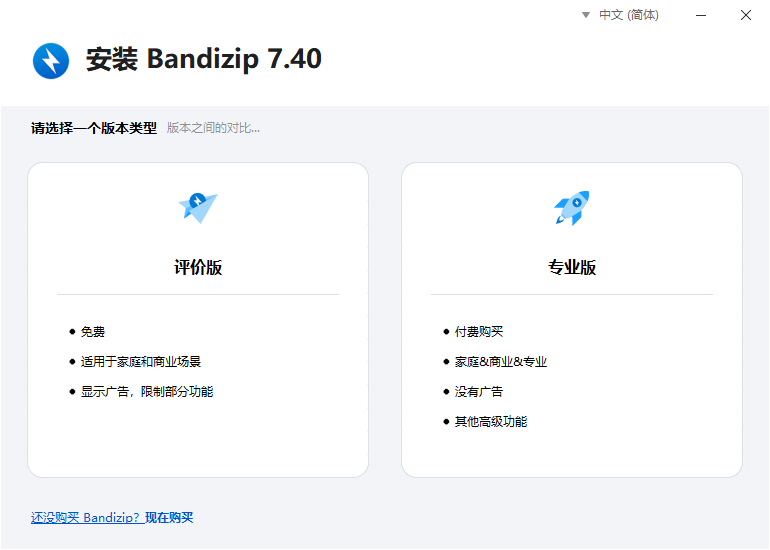
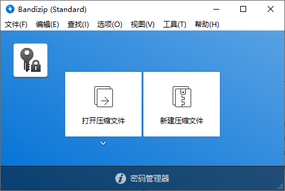
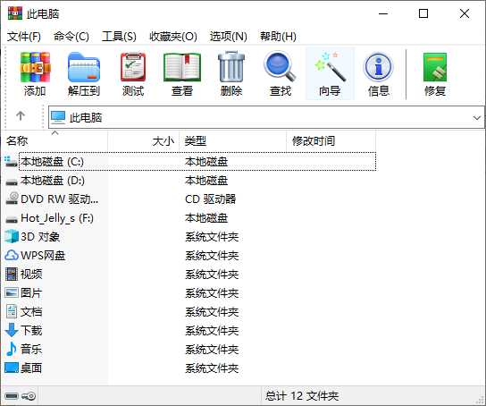
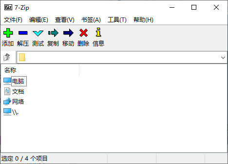
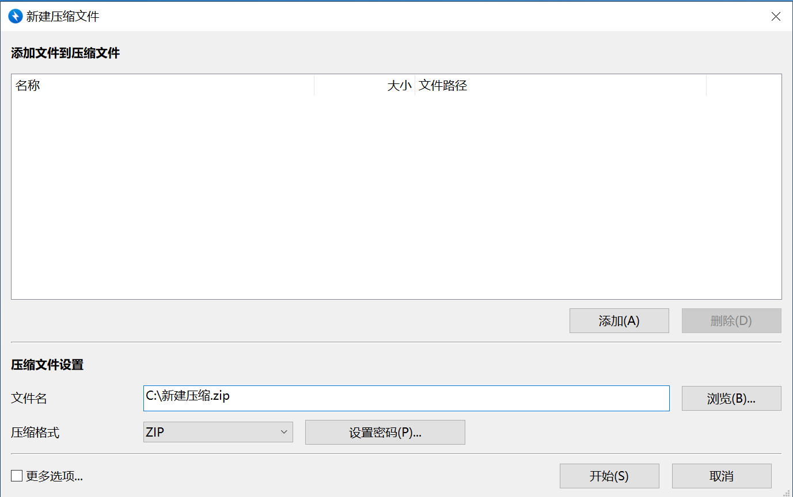

# 3.2 解压缩软件

解压缩软件，是专门用于处理压缩文件的工具类软件，核心功能是将压缩文件还原为原始状态（即解压），同时也支持将普通文件或文件夹打包压缩成压缩包（即压缩）。没有它，我们无法直接打开、编辑或使用压缩包里的内容，是处理文件的基础工具。

## 3.2.1 压缩文件

压缩文件，简单来说是通过特定算法对一个或多个原始文件进行处理后生成的特殊文件，核心目的是减小文件体积，以此方便文件的存储、传输与管理。它就像给文件打包压缩——把原本松散占用空间的文件数据，通过技术手段变得更紧凑，使用时再解压即可恢复原貌。

压缩文件有3个核心作用：

1. 节省存储空间：这是最基础的作用。比如一个1GB的文件夹，经无损压缩后可能只有500MB，直接减少一半存储占用，尤其适合硬盘空间有限的设备（如手机、旧电脑）。
2. 加快传输效率：无论是发送邮件、上传云盘，还是通过聊天软件传文件，体积越小的文件传输速度越快，还能避免文件过大无法发送的问题（比如邮件通常限制单文件20-50MB）。
3. 统一管理多文件：如果需要分享10个分散的照片、文档，直接发送会显得杂乱，而通常的传输手段又不支持直接传输文件夹；将它们压缩成一个打包文件，对方只需接收1个文件，解压后就能一次性获取所有内容，还能避免文件遗漏或错乱。

正因这些作用，网络上很多资源采用压缩文件的形式公开，例如学习资料、游戏模组和资源包等。要想使用它们，必须学会使用解压缩场景。

不同格式对应不同的压缩算法和场景，最常用的有以下三种。这里同时列出它们的后缀名，方便你知道哪些文件是解压缩软件。

格式 | 后缀名 | 特点 | 适用场景
| - | - | - | - |
ZIP | `.zip` | 兼容性最强（Windows、Mac、手机默认支持），压缩率中等，支持密码保护 | 日常简单压缩、跨设备分享文件
RAR | `.rar` | 压缩率比ZIP更高，支持分卷压缩（把大文件拆成多个小压缩包）、修复损坏文件 | 压缩大型文件夹（如游戏安装包、高清视频）
7Z | `.7z` |压缩率极高（同等文件下体积比ZIP小20%-50%），支持多种算法，但兼容性稍弱（需专用软件7zip） | 追求高压缩率、存储大量文件时

## 3.2.2 常见解压缩软件下载

Windows系统自带基础压缩功能，但仅支持简单压缩文件格式（如ZIP），且缺乏高级功能。解压缩软件则往往更专业。这里提供其对应的下载网址，在[3.1 - 浏览器](浏览器.md)中介绍了下载软件的方法，不必全部下载，满足要求即可。

常见软件 | 下载地址 | 特点 
| - | - | - |
7-Zip | `https://sparanoid.com/lab/7z/` | 完全免费、开源，支持格式极多（含7Z、RAR、ZIP等），压缩率极高，体积小巧无广告
WinRAR | `https://www.winrar.com.cn/download.htm` | 功能全面，支持分卷压缩、加密、修复损坏压缩包，兼容性强（几乎所有压缩格式都能解），但非完全免费（有试用期）
Bandizip | `https://www.bandisoft.com/bandizip/` | 界面简洁美观，支持“拖拽解压”“预览压缩包图片”，操作友好，免费版无广告，支持主流格式

>[!TIP]
> 这些软件的名称并不代表它们只能解压缩相应的文件格式，市面上的解压缩软件都是可以解压常见格式的。
>
>
>
>其中，Bandizip安装时选评价版。7zip安装后不会自动生成桌面快捷方式，你需要在软件根目录（通常为`C:\Program Files\7-Zip`）里找到可执行文件`7zFM.exe`来运行程序。你也可以自己创建一个指向这个程序的快捷方式。

## 3.2.3 使用

下图为Bandizip, WinRAR, 7-zip的主页。下载后打开软件后就可以看到。

鉴于WinRAR有使用时间限制，7zip的安装对新手不太友好，接下来的入门部分使用Bandizip教学。

### 3.2.3.1 压缩

第一种方法是打开解压缩软件压缩。打开Bandizip主页，选择 **“新建压缩文件”** 即可打开如下界面：

其中，压缩文件的内容在上方填入，既可以直接拖拽文件到白色方框里，也可以点击 **“添加”** 按钮从目录树添加。

下方 **“压缩文件设置”** 里可以指定打包完的压缩文件的位置和名称，还能设置文件类型和密码。

第二种方法更常用。先将所有想打包的文件或文件夹放进一个大文件夹里，然后对此文件夹单击右键。弹出的列表里有几个Bandizip的选项，选择 **“压缩为【文件名】.zip”** 即可把文件夹的所有文件压缩为一个同名压缩包文件，后缀为`.zip`。其他软件同理。

### 3.2.3.2 解压缩

如上图，对一个压缩包单击右键，在弹出列表中选择 **“解压到此处”** 即可把压缩包里的所有文件直接添加到当前目录里。但这样解压出的文件比较散乱，难以找全。解压缩时选择 **“解压到【文件夹名】”** 会新建一个同名文件夹，把所有解压出来的文件放在里面，比较整齐和完整。

对一个压缩包双击左键会打开预览界面，如果想要解压压缩包里的一个或几个文件而非全部，可以对文件单击右键进行操作。

## 3.2.3 分卷压缩

### 3.2.3.1 分卷压缩的基本信息

分卷压缩是压缩文件处理中的一种进阶打包方式，核心逻辑是将单个大型文件或文件夹，拆分成多个指定大小的小压缩包（这些小压缩包被称为分卷包），所有分卷包共同组成一个完整的压缩文件集合。使用时，必须将所有分卷包放在同一目录下，通过解压缩软件合并解压，才能还原出原始文件。它就像把一大箱物品拆成多个小包裹，方便传输与存储，最终再拼回完整的一箱。​

分卷压缩的诞生，主要是为了解决 “单个大文件不好传、不好存” 的痛点，常见使用场景包括：​

1. 突破传输大小限制​：很多平台对单个文件的传输体积有明确限制：比如邮件附件通常限制20-50MB，聊天软件（如微信）单文件传输上限多为1GB，部分云盘免费用户上传单个文件不能超过10GB。若要分享一个5GB的视频或3GB的软件安装包，直接传输会被系统拒绝。​此时用分卷压缩，可将5GB视频拆成5个1GB的分卷包（命名通常为“视频.part1.rar”“视频.part2.rar”……“视频.part5.rar”），每个分卷包都符合传输限制，就能逐一分批发送，对方接收后合并解压即可。​
2. 适配存储介质格式：有的硬盘/U盘格式要求单个文件不超过一定大小，这时压缩成分卷就可以避免放不进U盘。​​
3. 降低传输风险​：大文件传输时，一旦网络中断或出错，往往需要重新完整传输，耗时耗流量；而分卷包是独立的小文件，即使某一个分卷包传输失败，只需重新传输这一个，无需全部重来，尤其适合网速不稳定的场景（如下载大型游戏分卷安装包）。​

### 3.2.3.2 分卷压缩注意事项

所有分卷包是一个“整体”，缺一不可。如果丢失其中一个（如“视频.part3.rar”损坏或未下载），解压缩软件会提示分卷损坏，无法完整还原原始文件。同时，解压前必须将所有分卷包放在同一个文件夹中，不能分散在不同目录。​

不过不用为此担心，分卷包的命名是有规律的。分卷包的命名会自带“序号标识”，方便区分顺序，常见格式有两种：​

- 后缀带数字：如“资料.part1.rar”“资料.part2.rar”“资料.part3.rar”（RAR格式常用）；​
- 后缀带字母：如“备份.z01”“备份.z02”“备份.zip”（ZIP格式常用，最后一个分卷通常是.zip后缀）。​

这些标识能明确分卷的数量和顺序，避免混淆。​

解压时，无需逐个解压分卷包，只需选中任一分卷包，选择解压，解压缩软件会自动识别同目录下的其他分卷包，一次性合并并还原出完整的原始文件，操作和普通压缩包解压几乎一致。​
