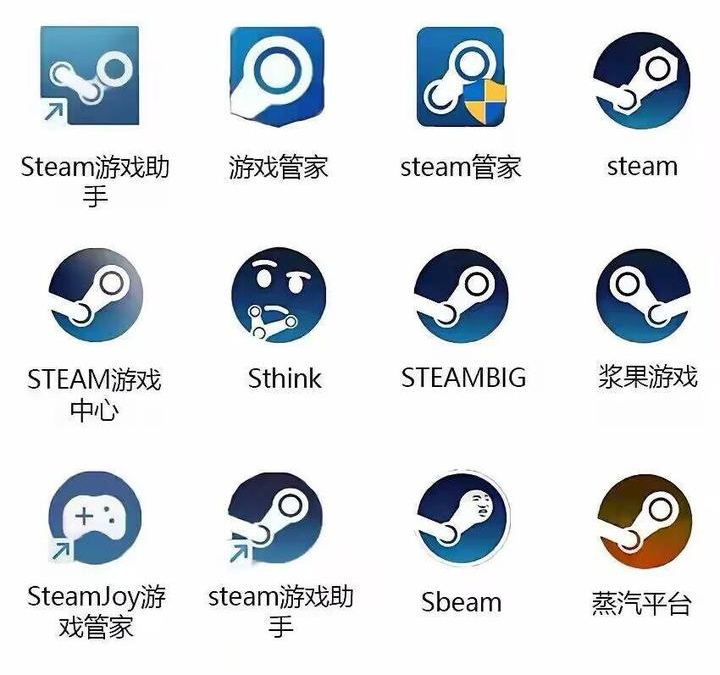
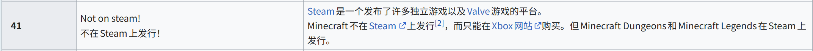
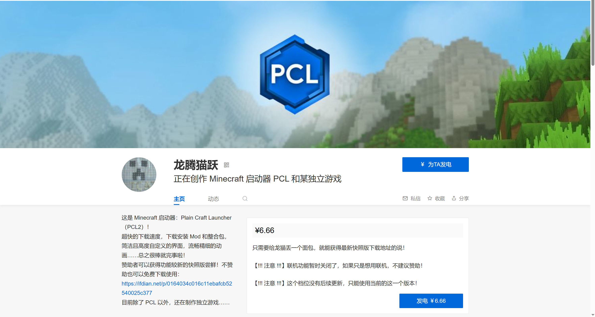

## 3.5 部分游戏下载

久 等 了 ！

想必有很多人在等待这一节。开始之前，请确保学习过3.1、3.2和3.4节的内容。

本节主要介绍Steam和MC的下载。

### 3.5.1 Steam下载

首先明确一点：请下载正版的Steam。以下这些都是盗版Steam。

下面这个才是正版Steam。

请确保你下载的是正版Steam，否则后果自负。

要下载正版Steam，请访问如下网站，这是Steam商店的官网。在此网页的右上角有一个明显的 **“安装Steam”** 图标，单击即可安装客户端。

~~~
https://store.steampowered.com/
~~~

#### 3.5.1.2 加速器

Steam的官网访问有时不稳定，而且下载速度可能受到限制。即使顺利下载了客户端，游戏的下载和联机也可能十分缓慢。这时就需要使用加速器。

常用加速器有网易UU、雷神、biubiu、奇游、迅游、AK等，请自行搜索官网并下载安装。

安装后，在加速器软件内搜索游戏或平台名，按需选择区服，最后通过加速器界面弹出的“启动游戏”按钮进入游戏。

>[!IMPORTANT]
>加速器并不能用于“翻墙”。加速器所使用的通道是向国家申请过的，只能加速对特定站点的访问，对其他站点无效。
>
>顺带一提，使用VPN翻墙是违法的。

#### 3.5.1.3 注册并登录

打开Steam客户端后，你需要用手机号、邮箱等信息注册Steam账号并登录。

#### 3.5.1.4 下载游戏

可以在商店中购买想要的游戏（记得蹲蹲折扣）。购买后，游戏会添加到Steam账号的库中，你需要从库中把游戏下载到本地才能游玩。

### 3.5.2 MC下载

Steam上可以玩到很多游戏，除了MC。在MC Java版的首页甚至有如下一条闪烁标语：

如何免费下载正版Java？这需要用到PCL启动器。Plain Craft Launcher启动器是由大佬龙腾猫跃开发的启动器，某些方面上其性能甚至超过官方启动器。

请访问爱发电官网`afdian.com`并在官网内搜索“龙腾猫跃”，进入个人首页。或者你也可以直接访问如下网址：

~~~
https://afdian.com/a/LTCat
~~~

PCL是完全免费的，右侧的付款按钮供想支持PCL开发的人自愿付款。付款也能提前解锁一些PCL功能，但主要的功能（下载游戏、模组等）是免费的。

此页面左下角有一个蓝色的链接，点击后进入一个提供下载链接的页面。

截至这一行写下时，此页面共有三个链接，分别指向夸克网盘、迅雷和蓝奏云三款网盘中的某个位置。点开任意一个链接，复制其中网址并在浏览器访问，即可打开对应的云盘页面。要想下载PCL，还需要在本地下载夸克或迅雷客户端，并注册账号。接下来就是网盘的使用方法，将云盘中存储的内容保存到自己的云盘，再通过客户端下载到本地即可。

在本地启动PCL启动器，并下载想要的MC版本（仅限Java），再按提示添加Java解释器即可。