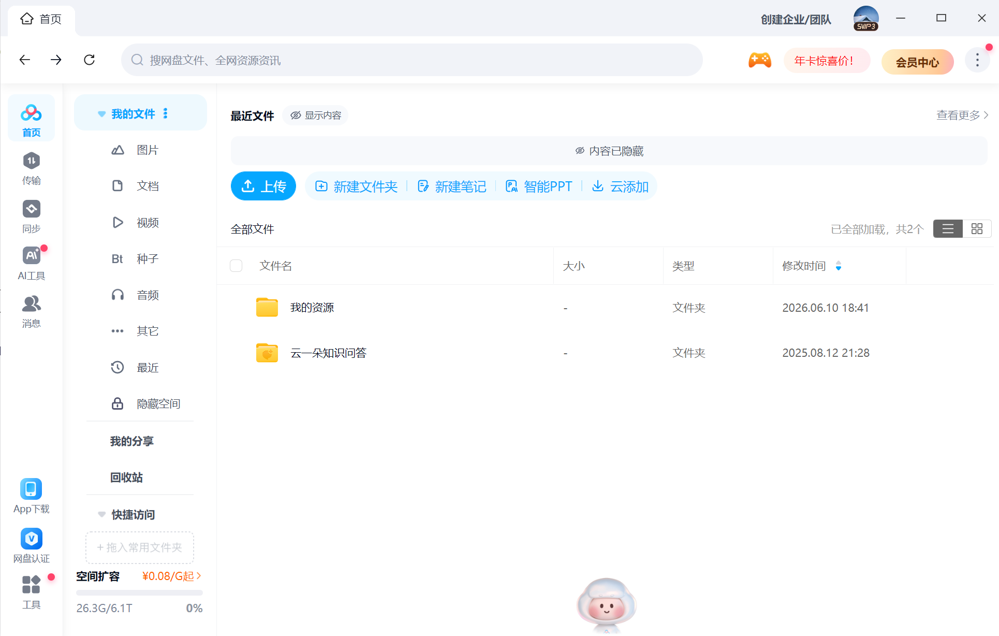
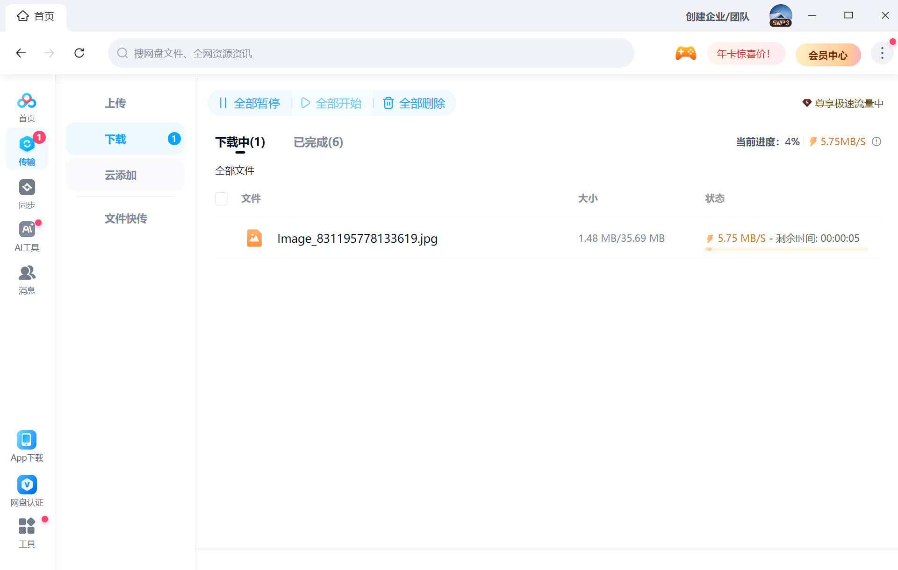
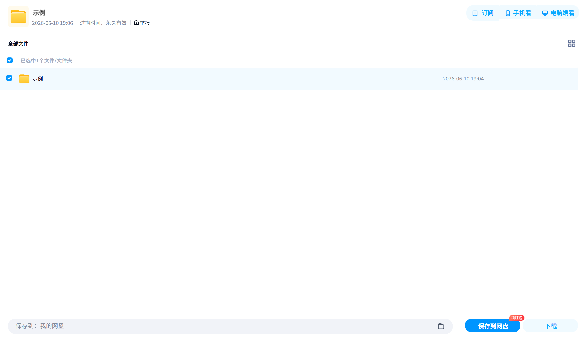

## 3.4 部分网盘软件下载与使用

网盘，顾名思义，是一种在云端存储文件的方式。使用网盘存储文件能节省电脑空间，而且只要把网盘链接公布出去就能分享文件。正因如此，很多人选择用网盘分享资源，例如电影、电视剧、自制游戏模组等。

本节介绍部分主流网盘软件的下载方法，重点介绍百度网盘的使用方法。其他网盘的使用方法类似。

### 3.4.1 部分网盘软件下载网址

| 软件名 | 网址 |
| - | - |
| 百度网盘 | https://pan.baidu.com/disk/base/semdownload/ |
| 迅雷 | https://www.xunlei.com/ |
| 夸克（主要功能是AI浏览器，内置网盘功能） | https://www.quark.cn/ |
| 天翼云盘 | https://cloud.189.cn/web/static/download-client/index.html |

下载的方法已经介绍过，不做赘述。

### 3.4.2 百度网盘登录

网盘归属到账号里，因此使用自己的网盘之前需要登录自己的账号。对于百度网盘，你可以扫码登录自己的百度账号，用手机号结合密码或验证码登录，或用QQ、微信登录。如果你没有百度账号，注册一个即可。

百度旗下所有软件的账号是通用的，如果你有百度、百度贴吧或百度网盘等软件的账号，直接用这个账号登录即可。

### 3.4.3 百度网盘空间

每个网盘用户有自己的一个云空间，可以将文件上传到云空间里，从云空间下载文件，公开部分云空间分享资源或下载别人的云空间里的文件。本节仅介绍上传与下载。

登录账号后，会打开如下主页。

这里可以进行新建文件夹、重命名、复制、剪切、粘贴、删除文件等操作，和文件资源管理器是类似的。

>[!TIP]
>云空间的大小是有限的，但通常足够用。主页左下角可查看空间使用情况。

### 3.4.4 百度网盘下载

#### 3.4.4.1 本账号空间里的下载

对任意一个自己空间里的文件或文件夹单击下载按钮（下图红框）即可将其添加进下载队列，开始下载。

下载队列在左侧的 **“传输”** 页面的 **下载->下载中** 页面查看。

下载完成后，可在 **“已完成”** 页面中查看下载好的文件，点击红框中的按钮即可打开文件所在的文件夹，默认下载在桌面上。

#### 3.4.4.2 其他账号公开的资源

百度网盘也支持把一部分云空间分享除去，供其他网盘用户下载。

公开者提供像下面这样的的链接和提取码。在 **浏览器** 中粘贴链接并填写提取码即可打开下载页面。

>通过网盘分享的文件：示例
>链接: https://pan.baidu.com/s/1JVBSsQqUnmnZxSO1EW0dmg?pwd=5s3a 提取码: 5s3a 

点击下方的 **“保存到网盘”** 按钮即可把文件保存到自己的云空间里（需要在浏览器中再登录一次账号）。此后再在自己的云空间里下载即可。

### 3.4.5 百度网盘上传

直接将文件夹或文件拖动到百度网盘页面里即可上传。在首页点击 **“上传”** 按钮也可以选择文件上传。

上传中的文件在左侧的 **“传输”** 页面的 **上传->上传中”** 查看。

### 3.4.6 下载太慢？

百度网盘最受诟病的一点就是故意限制你的下载速度，连小文件都需要传很久。

这时你可以选择充一个VIP。但也有免费的方法，这需要自己上网搜索。如果怕麻烦就直接充VIP。