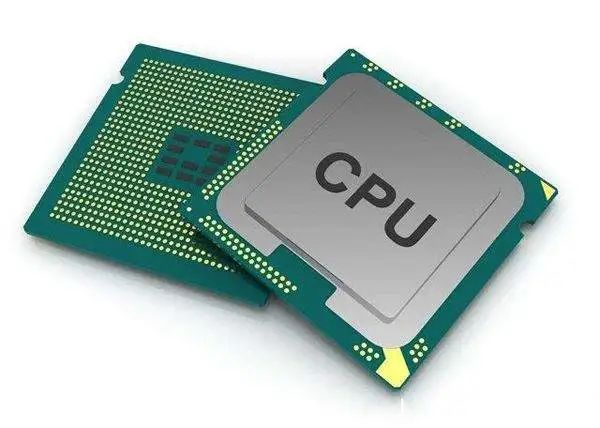
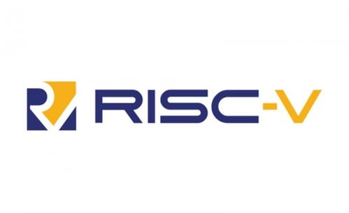

## 1.2 CPU
中央处理器（Central Processing Unit，简称CPU）作为计算机系统的运算和控制核心，是信息处理、程序运行的最终执行单元。
在本教程中,我们将它简称为CPU。

### 1.2.1 CPU的作用

CPU是电子计算机的主要设备之一，电脑中的核心配件。其功能主要是解释计算机指令以及处理计算机软件中的数据。

由于CPU的重要作用,有人把它称为“电脑的大脑”。它的性能强弱，直接决定了电子设备的响应速度和处理能力，是衡量一台计算机计算能力的最关键指标。

### 1.2.2 CPU的分类

CPU的分类方式有多种。本教程从应用场景、核心数量与结构、指令集架构三个方面对CPU进行分类。

#### 1.2.2.1 应用场景
这是最根本、最常见的分类方式，直接决定了CPU的性能、功耗和生态。

- 通用CPU

通用CPU的设计目标是处理各种不同类型的计算任务，追求通用性和灵活性。我们日常接触的电脑和服务器CPU大多属于此类。
x86架构和ARM架构是最主要的两种通用CPU。

x86架构：由Intel和AMD主导，在个人电脑和服务器市场占据绝对主导地位，性能强大，软件生态极其丰富。

ARM架构：采用精简指令集（RISC），以高能效比著称。
最初主导移动设备（智能手机、平板电脑），如今凭借Apple Silicon（M系列芯片）大举进入桌面领域，并在服务器、嵌入式系统等领域广泛应用。

- 嵌入式/微控制器

它们将CPU核心、内存、输入/输出端口等集成在单一芯片上，被称为MCU。它们是为特定控制任务设计的，功耗极低、成本低廉、体积小巧。

它们主要应用于家电、工业设备、汽车电子、物联网设备、智能手表等对性能要求不高的电子产品上。 
代表是ARM Cortex-M系列、ESP32、Arduino的AVR芯片等。

- 专用处理器

为特定类型的计算任务进行高度优化，在执行特定任务时效率远超通用CPU，但通用性差。常与通用CPU协同工作。
代表有

GPU：专门处理大规模并行图形计算和通用并行计算。
NPU：专门用于加速神经网络运算和人工智能应用。
DPU：专门处理数据中心内的数据转发、存储和安全等任务。
>[!TIP]
> 有关GPU的详细内容，参见[GPU.md](GPU.md)

#### 1.2.2.2 核心数量与结构
这反映了CPU内部的并行处理能力。

- 单核CPU

最早期的CPU形式，只有一个处理核心。同一时间只能处理一个任务，通过时间片轮转模拟“多任务”。 
现已基本退出消费级市场，仅见于一些最简单的微控制器。

- 多核CPU

将两个或更多的独立计算核心集成在一个物理芯片上。每个核心都可以同时执行任务，极大地提升了多任务处理能力和多线程性能。

双核、四核、六核、八核乃至十六核、二十四核等，核心数量越多，并行处理能力越强。
>[!TIP]
> 近年来，也有部分厂商推出大小核，旨在平衡高性能与低功耗，似乎逐渐成为趋势。但也有一些负面的市场反馈。

- 众核处理器

集成了数十个甚至上百个相对简单的核心，专为高度并行的科学计算、大数据分析等特定领域设计。
代表有Intel的Xeon Phi系列（已停产）、一些基于ARM架构的服务器CPU。

#### 1.2.2.3 指令集架构
这是CPU与软件沟通的“语言”基础，是区分CPU血脉的根本性分类。

- 复杂指令集计算机

指令集丰富、功能复杂，一条指令可以完成多个操作。硬件结构复杂，旨在减少编译代码量，但单条指令执行时间可能较长。
代表有x86架构及其64位扩展x86-64。

- 精简指令集计算机

指令集简短、精简，只包含最常用的指令。追求单条指令在一个时钟周期内完成，通过组合简单指令完成复杂操作。硬件设计更简单，通常能效更高。
代表有ARM、MIPS、RISC-V。

>[!TIP]
>RISC-V是新兴的开源指令集架构，因其开放、自由、灵活的特性，正受到产业界的广泛关注。

