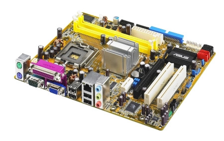

## 1.4 主板

主板是电脑中最重要的基础硬件之一，它类似于计算机的“骨架”和“交通枢纽”。所有主要硬件（CPU、内存、硬盘、显卡、网卡等）都要通过主板连接起来，并依靠主板上的芯片组协调工作。

### 1.4.1 主板的作用

主板的主要作用包括：

- 为CPU、内存、显卡、硬盘等提供插槽和接口；
- 通过芯片组控制数据在各个部件之间的传输；
- 提供电源分配、时钟信号、外设控制和扩展能力；
- 提供BIOS/UEFI固件，用于启动和初始化系统；
- 为机箱按钮、USB接口、音频接口、网络接口等外围设备提供连接支持。

如果没有主板，计算机的各个部件就无法协同工作；主板既是结构载体，也是“硬件协议”的实现者。

### 1.4.2 主板的组成与核心部件

主板并不只是一个电路板，它上面集成了许多关键部件。初学者最需要认识以下几类：

- CPU插槽（Socket）

这是安装处理器的地方，不同CPU对应不同插槽形式。比如Intel有LGA1700、LGA1200等，AMD有AM4、AM5等。插槽不兼容，CPU就装不上；购买主板前，必须先确认CPU型号与插槽类型是否匹配。

- 内存插槽（DIMM Slot）

用于插入内存条。现代台式机主板一般有2到4个插槽，少数高端主板有6或8个；笔记本主板通常有2个内存插槽。主板也会标注支持的内存类型，例如DDR4或DDR5。

- 显卡插槽（PCIe x16）

独立显卡一般插入PCIe x16插槽。该插槽也可用于某些高性能扩展卡（例如专业声卡、RAID卡等）。如果你不装独立显卡，就可以使用CPU自带的集成显卡（前提是CPU支持集成显卡）。

- 存储接口

常见的有：
  - SATA接口：用于连接机械硬盘、SATA固态硬盘、光驱等；
  - M.2接口：用于安装NVMe SSD或SATA SSD。现代主板多配备多个M.2插槽。

- 主板芯片组（Chipset）

芯片组负责管理CPU、内存、显卡、存储设备、USB、网络等之间的数据流。它决定了主板支持的功能、扩展能力及性能特性。不同芯片组之间存在差异，比如Intel B660与Z690、AMD B650与X670等。

- 电源供电模块（VRM）

VRM负责将电源从电源供应器转换为稳定的CPU、内存和其他组件需要的电压。好的电源供电设计可以让CPU运行更稳定，尤其在高负载或超频时更重要。

- BIOS/UEFI固件芯片

这是主板的“基本输入输出系统”，负责电脑开机时识别硬件、加载操作系统。现代主板多使用UEFI，支持更快启动、更大硬盘和图形界面设置。

- 机箱后置I/O接口

包括USB、网口、音频口、视频输出、键盘/鼠标接口等。不同主板后置I/O的接口数量和类型差别很大。

### 1.4.3 主板规格与尺寸

常见的主板规格主要有三种：

- ATX：标准尺寸，通常长30.5cm、宽24.4cm。扩展槽最多，适合中大型机箱；
- Micro-ATX（mATX）：长24.4cm、宽24.4cm，扩展能力比ATX少一些，但更适合小机箱；
- Mini-ITX：长17cm、宽17cm，体积最小，仅有一个PCIe插槽，适合迷你主机。

选择主板时，机箱大小和需求要一起考虑。若你需要更多显卡、硬盘、扩展卡，建议选择ATX；如果只是日常办公或轻度游戏，Micro-ATX或Mini-ITX也完全足够。

### 1.4.4 台式机主板和笔记本主板的区别

台式机主板和笔记本主板在形态与可扩展性上有显著不同：

- 台式机主板

  - 通常使用标准化设计，插槽与接口丰富；
  - 支持更灵活的CPU、内存、显卡、存储升级；
  - 便于维护、拆装与改装。

- 笔记本主板

  - 常常为定制化设计，尺寸和布局针对机型优化；
  - 很多部件（如CPU、内存、Wi-Fi模块）可能是焊接在板上，不易更换；
  - 便携性更强，但升级空间较小。

对初学者来说，台式机主板更容易理解和升级；笔记本主板则需要先查清楚“是否可拆卸”再决定是否升级内存或硬盘。

### 1.4.5 主板的常见接口与含义

主板经常出现的接口和插槽，认识这些可以避免买错硬件：

- CPU插槽（Socket）：决定CPU可否安装。
- 内存插槽：决定支持的内存类型与最大容量。
- PCIe插槽：用于独立显卡、NVMe扩展卡、声卡、网卡等。
- SATA接口：用于连接机械硬盘、SATA固态硬盘和光驱。
- M.2插槽：用于安装NVMe SSD或M.2 SATA SSD。
- 后置USB接口：用于连接鼠标、键盘、U盘、手机等外设。
- 后置网口：用于有线网络连接，速度有 100Mbps、1Gbps、2.5Gbps 等不同规格。
- 音频接口：用于耳机、麦克风、音箱。
- CPU风扇接口、机箱风扇接口和水冷接口：用于连接散热风扇和水冷设备。

如果你看到主板说明书中提到“PCIe x16”“PCIe x1”“USB 3.2 Gen 1”“USB-C”“SATA 6Gb/s”，就不必害怕，它们只是不同扩展功能的命名。

### 1.4.6 主板芯片组与性能关系

主板芯片组很大程度上决定了主板的能力。它会影响：

- 有多少条PCIe通道可用；
- 是否支持超频；
- 是否支持更多USB接口；
- 是否支持更高频率和更多容量的内存；
- 是否支持更多SATA和M.2硬盘。

简单举例：

- Intel B 系列（如B660、B760）：定位主流，功能均衡，适合普通办公、学习和大部分游戏；
- Intel Z 系列（如Z690、Z790）：定位高端，支持超频、更多PCIe通道和更多存储接口；
- AMD B 系列（如B550、B650）：适合大多数用户，性价比高；
- AMD X 系列（如X570、X670）：适合追求高性能、游戏、内容创作的用户。

> [!TIP]
> 如果你不是发烧级用户，不必去纠结最顶级的芯片组。大多数用户选择主流的B系列或中端Z/B系列主板，就能获得非常好的性能体验。

### 1.4.7 选购主板时的关键点

买主板时要关注这些关键因素：

- CPU兼容性

  - 先确定你要用的CPU型号；
  - 再确认主板支持该CPU插槽；
  - 注意不同CPU代数之间可能不兼容，即使插槽相同。

- 内存支持

  - 看主板支持DDR4还是DDR5；
  - 看最大支持容量和频率；
  - 如果想组成双通道，最好买两条同规格内存。

- 扩展插槽数量

  - 是否需要多张显卡、声卡、网卡、USB扩展卡；
  - 是否需要更多M.2固态硬盘和SATA硬盘。

- 接口类型

  - 是否有足够的USB接口、视频输出接口、网口；
  - 是否需要USB-C、Wi-Fi、蓝牙；
  - 是否需要前置面板接口支持机箱额外USB或读卡器等。

- 供电与散热

  - 如果打算进行高性能计算或超频，选择供电设计更稳、散热片更大的主板；
  - 对于普通办公本，基础供电设计即可。

- 品牌与售后

  - 选择有信誉的品牌，例如华硕、技嘉、微星、华擎、映泰等；
  - 注意保修时间和售后政策，遇到兼容问题时更容易解决。

### 1.4.8 主板的日常维护与升级建议

主板本身不需要频繁保养，但正确维护和升级可以延长使用寿命：

- 静电保护

安装或拆卸主板时，先触摸金属外壳释放静电，避免用力接触金属接口。静电可能损坏主板组件。

- 定期清理灰尘

机箱内灰尘积累会导致主板周边元件散热变差。可以使用压缩空气或软毛刷清除灰尘，保持风道畅通。

- 固件更新

主板厂商会发布BIOS/UEFI更新，修复兼容性问题或提升稳定性。仅在需要支持新CPU或修复问题时更新，操作前请仔细查阅官方说明。

- 插件安装

插入内存、显卡、硬盘时，先断电再操作。避免在机箱内反复插拔产生松动，安装完成后应检查是否牢固。

- 升级前备份数据

如果要更换主板或重装系统，建议先备份重要数据。因为更换主板后，操作系统可能需要重新激活，并且驱动程序也可能需要更新。

### 1.4.9 常见问题与故障排查

使用主板时常见的问题包括：

- 电脑无法开机

  - 检查电源线是否连接，电源开关是否打开；
  - 检查CPU、内存、显卡是否安装到位；
  - 检查前面板开机键线缆是否插对位置；
  - 如果主板上有故障指示灯或蜂鸣器，可根据说明书判断问题类型。

- 识别不到内存或硬盘

  - 确认内存条是否插牢，插到正确颜色的插槽；
  - 确认硬盘数据线、供电线是否连接；
  - 如果是M.2固态硬盘，确认该插槽是否与SATA接口冲突；
  - 尝试换一根数据线或换一个不同接口测试。

- 无法识别新CPU

  - 可能是主板BIOS版本过低，不支持该CPU；
  - 这时可尝试更新BIOS，但更新前务必确认主板型号与固件版本；
  - 部分旧主板不支持新一代CPU，即使更新BIOS也无法兼容。

- USB接口不工作

  - 检查是否在BIOS中禁用了某些USB端口；
  - 检查机箱前置USB线是否与主板连接正确；
  - 如果只有部分接口失灵，可能是主板后置I/O芯片损坏。

- 风扇转速异常

  - 检查风扇接口是否正确连接到主板风扇插座；
  - 在BIOS/UEFI中查看风扇设置，确认是否开启了自动控制；
  - 如果风扇老旧或灰尘严重，也会导致噪音大或转速异常。

> [!CAUTION]
> 主板属于电脑最基础也最关键的部件之一，任何拆装和升级操作都建议在断电状态下进行。若你没有把握，最好请懂行的朋友或专业技师协助。

