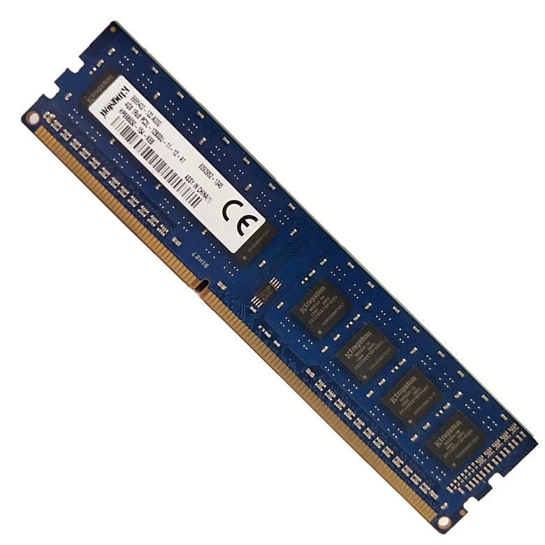

## 1.5 内存

> 内存（Memory），是大多数人最容易产生误区的计算机组件。许多人会把它与“储存空间”搞混淆，误以为他们的软件和资料都存在“内存“上。实际上人们口中说的”256G“”1TB“是“储存空间”，也就是硬盘大小，而内存是完全不同的概念。

### 1.5.1 内存是什么？

咱们可以把计算机比作一家超市：

- **硬盘（机械硬盘 / 固态硬盘）** 是超市的 “仓库”，负责长期存放商品（文件、软件、系统），即使断电，里面的东西也不会消失；

- 而**内存（RAM，随机存取存储器）** 是超市的 “收银台工作台”—— 收银员要扫描商品（运行程序）时，会先把商品从仓库搬到工作台上，工作台越大，能同时处理的商品越多，结账速度就越快；一旦超市下班（电脑关机），工作台上没处理完的东西（临时数据）就会清空，下次开机需要重新从仓库调取。

简单说：**内存是计算机 “正在用” 的数据的临时存放地**。比如你同时打开微信、浏览器、Excel，这些程序的临时数据都在内存里运行；如果内存不够，工作台放不下，电脑就会 “卡顿”“未响应”，甚至自动关闭部分程序。

### 1.5.2 常见内存类型：DDR4 和 DDR5

现在市面上的消费级内存，主要是 “DDR 系列”，就像手机的 “5G” 和 “4G”，数字越大，技术越新、速度越快：

| 类型 | 常见频率                  | 速度（理论） | 适用场景                    | 兼容性                                   |
| ---- | ------------------------- | ------------ | --------------------------- | ---------------------------------------- |
| DDR4 | 2400MHz、2666MHz、3200MHz | 最高 34GB/s  | 日常办公、中端游戏本        | 只支持 DDR4 主板，不能和 DDR5 混用       |
| DDR5 | 4800MHz、5600MHz、6400MHz | 最高 68GB/s  | 高端游戏、视频剪辑、3D 建模 | 只支持 DDR5 主板，速度比 DDR4 快一倍左右 |

举个例子：如果你的电脑是 2022 年之前买的中端本，大概率是 DDR4 内存；2023 年之后的新款高端本或台式机，基本以 DDR5 为主。

>[!CAUTION]
**买内存时一定要先看主板支持哪种类型**，不然插不进去也用不了。以及注意CPU可用的最大频率以及最大内存容量。例如AMD的CPU一般无法支持DDR5内存中最快的那几档，花了高价买了高频内存最后却因为CPU而用不上。

### 1.5.3 内存的关键参数

1. 容量

这是最影响体验的参数，单位是 “GB”。不同使用场景，对容量的需求天差地别：

- **4GB**：只能满足最基础的需求，比如只开一个浏览器页面、写简单文档，多开一个程序就会卡顿，现在基本被淘汰；

- **8GB**：日常办公的 “入门标配”，能同时开微信、3-5 个浏览器标签、Excel，适合学生党和普通上班族；

- **16GB & 32GB**：“主流黄金容量”，不管是玩《英雄联盟》《原神》等游戏，还是做轻度视频剪辑（1080P），都能轻松应对，大多数人选 16GB 不会错；

- **64GB 及以上**：适合 “重度需求”，比如专业视频剪辑（4K/8K）、3D 建模（Blender、3D Max）、运行虚拟机，普通用户没必要选这么大。

>[!TIP]
更加专业的软件，例如部分工程软件，Adobe After Effect，以及AI大模型运行等等，内存量越大越好，256GB甚至极端情况下1-2TB的运行内存都不为过。

2. 频率

单位是 “MHz”，数值越高，内存读写数据的速度越快。比如 DDR4-3200 比 DDR4-2666 快，DDR5-5600 比 DDR5-4800 快。

但要注意：**频率不是 “越高越好”**。比如你的主板最高只支持 DDR4-3200，就算买了 DDR4-3600 的内存，也会自动降到 3200MHz 运行，白花冤枉钱。

3. 通道数

内存分 “单通道” 和 “双通道”，双通道的传输速度明显比单通道高。

怎么实现双通道？买两条相同容量、相同频率的内存（比如两条 8GB DDR4-3200），插在主板上标有 “1+3” 或 “2+4” 的插槽里（插槽通常会用不同颜色区分）。比如你的电脑是 16GB 内存，“两条 8GB 双通道” 比 “一条 16GB 单通道” 体验好很多，尤其玩游戏时帧率更稳定。

### 1.5.4 怎么查自己的内存？不够用了怎么办？

1. 查内存信息

简单的查询工作直接使用[任务管理器](../系统/系统工具.md/#内存)即可。如果需要更加详细的参数，建议使用Hwinfo。此处不再赘述Hwinfo的使用方法。

2. 内存不够用了：两种解决办法

如果你的电脑经常卡顿，内存占用率经常超过 90%，就该升级了：

- **台式机**：直接买一条和原有内存 **同类型、同频率** 的内存插上（比如原有是 8GB DDR4-3200，就再买一条 8GB DDR4-3200），组成双通道，或者直接全部换新。

- **笔记本**：部分笔记本内存是 “板载” 的（直接焊在主板上，不能拆），几乎无法仅升级内存；如果是 “可插拔” 内存（任务管理器显示外形规格为SODIMM），直接换更大容量的即可（比如把两条 4GB 换成两条 8GB）。

>[!TIP]
还有一种东西叫做“虚拟内存”。虚拟内存是电脑使用一部分硬盘来临时充当内存储存数据。有一些教程会让你把虚拟内存调大以缓解内存紧张问题，但是硬盘的速度远小于内存，会导致软件异常卡顿甚至崩溃，而且过大的虚拟内存会挤占C盘空间，并损耗硬盘读写寿命。故不推荐过分依赖虚拟内存。

### 1.5.5 常见误区

1. **“内存越大，电脑越流畅”？** 不一定。如果你的电脑是老旧机型（比如 CPU 是 i3-7 代、显卡是入门级），只升级内存，流畅度提升有限；

2. **“内存和硬盘一样，能长期存东西”？** 内存是 “临时存储”，电脑关机后数据就没了，所以编辑文档时一定要及时保存，避免断电丢失；

3. **“不同品牌的内存不能一起用”？** 可以但不建议。只要类型、频率、**时序**相同，大多数品牌可以混用（比如金士顿和芝奇的 DDR4-3200 8GB），但尽量选同品牌，稳定性更好。

>[!CAUTION]
上文中未提及内存的时序，这里简单说明一下。时序非常复杂，可以极其简单地理解为CPU读取内存中的数据所需要的时间，时序数值越小越好（也就是延迟越低），单位为周期，1周期=(1/频率)秒，一般频率越大时序越大，所以选购内存时要在频率和时序之间进行权衡（一般还是频率更重要一些）。
时序为一组值，共四个数据，一般如`16-18-18-38`这样的形式标注（以上值分别为CL-tRCD-tRP-tRAS，有兴趣可以去搜搜）。混用不同品牌甚至同品牌同系列不同批次的内存条时，**必须确认两条内存条以上四个值完全相同，否则即使频率、类型相同，也不可混用，否则无法开机。**
