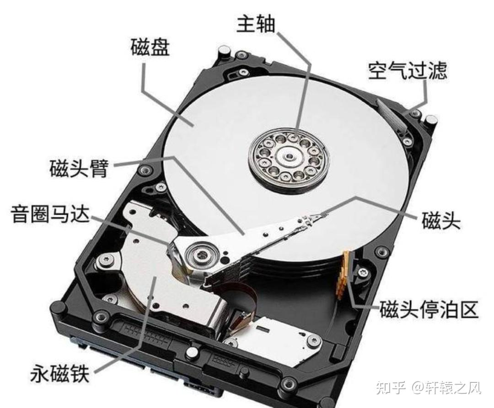
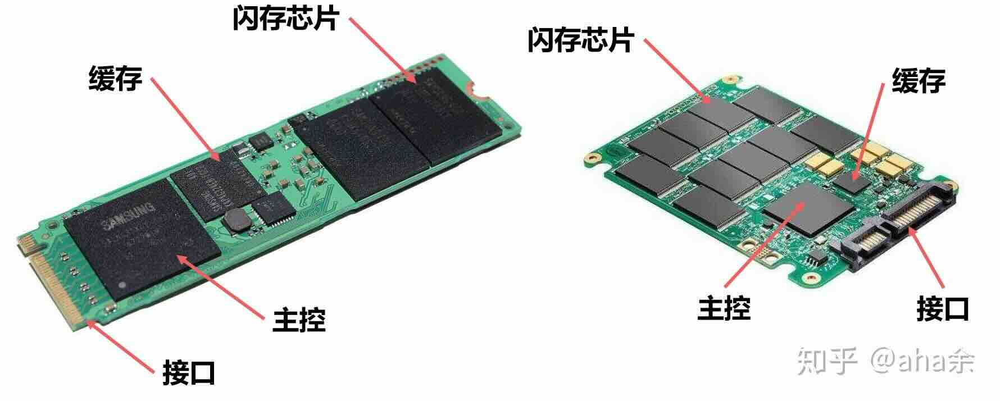

## 1.6 硬盘

### 1.6.1 作用

硬盘用于长期储存计算机运行时产生的数据。

区别于内存，硬盘断电后仍然可以存储数据，而内存在断电后数据即清空。

### 1.6.2 分类

硬盘一般分为机械硬盘和固态硬盘。

#### 1.6.2.1 机械硬盘

机械硬盘(HDD)，特点是尺寸大，容量大（最高可以至22TB甚至更高），速度低，价格便宜。

下图为机械硬盘的结构（来源：[知乎 @轩辕之风](https://zhuanlan.zhihu.com/p/394971581)）：

机械硬盘的缺点是不抗摔，有噪音，而且速度低（顺序读写下一般数百MB/s）。但是寿命比较长，而且便宜大碗，数据相对易恢复。

#### 1.6.2.2 固态硬盘

固态硬盘(SSD)，与机械硬盘相反，尺寸小，容量相对小（常见的最大至4TB），速度高（顺序读写下5000MB/s左右，但是一般不会长时间跑在这么高的速度下），价格相对高。

下图为固态硬盘的结构（来源：[知乎 @aha余](https://www.zhihu.com/tardis/zm/art/331636465?source_id=1005)）：

固态硬盘的缺点是价格贵，寿命短，而且高速读写下散热相对受限。但是随机读写速度快，体积小，读取延迟小。

固态硬盘的种类较多，存在PCIe/SATA协议，PCIe/SATA/M.2物理接口等诸多兼容困难的种类。同时NVMe还有2280,2230,2242等不同长宽的尺寸。购买时需要注意。

如果你希望更详细地了解这方面的知识，请查阅[该博客（感谢博客园 @陆小呆）](https://www.cnblogs.com/luxiaodai/p/13444756.html)。

### 1.6.3 SLC? TLC?

SLC,TLC等内容，只存在于固态硬盘当中。

### 1.6.4 NAND