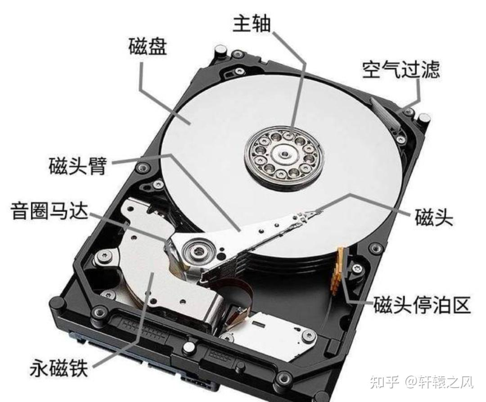

## 1.6 硬盘

硬盘是计算机用于长期存储数据的设备。无论是操作系统、软件程序、文档、照片，还是视频、游戏，都会保存在硬盘里。

### 1.6.1 作用

硬盘的主要作用是“长期储存数据”。

- 断电后，硬盘里的文件仍然会保留；
- 操作系统、软件、个人资料都跑在硬盘上；
- 当电脑打开文件时，数据从硬盘读取到内存，再由CPU处理。

与内存相比，硬盘更慢但容量更大；与CPU相比，硬盘更适合存储而不是计算。

### 1.6.2 分类

硬盘可以分为两类：机械硬盘（HDD）和固态硬盘（SSD）。

#### 1.6.2.1 机械硬盘（HDD）

机械硬盘内部有一个或多个快速旋转的磁盘，以及一个磁头在盘面上移动读写数据。它的优点是：

- 容量大，价格便宜；
- 适合存放大量文件、照片、视频和备份；
- 一般寿命较长，数据恢复可能性较高。

缺点是：

- 读写速度慢，开机启动和加载程序较慢；
- 机身有噪音，通电时会有转盘声音；
- 抗震能力差，跌落或震动容易损坏；
- 功耗较高，发热较大。

> 经典对比：机械硬盘就像传统仓库里的货架，容量很大但取东西需要时间；
> 固态硬盘更像办公桌，取东西快但空间有限。

#### 1.6.2.2 固态硬盘（SSD）

固态硬盘没有机械结构，主要由闪存芯片和控制器组成。它有以下优点：

- 读写速度快，系统启动和程序加载迅速；
- 没有噪音，功耗低；
- 抗震性好，适合笔记本和移动设备；
- 体积小，便于做成M.2、PCIe等小型接口。

它的缺点是：

- 单位容量价格比机械硬盘高；
- 写入寿命有限，长期大量写入会加速磨损；
- 一些旧型号兼容性较差。

固态硬盘的种类较多，常见的接口和协议有 SATA、PCIe、NVMe 以及 M.2。

### 1.6.3 硬盘接口与协议

硬盘与主板之间的连接方式非常重要，它决定了硬盘速度和兼容性。

- SATA 接口：
  - 主要用于机械硬盘和传统SATA SSD；
  - 典型传输速度为 6Gb/s（对应约 600MB/s）；
  - 适合普通存储、系统盘和大容量冷数据盘。

- M.2 接口：
  - 一种小型插槽，直接插在主板上；
  - 可支持 SATA 或 NVMe 协议；
  - 大多数现代笔记本和主板都支持 M.2 SSD。

- NVMe 协议：
  - 基于 PCIe 总线，可显著提高速度；
  - 常见速度范围从 1000MB/s 到 7000MB/s 以上；
  - 适合系统盘、游戏盘、专业视频编辑和大型软件加载。

- PCIe 接口：
  - 一些高端 SSD 会直接插在 PCIe 槽上；
  - 这种方式通常用于极限性能需求，但台式机中更常见。

简单总结：

- 机械硬盘通常使用 SATA 接口；
- 传统固态硬盘可使用 SATA 或 M.2 SATA；
- 速度最快的固态硬盘一般使用 NVMe + PCIe。

### 1.6.4 SLC、MLC、TLC、QLC 是什么？

这些术语描述的是固态硬盘内部闪存颗粒存储一个单元所代表的比特数：

- SLC（Single-Level Cell）：每个单元存储 1 个比特，速度最快、寿命最长，但价格最高；
- MLC（Multi-Level Cell）：每个单元存储 2 个比特，性能与寿命适中；
- TLC（Triple-Level Cell）：每个单元存储 3 个比特，性价比高，是目前主流消费级 SSD 的常见类型；
- QLC（Quad-Level Cell）：每个单元存储 4 个比特，容量更大但寿命更短，适合读多写少的存储场景。

对于大多数普通用户来说，

- 选择 SATA SSD 或 NVMe SSD 时，TLC 已经足够；
- 如果预算有限，可以选择带缓存的 QLC 固态硬盘；
- 高性能用户希望更高寿命时，SLC/MLC 更可靠，但价格更贵。

> [!TIP]
> 如果你只是日常办公、上网、看视频、玩游戏，那么选择 TLC SSD 就可以获得最好的性价比。

### 1.6.5 NAND 和控制器

固态硬盘实际上由两部分组成：

- **NAND 闪存颗粒**：负责存放数据；
- **控制器芯片**：负责把数据在计算机和闪存之间传输，并管理垃圾回收、磨损均衡、错误纠正等工作。

NAND 闪存就像书柜里的书籍，而控制器就是图书管理员。好的控制器可以让 SSD 更稳定、速度更快、寿命更长。

固态硬盘还会使用“缓存”来提高性能。常见缓存类型包括 DRAM 缓存和 SLC 缓存。带 DRAM 的 SSD 读取速度更稳定；没有 DRAM 的 SSD 价格更低，但在大文件写入时速度会出现波动。

### 1.6.6 硬盘性能指标与选购建议

选购硬盘时，可以重点看这些参数：

- 容量：
  - 机械硬盘适合 1TB、2TB、4TB 乃至更大容量；
  - 固态硬盘系统盘一般建议 256GB、512GB 或 1TB；
  - 如果要安装游戏和大型软件，建议 1TB 以上。

- 顺序读写速度：
  - 决定大文件读写效率；
  - SATA SSD 通常 500MB/s 左右；
  - NVMe SSD 可达到 2000MB/s、3000MB/s，甚至更高。

- 随机读写 IOPS：
  - 影响系统启动、软件打开、小文件读写等实际体验；
  - SSD 的随机读写性能远超 HDD。

- TBW（总写入字节数）：
  - 表示固态硬盘在寿命期间能写入的数据量；
  - TBW 越高，理论寿命越长。

- 缓存类型：
  - 如果预算允许，优先选择带 DRAM 缓存的 SSD；
  - 若追求最低价格，可选带 SLC 缓存的 QLC SSD。

- 接口兼容性：
  - 笔记本或主板需要支持 M.2 或 SATA；
  - M.2 接口还要区分是否支持 NVMe；
  - 购买前务必查看主板说明书和硬盘规格。

> [!CAUTION]
> 不能把机械硬盘和固态硬盘直接比较容量和价格，它们的定位不同。日常系统盘优先选择 SSD，海量存储优先选择 HDD。

### 1.6.7 硬盘安装与日常维护

硬盘安装前后都需要注意一些细节：

- 安装前断电，并接地防静电；
- 安装机械硬盘时，使用机箱螺丝固定，避免震动；
- 安装 M.2 SSD 时，注意拧紧支架螺丝，避免松动；
- 为硬盘留出散热空间，特别是高性能 NVMe SSD；
- 定期清理机箱灰尘，保持风道通畅。

日常使用时也要注意：

- 避免突然断电，特别是正在读写的硬盘；
- 定期备份重要数据；
- 不要频繁格式化或删除大量文件；
- 对机械硬盘，尽量不要移动或震动；
- 对固态硬盘，避免长时间持续大量写入（例如长时间运行下载任务、大量视频转码）。

### 1.6.8 常见故障与排查

硬盘出现问题时，先不要慌。常见情况和排查方法如下：

- 电脑无法识别硬盘：
  - 检查数据线和电源线是否插好；
  - 确认 BIOS/UEFI 是否识别到硬盘；
  - 如果是 M.2 SSD，检查主板是否支持该规格。

- 开机慢、程序加载慢：
  - 机械硬盘系统盘会明显慢于 SSD；
  - 如果固态硬盘速度变慢，可能是空间接近满载，建议腾出 10%-20% 空间；
  - 也可能是硬盘健康度下降，需要备份并更换。

- 磁盘噪音或异常震动：
  - 机械硬盘转盘运转中会有正常声音，但如果出现异响、卡顿或“咔哒”声，可能硬盘出现故障；
  - 立即备份数据，尽快更换硬盘。

- 数据丢失或文件损坏：
  - 首先停止对硬盘进行大量写入；
  - 尝试使用系统自带磁盘检查工具或第三方恢复软件；
  - 重要数据最好交给专业数据恢复机构处理。

### 1.6.9 数据备份与恢复

硬盘故障往往导致数据丢失，所以备份非常重要。

- 备份方式：
  - 外接移动硬盘备份；
  - 使用云盘、网盘保存关键文件；
  - 定期做系统镜像或完整备份。

- 备份频率：
  - 重要文档建议每天或每次修改后备份；
  - 常用软件和系统配置建议每周备份一次；
  - 大量数据（照片、视频）可以按月备份。

- 恢复建议：
  - 如果硬盘坏了，先检查是否能读取数据；
  - 如果只是系统故障，可考虑格式化后重装系统；
  - 若数据无法恢复，建议停止继续写入，避免覆盖原始数据。

### 1.6.10 选购建议

对于绝大多数初学者，建议采用“SSD+HDD”组合：

- 用 256GB-512GB 的 SSD 放系统和常用软件，获得流畅开机和快速响应；
- 用 1TB 或更大容量的 HDD 存储照片、视频、备份文件，兼顾容量与成本。

如果预算有限，至少把系统盘选成 SSD；如果追求极致性能，可选 NVMe SSD；如果需要海量数据存储，选择大容量机械硬盘。

> [!TIP]
> 对于笔记本用户，优先选择支持 NVMe M.2 的机型；对于台式机用户，优先考虑 SSD 做系统盘、HDD 做数据盘的混合搭配。
