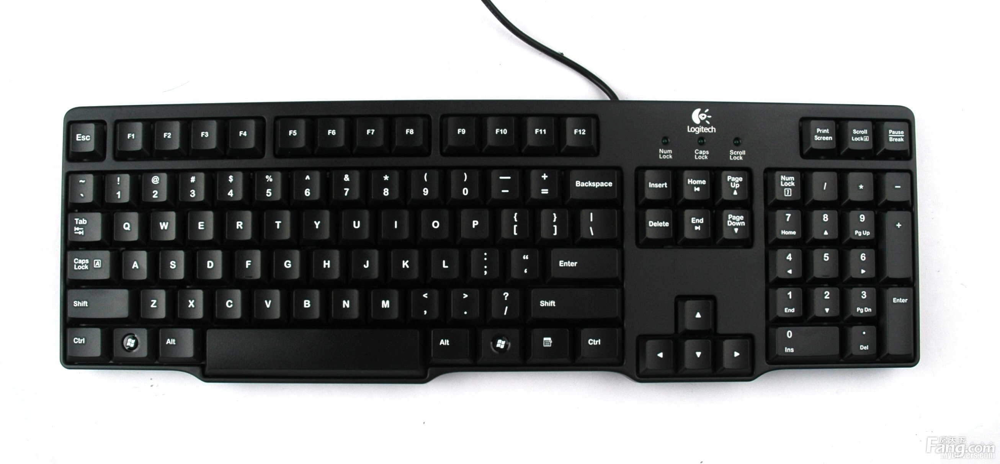

## 3.7 键盘

### 3.7.1 键盘的作用

电脑键盘是计算机核心输入设备，用于输入文字及控制指令。

键盘是最常用也是最主要的输入设备（其他的输入设备，参见[鼠标.md](鼠标.md)和[触控板.md](触控板.md)），通过键盘可以将英文字母、汉字、数字、标点符号等输入到计算机中，从而向计算机发出命令、输入数据等。还有一些带有各种快捷键的键盘。

掌握键盘使用技巧，是使用电脑的前提条件。

### 3.7.2 键盘的分类

键盘一般分为3类，分别是薄膜键盘、机械键盘和电容键盘。它们各有特点，适合不同的人群使用。

- 薄膜键盘

薄膜键盘的特点是声音小，重量轻，价格低。这种键盘无机械磨损，可靠性较高。薄膜键盘的受众人群较广，主要用于办公领域。目前该种键盘几乎随处可见，价格也非常便宜。

- 机械键盘

机械式键盘采用金属接触式开关的原理使触点导通或断开。机械键盘的每一颗按键都有一个单独的开关来控制闭合，这个开关也被称为“轴”，轴有很多分类，按压力度和行程也不尽相同，主要根据轴体颜色来进行区分。机械键盘适合使用需求更高，想要有更高输入体验的人使用，比如程序员、编辑人员电竞游戏类玩家，以及发烧友。

- 电容键盘

电容键盘属于纯高端键盘，价格昂贵且市场上稀少，一般特殊环境下使用的需求会更大，例如在医疗方面。

>[!TIP]
>虽然不同种类的键盘内部结构也有所差异，但它们的基本使用方式却并没有大的区别。建议无特别需求，直接购买薄膜键盘即可。

### 3.7.3 键盘的布局

当前最广泛使用的键盘布局模式是QWERTY键盘，又称柯蒂键盘、全键盘。由克里斯托夫·拉森·授斯（Christopher Latham Sholes）发明，1868年申请专利，1873年使用QWERTY布局的第一台商用打字机成功投放市场。该布局被沿用到后来的电脑键盘设计上，一直被广泛使用到今日。

当然，主流键盘除了字母按键之外，也包含一些特殊按键（如`shift`和`control`等）以及触控板。

>[!TIP]
>QWERTY键盘布局的目的是为了解决当时打字机因打字速度太快而卡壳的问题，实现“在不会卡死的情况下尽力提高打字速度”的目的，为此QWERTY键盘布局事实上降低了打字速度。Sholes的QWERTY键盘布局被英国打字机发展史方面的人认定为“有史以来最大的欺骗活动之一”，是“彻头彻尾的谎言”，虽然有些偏激，却也反映了事实的一部分。奇怪的是，那些与绍尔斯设计不同的、更为科学的键盘竟然被历史淘汰了，而人们却渐渐习惯于使用这种编排古怪的键盘。

### 3.7.4 键盘的使用

需要打字时，只需要按下键盘上相应的按键即可（不要一直按着，否则会同时打出太多相同的字符）。有关快捷键的使用，参见[常用快捷键.md](../../系统/常用快捷键.md)。

如果需要加快自己的打字速度，建议养成正确的指法，或者使用金山打字通等打字练习软件进行训练。长此以往，你的打字速度会得到快速提升，还可以尝试盲打。
