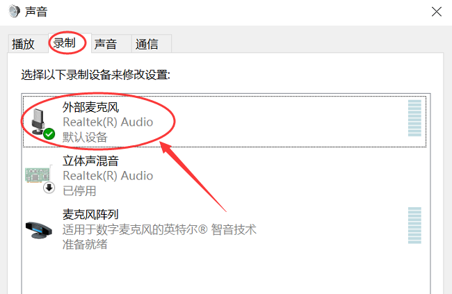

## 1.12 麦克风

麦克风是一种将声音转换为电信号的输入设备。它广泛应用于语音通话、视频会议、在线课堂、录音、直播和语音识别等场景。

### 1.12.1 麦克风的作用

麦克风的核心作用是“把声音变成电脑能识别的信号”。

- 说话时，空气中的声波会撞击麦克风的振膜；
- 振膜振动后，麦克风内部的元件将机械运动转换为电信号；
- 电脑通过声卡、USB 或蓝牙接收这些信号，再经过数字化处理后输出为声音、文字、文件等。

麦克风是语音交互的第一步。没有麦克风，语音会议、在线教育、语音搜索、直播、游戏语音等都无法正常工作。

### 1.12.2 麦克风的分类

麦克风可以按结构、安装方式、用途和指向性等多种方式分类。初学者最容易理解的分类如下：

- **按工作原理**
  - **电容式麦克风**：灵敏度高、频响好，常用于录音、播客、直播和专业场景；
  - **动圈式麦克风**：耐用、抗干扰强，适合现场演出、舞台和一般语音使用；
  - **驻极体麦克风（电容式的一种）**：常见于电脑、手机和耳机，自带供电，成本低，适合普通语音通话。

- **按接口和使用方式**
  - **内置麦克风**：笔记本、手机、平板等设备自带，方便但音质一般；
  - **USB麦克风**：直接插入 USB 接口即可使用，不需要额外声卡，适合普通用户和在线办公；
  - **3.5mm 麦克风**：通过耳机接口/麦克风接口连接，适合老旧电脑和专业麦克风；
  - **蓝牙麦克风**：无线连接，方便移动，但可能有轻微延迟；
  - **XLR 专业麦克风**：常用于录音棚、广播和专业直播，需外接声卡或调音台。

- **按用途与形态**
  - **耳机麦克风**：常见于游戏耳机、办公耳机，带有话筒臂，方便语音聊天；
  - **桌面麦克风**：放在桌面上使用，适合直播、录音、视频通话；
  - **领夹麦克风**：夹在衣领上，适合录制讲课、采访和演讲；
  - **枪式/指向性麦克风**：适合摄像和专业录制，需要对准声源。

> [!TIP]
> 对普通用户来说，最常见也最方便的麦克风是 USB 麦克风或耳机麦克风。它们无需专业音频设备即可直接开始使用。

### 1.12.3 麦克风的关键参数

了解麦克风的几个重要参数，有助于选择适合自己的产品：

- **指向性（拾音模式）**
  - **全向**：360°拾音，适合多人会议或环绕录音；
  - **心形**：前方拾音最强，后方拾音弱，适合单人录音或语音通话；
  - **超心形/卡迪奥德**：比心形更强调前方，适合收音环境更复杂时减少背景噪音；
  - **双向**：前后两侧拾音，适合对话录音。

- **频率响应**
  - 表示麦克风能拾取声音的频率范围，单位为 Hz；
  - 语音通常集中在 100Hz-8kHz 之间；录音、音乐需要更宽的频率响应范围。

- **灵敏度**
  - 反映麦克风将声音转换为电信号的能力；
  - 灵敏度越高，微弱声音越容易被拾取；但环境噪音也可能被带入。

- **信噪比（SNR）**
  - 表示麦克风信号与自身噪声的比值，数值越高越好；
  - 高信噪比意味着录音更干净，噪音更少。

- **采样率与比特深度**
  - 采样率常见 44.1kHz、48kHz、96kHz；
  - 比特深度常见 16bit、24bit；
  - 这些参数决定数字音频的精细程度，专业录音通常选择 48kHz/24bit 及以上。

### 1.12.4 麦克风的使用方法

正确使用麦克风，能让语音更清晰、噪音更少：

- **保持合适距离**
  - 如果是桌面麦克风，建议距离嘴巴 10-20 厘米；
  - 耳机麦克风通常贴近嘴角附近；
  - 过近会产生爆破音，过远会导致声音变小。

- **注意角度与位置**
  - 心形麦克风应对准声源正前方；
  - 领夹麦克风应夹在胸前约 15-20 厘米处，避免衣物摩擦声；
  - 内置麦克风尽量不要遮挡，保持设备正对自己。

- **控制环境噪音**
  - 选择安静的房间，关闭风扇、空调、电脑发出明显噪音的设备；
  - 远离窗户、门和喧闹区域；
  - 如果条件允许，可在桌面铺一层毛巾或防风罩，减少反射噪音。

- **保持声音稳定**
  - 讲话语速和音量尽量平稳；
  - 遇到“b”“p”“t”等爆破音，可稍微侧头，避免直接对着麦克风喷气；
  - 需要录音或直播时，先检查音量是否合适，避免过载导致失真。

- **软件设置**
  - 在系统设置或应用中选择正确的麦克风设备；
  - 调整输入音量、启用回声消除、噪声抑制等功能；
  - Windows 中可在“声音设置”->“输入设备”中检测麦克风输入；macOS 中可在“系统设置”->“声音”中检查。

### 1.12.5 麦克风的常见问题与排查

麦克风使用时常见问题包括：

- **没声音 / 无信号**
  - 检查麦克风是否已正确连接；
  - 确认系统选择了正确的输入设备；
  - 笔记本内置麦克风可能被误设置为静音或禁用；
  - USB 麦克风可能需要安装驱动程序。

- **声音小 / 录音太静**
  - 增加麦克风输入音量；
  - 减少录音距离；
  - 确认麦克风本身是否支持所需的灵敏度。

- **回声 / 噪音大**
  - 如果是语音通话，打开回声消除和噪声抑制；
  - 关闭周围噪音源；
  - 使用定向麦克风，减少周边声源拾取。

- **爆破音 / 嘶嘶声**
  - 尝试调整麦克风位置，不要正对嘴巴；
  - 使用防喷罩或海绵罩；
  - 说话时语气放松，避免突然大声喊叫。

- **延迟或不同步**
  - 主要出现在蓝牙麦克风或无线麦克风；
  - 优先使用有线 USB、3.5mm 或 XLR 接口；
  - 如果是直播或录音，建议选择延迟更低的设备。

> [!CAUTION]
> 如果麦克风本身没有问题，但软件里听不到声音，通常是系统权限、输入设备选择或驱动安装问题，而不是硬件故障。

### 1.12.6 麦克风的选购建议

购买麦克风时，应先明确用途：

- **语音通话/视频会议**：耳机麦或普通 USB 麦即可，价格亲民，使用方便；
- **录音/播客/直播**：推荐心形电容麦或专业 XLR 麦，搭配防喷罩、支架、声卡效果更佳；
- **游戏直播**：可选USB 麦和耳麦麦克风组合，兼顾语音沟通和直播录音；
- **语音识别/在线课堂**：优先选择带噪声抑制的麦克风，确保声音清晰。

购买时还要注意：

- **接口兼容性**：确定电脑是否有USB、3.5mm、Type-C 或 XLR 接口；
- **麦克风类型**：如果只需要简单语音通话，内置麦或耳机麦就够；如果需要录音，建议选择单独的桌面麦；
- **预算与品牌**：常见品牌有罗技、赛睿、百灵达、得胜、森海塞尔等；
- **是否附带配件**：优先选择带支架、防喷罩、连接线和收纳袋的套装。

### 1.12.7 常见麦克风搭配与使用场景

以下是几个常见的搭配建议：

- **办公 / 线上会议**
  - 内置麦克风或 USB 便携麦；
  - 使用耳塞或头戴式耳机搭配能减少回声。

- **游戏语音聊天**
  - 游戏耳机自带麦克风，方便沟通；
  - 如果对声音质量有更高要求，可选独立 USB 麦。

- **内容创作 / 直播**
  - 桌面电容麦 + 防喷罩 + 可调支架；
  - 需要保证麦克风与嘴巴的距离稳定，并注意房间的声学环境。

- **录音 / 采访**
  - 领夹麦或指向性麦克风；
  - 适合讲课、采访、录制手机短视频时使用。

### 1.12.8 维护与保养

麦克风维护主要是保持清洁和避免损坏：

- 定期擦拭麦克风外壳和防喷罩；
- 不要用力拉扯数据线，避免线缆折断；
- 蓝牙麦克风需要注意电池充电和防潮；
- 录音后及时保存音频文件，避免数据丢失。

> [!TIP]
> 选择适合自己的麦克风，比追求最高音质更重要。清晰、稳定、易用，才是日常语音应用的首要目标。
