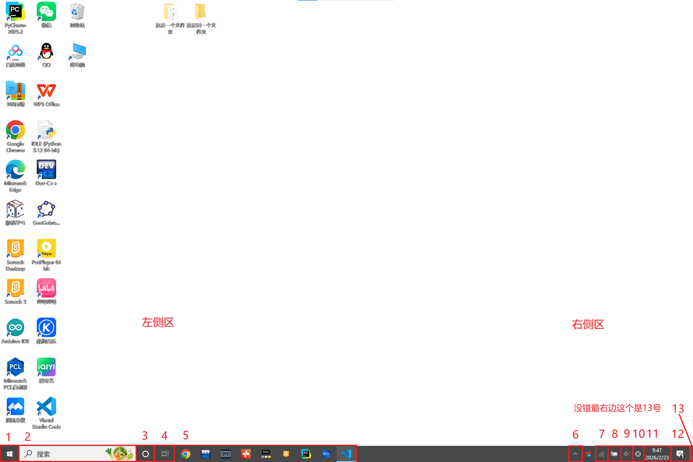

## 2.6 任务栏

任务栏通常位于桌面最下方，是一个长条。最左侧有一个Windows图标，最右侧显示了时间、通知、电量、声音等。

我们把它们分别编号，以方便介绍，如上。

### 2.6.1 开始

单击最左侧的Windows图标，一个界面会从这里升起。

#### 2.6.1.1 最左栏

如上图，最左侧下方有五个按钮。最下方的“电源”键用于关机，左键单击它会出现三个选项：睡眠、关机、重启。字如其意，不做赘述。

>[!TIP]
>你可能认为使电脑关机和开机一样，只需要长按电源键即可，但正确的关机方式应该是上述开始界面-电源-关机选项。长按电源键当然也可以关机，但这被称作“强制关机”，二者原理不一样。单击系统的关机键是在对系统发出指令，此后系统会有条不紊地关闭各项程序并安全地关机。在对硬件有更多了解后，你会了解到强制关机的原理是向底层的BIOS发去指令，强制给CPU断电。只有在系统卡死，正常关机无法执行时才能使用强制关机。虽然大部分情况下强制关机并不会对电脑造成损害，但是还是有概率损坏数据乃至损坏电脑的。不要拿强制关机当正常关机使！

下数第二个“设置”键可以进入设置页面，详见2.-设置与个性化。

下数第三个和第四个“图片”“文档”键连接到默认库“图片”和“文档”，如果你的文件没有存放在这两个位置，这两个按键不常用。

第五个“账户”键可以进行账户设置，或在这台电脑上锁定或注销当前账号。

#### 2.6.1.2 应用区

#### 2.6.1.3 磁贴区