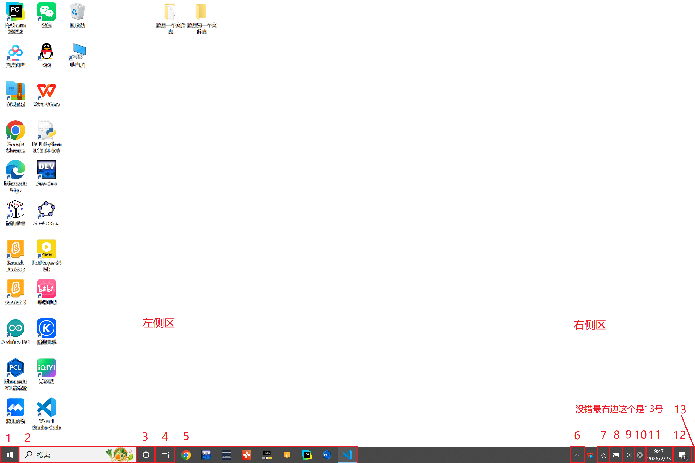
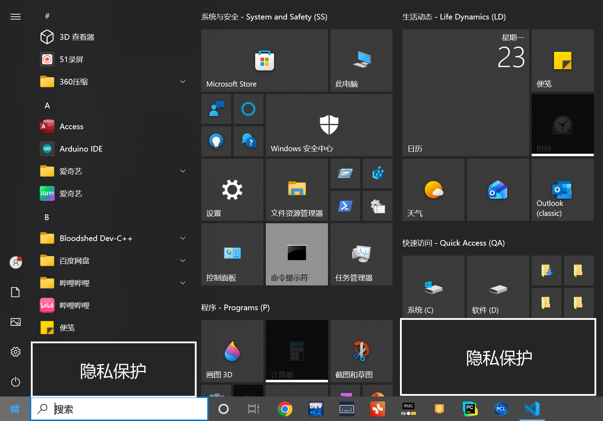
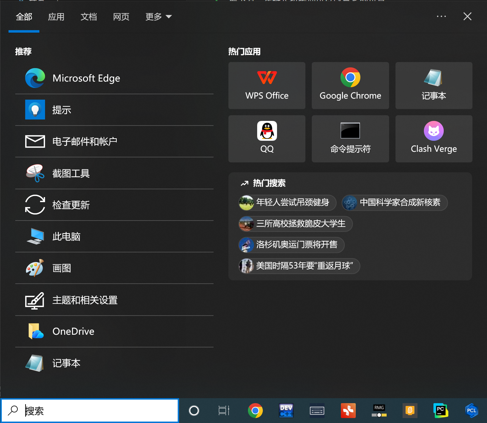
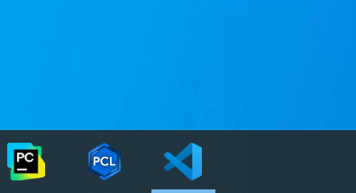
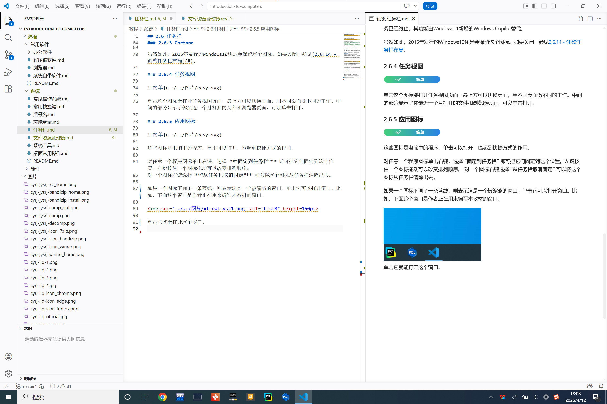
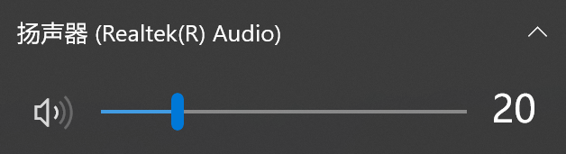
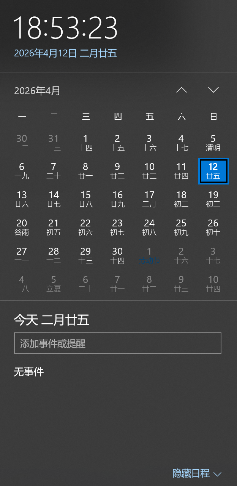
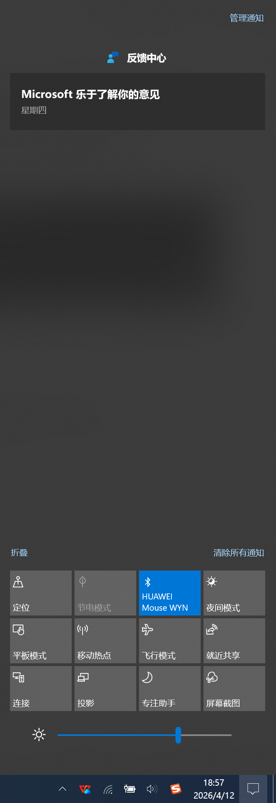
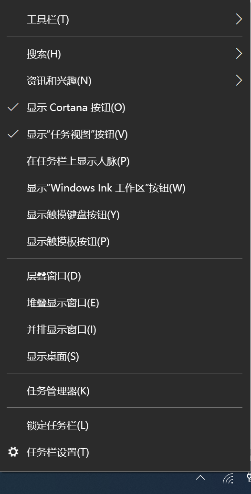
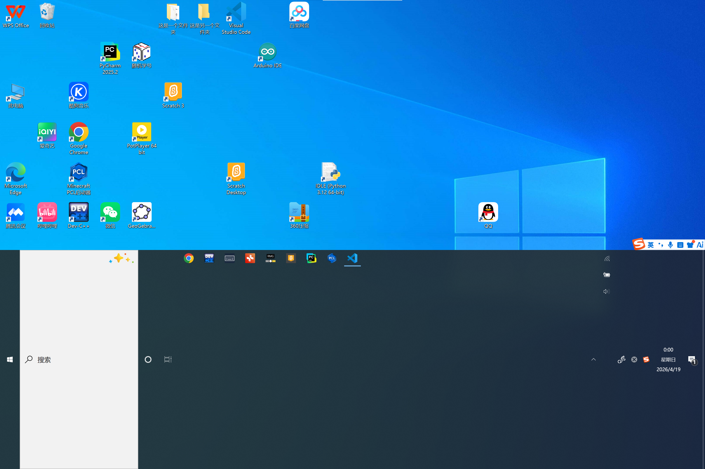

## 2.6 任务栏

任务栏通常位于桌面最下方，是一个长条。最左侧有一个Windows图标，最右侧显示了时间、通知、电量、声音等。任务栏允许个性化，因此你的电脑上它可能与本教材上不一样。如果遇到这样的情况，跳过不一样的地方即可。

我们把这些图标分别编号，以方便介绍，如上。

### 2.6.1 开始

单击最左侧的Windows图标，一个界面会从这里升起。

#### 2.6.1.1 最左栏

如上图，最左侧下方有五个按钮。最下方的“电源”键用于关机，左键单击它会出现三个选项：睡眠、关机、重启。字如其意，不做赘述。

>[!TIP]
>你可能认为使电脑关机和开机一样，只需要长按电源键即可，但正确的关机方式应该是上述 **“开始界面-电源-关机”** 选项。长按电源键当然也可以关机，但这被称作“强制关机”，二者原理不一样。
>
>单击系统的关机键是在对系统发出指令，此后系统会有条不紊地关闭各项程序并安全地关机。在对硬件有更多了解后，你会了解到强制关机的原理是向底层的BIOS发去指令，强制给CPU断电。只有在系统卡死，正常关机无法执行时才能使用强制关机。
>
>虽然大部分情况下强制关机并不会对电脑造成损害，但是还是有概率损坏数据乃至损坏电脑的。不要拿强制关机当正常关机使！

下数第二个 **“设置”** 键可以进入设置页面，详见[2.-设置与个性化](#)。

下数第三个和第四个 **“图片” “文档”** 键连接到默认库 **“图片”** 和 **“文档”**，如果你的文件没有存放在这两个位置，这两个按键不常用。

第五个 **“账户”** 键可以进行账户设置，或在这台电脑上锁定或注销当前账号。

#### 2.6.1.2 应用区

左侧第二列是一些电脑中的软件和文件夹，以字母顺序排列，起到快捷方式的作用。有的软件在安装时会自动把路径添加到这里。

特别地，如果你下翻到 **“W”** 字母区，你会发现一系列与Windows系统有关的文件夹，此后学习的一些系统工具可以从这里方便地打开，例如Powershell、任务管理器等。

#### 2.6.1.3 磁贴区

右侧的一个个方形排成的区域叫作磁贴区，这是一个可以个性化的区域。

这些方形图标叫作 **“磁贴”**，单击可以迅速启动程序或跳转到文件夹中。要添加磁贴，你可以对应用或文件夹右键，在弹出的列表中选择 **“添加到‘开始’屏幕”** 来将它变成磁贴，新磁贴会出现在磁贴区最下方，左键长按拖动可以改变它的位置。

要将一个磁贴清除，右键点击这个磁贴并选择 **“从‘开始’屏幕取消固定”** 即可。这只会将磁贴从开始屏幕去除，不会删除程序或文件。
有的磁贴可以设置为不同的形状，例如长方形或大正方形，右键点击这个磁贴并在 **“调整大小”** 中选择即可。

磁贴可以分组，给这些分组命名可以使开始界面更为美观和方便，就像本节刚开始的那张图片那样。

### 2.6.2 搜索框

有的电脑不会显示搜索框，这主要依据个人习惯。如果想要调整显示与否，参见[2.6.14 - 调整任务栏布局](#)。

单击搜索框可以在这里输入要搜索的内容。这里可以搜索系统内的文件或程序，如果系统中没有这样的程序，那么会显示通过Microsoft Edge浏览器搜索到的网络内容。
在此栏上方选择 **“应用” “文档”** 等选项可以限定搜索的范围。

最右侧的图标是Microsoft Edge的每日推荐，通常是世界景点、节日等。

### 2.6.3 Cortana

Cortana是微软的语音助手，类似于苹果的Siri等。但是由于ChatGPT的影响，2023年8月其服务已经终止，其功能由Windows11新增的Windows Copilot替代。

虽然如此，2015年发行的Windows10还是会保留这个图标。如要关闭，参见[2.6.14 - 调整任务栏布局](#)。

### 2.6.4 任务视图

单击这个图标能打开任务视图页面，最上方可以切换桌面，用不同桌面做不同的工作。中间的部分显示了你最近一个月打开的文件和浏览器页面，可以单击打开。

### 2.6.5 应用图标

这些图标是电脑中的程序，单击可以打开，也起到快捷方式的作用。

对任意一个程序图标单击右键，选择 **“固定到任务栏”** 即可把它们固定到这个位置。左键按住一个图标拖动可以改变排列顺序。
对一个图标右键选择 **“从任务栏取消固定”** 可以将这个图标从任务栏清除出去。

如果一个图标下画了一条蓝线，则表示这是一个被缩略的窗口。单击它可以打开窗口。比如，下面这个窗口是作者正在用来编写本教材的窗口。

单击它就能打开这个窗口。

>[!TIP]
>如果你想知道，这个软件叫作Visual Studio Code。对编程感兴趣的话，你可能会用到它。

### 2.6.6 更多图标

这个上箭头表示缩略的一些图标，可能是应用的快捷方式，例如微信、QQ、安全软件等，可以快速打开。

### 2.6.7 连接网络

此处可以请教家中长辈如何使用。打开后，会显示可用的网络，找到自己家里的网络或移动热点，输入密码后即可连接。

下方也有一些选项：

**“WLAN”** 选项可开关WLAN连接。

**“飞行模式”** 选项可以开关飞行模式。

**“移动热点”** 选项可以开关本机移动热点。

此外，点击 **“网络和Internet设置”** 可以快速跳转到设置（详见链接）中的网络设置页面。

### 2.6.8 电源与电量

点击此图标可以显示当前电量，剩余续航时间（或至电量充满需要的时间）和电源模式。

**“电源模式”** 可以设置电脑如何使用电量，比如获得更长续航或更好的性能。

**“电池设置”** 可以快速跳转到设置（详见链接）中的电池设置页面。

### 2.6.9 扬声器设置

左侧喇叭按钮可以设置静音与否，中间滑块可以调整音量，而上方扬声器选项用于在连接了多个扬声时，选择使用的扬声器。

### 2.6.10 输入法

左键单击这里可以切换输入法。

**“语言首选项”** 可以跳转到设置中的语言首选项部分，详见链接。

### 2.6.11 时间和日期

这里显示了时间、日期、日历和日程，不做赘述。

### 2.6.12 通知和快速操作

这个页面上方显示了收到的通知（例如微信和QQ的消息、电子邮件等）。

**“管理通知”** 可以跳转到设置的通知和快速操作部分。

**“清除所有通知”** 可以清除这里显示的通知。

下方称为 **“快速操作”**。其中如飞行模式、移动热点等已经介绍过。

其中，**“连接”“投影”** 可以搜索可用于连接和投屏的设备，并选择连接。如果要将电脑屏幕投屏到电视上等地方，需要在电视上找到投屏指南，根据指南操作，不同品牌的步骤可能不一样。

最下方滑块可以调整亮度。

点击 **“折叠”** 可以将快速操作部分折叠起来。

### 2.6.13 快速显示桌面

仔细看，任务栏最右侧有一个亮条。如果你正在使用程序，将鼠标悬浮到这里可以暂时地显示桌面，左键单击则会最小化所有窗口并显示桌面。

### 2.6.14 调整任务栏布局

在上述学习过程中，你可能已经发现你的任务栏和本书用于介绍的任务栏不一样，这很正常。下面将教学如何个性化你的任务栏。

在任务栏空白（没有图标的）区域单击右键，会出现以下选项，我们将选择性介绍。

**“工具栏”** 可以在任务栏显示地址（即文件路径）、桌面（即桌面上的文件）、链接（系统默认的链接文件夹）工具栏，但很少使用。

**“搜索”** 和 **“资讯和兴趣”** 可以控制任务栏是否显示由Microsoft Edge提供的搜索和资讯内容。比如，教材示例的电脑中开启了搜索功能（详见[2.6.2 - 搜索框](#262-搜索框)）。如果开启资讯和兴趣，Microsoft Edge会在任务栏展示一些新闻、股市信息（你没看错，就是股市）等。

**“显示Cortana按钮”** 如果被勾选，将会在任务栏上显示Cortana。但是鉴于Cortana已经停止服务，你大可直接关闭它。

**“显示‘任务视图’按钮”** 可以开启[2.6.4 - 任务视图](#264-任务视图)。

**“显示‘Windows Ink 工作区’按钮”** 适用于将Windows安装在平板上时（微软有平板产品）。这时，你可以像使用iPad一样用触控笔操控Windows。

**“显示触摸键盘按钮”** 和 **“显示触摸板按钮”** 适用于支持屏幕触控的电脑。启用后会在屏幕上显示键盘和触摸板（详见[1.9 - 触控板](../硬件/触控板.md)）。

**“层叠窗口”** **“堆叠显示窗口”** **“并排显示窗口”** **“显示桌面”** 可以快速调整已经打开的窗口布局或显示桌面，可以点击尝试，看作用效果。

**“任务管理器”** 可以启动任务管理器，详见[2.7.1 - 任务管理器](系统工具.md)

**“锁定任务栏”** 用于锁定任务栏的大小。如果没有启用，任务栏的上边缘可以拖动以改变宽度，这时如果不小心拖动了任务栏上边缘，会把桌面搞得一团乱。

锁定后就不会如此。

**“任务栏设置”** 会跳转到设置中有关任务栏的页面，详见。