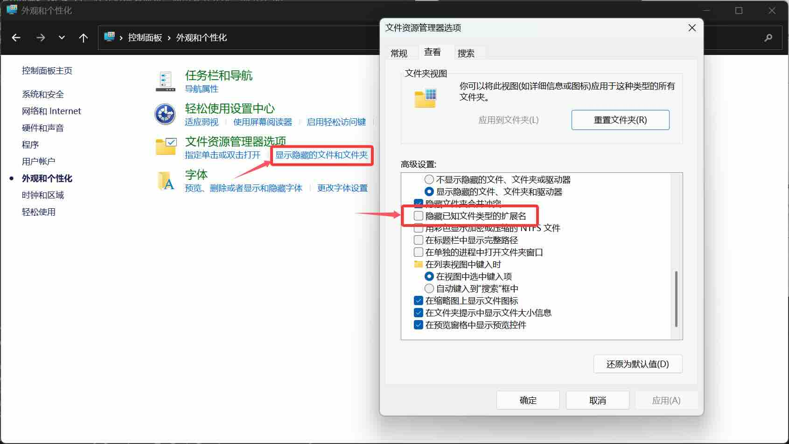

## 2.4 后缀名

### 2.4.1 定义

后缀名，又称文件扩展名。用于区别不同类别的文件，并指导系统使用对应的软件处理该文件。

### 2.4.2 如何查看？

一般情况下，Windows系统默认是不显示文件后缀名的。

对于Windows 10 & 11，打开后缀名显示，通用且方式统一的方法为：
- 搜索框搜索`控制面板`
- 打开`外观与个性化`一栏
- 选择`显示隐藏的文件和文件夹`
- 在打开的窗口中下拉，找到`隐藏已知文件类型的扩展名`，并取消选择（如图所示）

还有一种相对简单的方法，但是Windows 10与11有一些区别。下面以Windows 11为例做演示。

- 在文件资源管理器上方，选择`查看`
- 下拉栏中选择`显示`，并勾选`文件扩展名`

>[!TIP]
> 我们非常、非常、非常推荐你打开扩展名显示。

### 2.4.3 常见误区

更改扩展名并不会更改文件里的**任何**内容，它只会影响系统决定使用什么软件打开该文件。

至于扩展名更换后无法正常打开？因为不同类别的文件是有不同的数据结构的，换一个风马牛不相及的软件无法理解这种数据结构，自然无法打开该文件。

有极少一部分的文件类别可能可以互相兼容，例如大部分情况下，`.jpg`文件和`.png`文件互换后缀名也可以正常打开。

非特殊情况请勿随意更改后缀名。如果你认为更改后缀名是必要的，建议在原后缀名后紧跟新后缀名，而非删除原后缀名。[原理见下。](#234-哪个是后缀名)

### 2.4.4 哪个是后缀名？

有时我们可能看到一个类似`.docx.exe`或者`.txt.vbs`之类的后缀名。

请注意，只有**最后一个**`.`符号后的内容为该文件的后缀名。例如上文中的`.exe`和`.vbs`。

### 2.4.5 与软件建立联系

一个后缀名是如何与对应的软件建立联系的？

其实，后缀名是由注册表的`HKEY_CLASSES_ROOT`项控制的。但是我们不需要知道这么深入的内容。

系统在打开一个未知的文件的时候，会弹出如上图所示的窗口来提示我们，让我们选择一个软件来打开该文件。

当我们选择“仅一次”的时候，系统并不会将该后缀名与软件建立联系。但是，如果选择“始终”，那么该后缀名就会与该文件建立联系。

如果你想要更换与该后缀名建立联系的软件（默认软件），那么可以右键点击任意一个该后缀名的文件，选择“打开方式” --> “选择其它应用”，然后选中对应的软件，点击“始终”。

### 2.4.6 遇到陌生的后缀名

有时我们会在电脑中发现一些没有见过的后缀名，并且没有相对应的软件来打开它。

这个时候你可以寻求一些三方网站的帮助，来查询该后缀名对应的软件。

这里推荐一个网站（真不是打广告）：https://filefans.com/