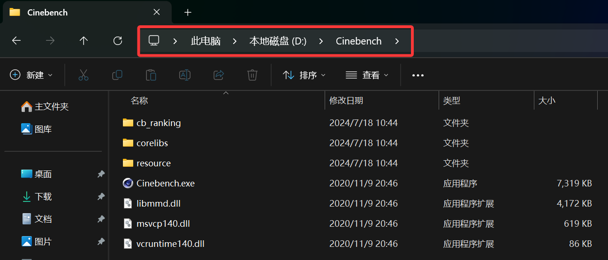
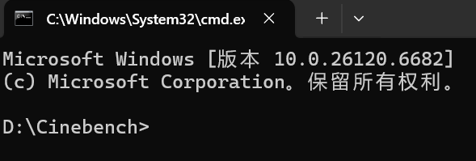

## 2.2 常用快捷键

所有该文档中指示的快捷键，均以加号（+）来连接两个不同的按键。

例如：`Ctrl`+`Shift`+`Del`，即为`Ctrl`, `Shift`, `Delete`三个键

部分按键会有其缩写形式，例如Del(Delete)，在下文中会有说明。

其他软件的常用快捷键，详见[“常用软件”](../常用软件)部分。

### 2.2.1 快捷键操作方法

所有快捷键在操作时，都应当注意以下两点：
- 依次，按照从前到后的顺序
- 在按下下一个键后，不要松开之前所按下过的键，否则你需要从头再来一次

如果你认为正确按下了一个快捷键，但是电脑并没有反应，一般而言有几种可能：
- 你按错了，请再重试一次（但是不要反复按）
- 这个快捷键是静默的（它在操作完之后不会给你任何反馈，但是实际上它已经完成了任务）
- 电脑暂时死机了，这就是为什么不要反复按快捷键，很有可能机器恢复正常后会瞬间执行你之前按下过的所有快捷键，然后把电脑搞得一团乱麻

### 2.2.2 复制、粘贴与剪切

这三个是应用最广泛的一组快捷键，几乎所有软件所有平台支持。

#### 2.2.2.1 复制

快捷键为`Ctrl`+`C`。 复制选中的项目（鼠标长按并拖拽而选中的文本，图片，资源管理器中的文件等等）至剪切板。 如果被复制的项目在被粘贴前又再次执行了复制，则会丢失。原文件不会丢失。

#### 2.2.2.2 粘贴
快捷键为`Ctrl`+`V`。 将你之前复制的内容粘贴（创建一模一样的副本）至新的选中区域。

#### 2.2.2.3 剪切
快捷键为`Ctrl`+`X`。 功能为复制+删除，在文档中，被复制的内容会被从文档中删除；在文件资源管理器中，文档会显示半透明，并且在粘贴操作完成后被删除；如果在粘贴前复制或剪切了其他内容，则原先剪切的文档会被还原至原来的位置。 对于网页等无法剪切的部分，剪切操作不起效果。

### 2.2.3 全选

快捷键为`Ctrl`+`A`。 选中文档中所有内容或者文件资源管理器中该目录下的所有内容等等。便于大批量的操作。

### 2.2.4 保存

快捷键为`Ctrl`+`S`。 在绝大部分的软件中，它会将你在软件内创作的内容保存至一个文件里。部分软件是没有自动保存的功能的，所以定期按一下Ctrl+S会很有用。

### 2.2.5 删除

#### 2.2.5.1 放入回收站

快捷键为`Delete`。 `Delete`在键盘右上角位置，标识为`DEL`。 选中一个或多个文件并单击`Delete`，会将文件放入回收站。回收站中的文件可以被找回。

#### 2.2.5.2 直接永久删除
快捷键为`Shift`+`Delete`。 使用该快捷键删除文件，将直接跳过回收站，永久删除该文件。

>[!CAUTION]
>永久删除会导致文件难以被找回，或者直接无法找回。如果你不是万分确定你删除的文件完全无用，请不要直接使用永久删除。

#### 2.2.5.3 文件中删除内容
不同软件快捷键不定，可以尝试`Delete`和`Backspace`（俗称删除键）。

### 2.2.6 快速“退出”（闪退）

在大部分应用中，`Alt`+`F4`这个快捷键被用来使软件抛出错误并闪退，以用于软件开发时的测试。你也可以用它来快速退出一个软件。

>[!TIP]
> `Alt`+`F4`只是软件开发人员间的共识，并不是任何形式的强制性规定。部分软件此快捷键无效果。
> 更少一部分的软件按下`ESC`键也会有此效果（例如，截屏，输入法）。

### 2.2.7 进入安全选项

快捷键为`Ctrl`+`Alt`+`Del`。

在安全选项中，你可以注销、切换用户、锁定电脑。

但是，最常用的还是打开任务管理器。

另外，它还有一个妙用：如果电脑卡死了，你可以尝试多按几次这个快捷键。如果电脑没有反应，就代表该[强制关机](../硬件/杂项.md#111-强制关机)了。

### 2.2.8 快速打开任务管理器

快捷键为`Ctrl`+`Shift`+`Esc`。

关于任务管理器的更多内容，详见[系统工具](系统工具.md)。

### 2.2.9 截屏

快捷键为`Win`+`Shift`+`S`。

Windows系统自带了截屏工具，并且在截屏后会将图片放入剪切板中。

按下快捷键后，长按鼠标拖动并选中你想要截屏的地方。取消截屏，单击`Esc`键即可。

另外，`Prt Sc`键也可以快速触发截屏（位于功能键区，在键盘右上角）。关于键盘功能区的更多说明，参见[硬件-键盘](../硬件/键盘.md#173-键盘的布局)。

>[!TIP]
>
>说实话，我并不推荐你使用系统自带截屏（真的很难用）。如果不在意的话，我更推荐使用QQ自带截屏工具。登录QQ之后，按下`Ctrl`+`Alt`+`A`，即可快速截屏。操作逻辑类似系统自带截屏。

### 2.2.10 快速切换

#### 2.2.10.1 快速切换软件

快捷键为`Alt`+`Tab`。

按下`Alt`+`Tab`之后，**`Alt`键不松手**，连续短按`Tab`，可以在不同的软件之间快速切换。

#### 2.2.10.2 快速切换桌面

快捷键为`Win`+`Tab`。

Windows 10 & 11新增了一项创建多个桌面的功能，用户可以将不同的软件放在不同桌面上，并且在多个桌面之间来回切换。*不要与多显示器混淆！*

按下`Win`+`Tab`之后，**`Win`键不松手**，连续短按`Tab`，可以在不同的桌面之间切换。

### 2.2.11 打字相关

#### 2.2.11.1 切换中英文

短按`Shift`，可以**在输入状态下**切换中英文输入。

#### 2.2.11.2 切换输入法

快捷键为`Win`+`Space`（空格）。

按下`Win`+`Space`之后，**`Win`键不松手**，连续短按`Space`，可以在不同的输入法之间切换。

### 2.2.12 粘滞键

#### 2.2.12.1 粘滞键作用

粘滞键允许你通过一次按下一个键的方式使用以上的快捷键。不需要同时按下所有键，但是仍然需要按顺序按下。

启用粘滞键时，如果你通过同时按下的方式操作了一个快捷键，则粘滞键会自动退出。

#### 2.2.12.2 粘滞键启动

连续快速按下5次`Shift`按键，粘滞键就会启动。

#### 2.2.12.3 避免启动粘滞键

*你是否在玩Minecraft时常常启动粘滞键？*

在系统设置中，查找设置`粘滞键`，或者手动查找`辅助功能 --> 键盘 --> 粘滞键`，关闭“粘滞键的键盘快捷方式”。

### 2.2.13 系统搜索

直接按下`Win`键，然后直接输入你想在系统内搜索的内容。无需使用鼠标选中搜索框。

### 2.2.14 快速打开设置

快捷键为`Win`+`I`。

该快捷键用于打开系统设置。

### 2.2.15 “运行”-系统工具

*没错，这个工具的名称就叫`运行`。*

快捷键为`Win`+`R`。

通常用于快速打开一些系统工具，也可以打开其他文件（需要绝对路径），打开网页等。

一般而言，用它打开cmd或taskmgr的频率更高。

### 2.2.16 在当前路径下打开CMD

在文件资源管理器中，有时可能会遇到想要在当前的目录下直接运行CMD，而不是打开CMD再cd到当前目录。

此时可以在路径（下图红框）中**删除原有的路径**，输入cmd，然后回车。

效果如下：

### 2.2.17 重命名

在文件资源管理器中，鼠标单击选中一个文件之后，键盘单击`F2`键，即可快速重命名。
