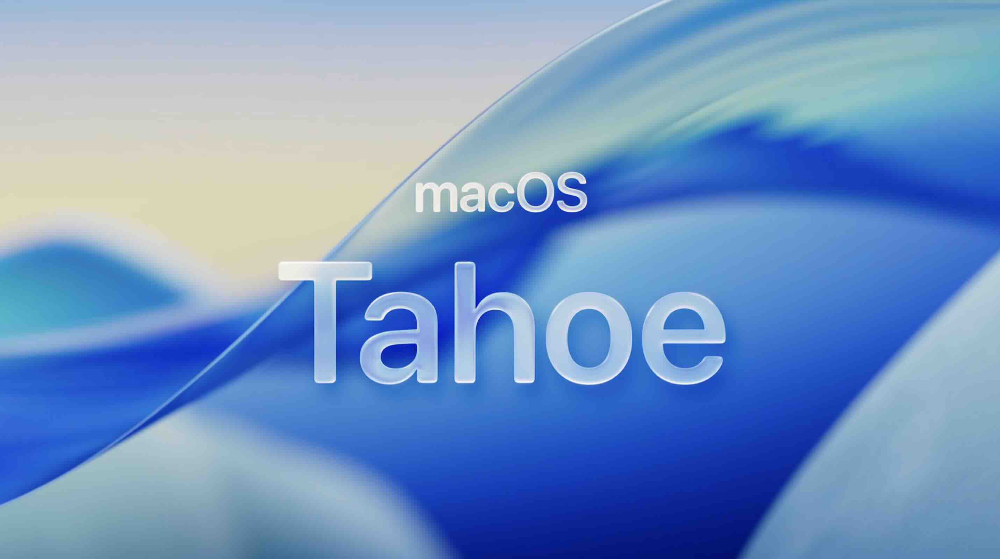
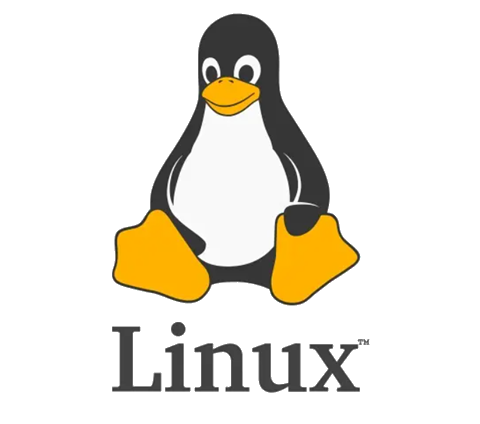
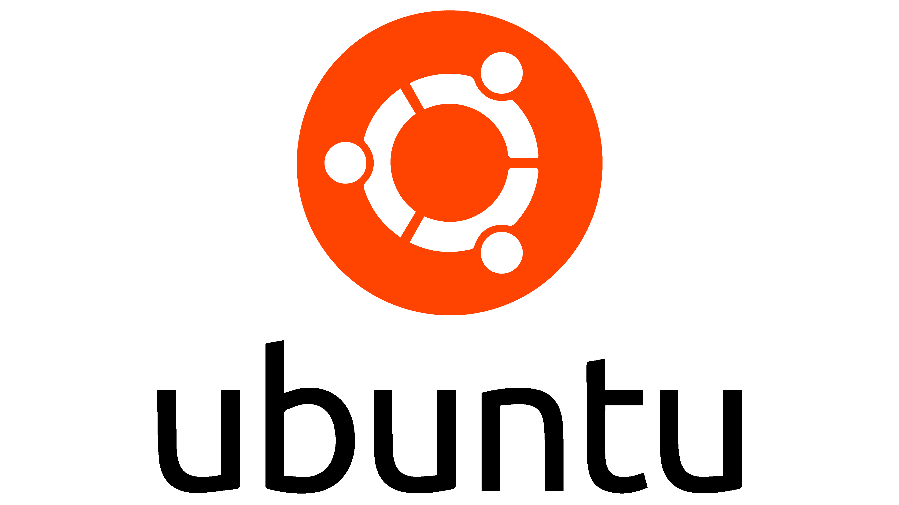
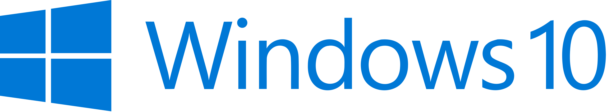
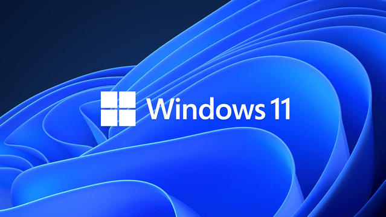
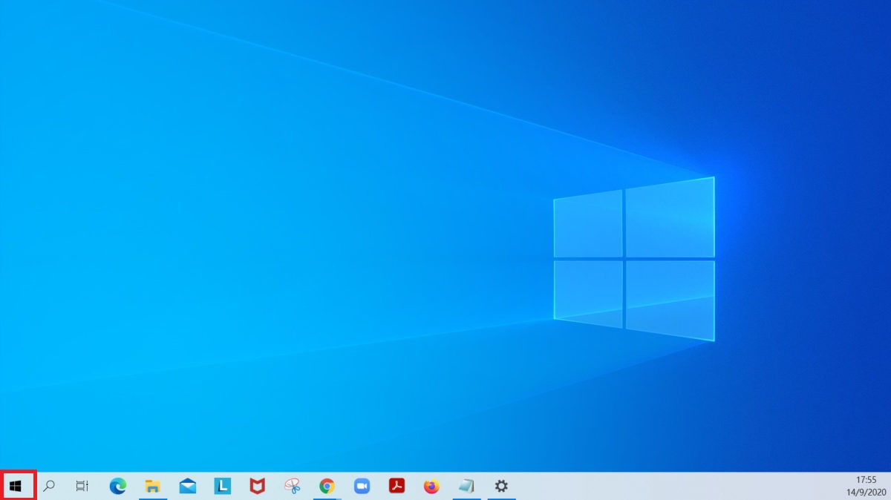
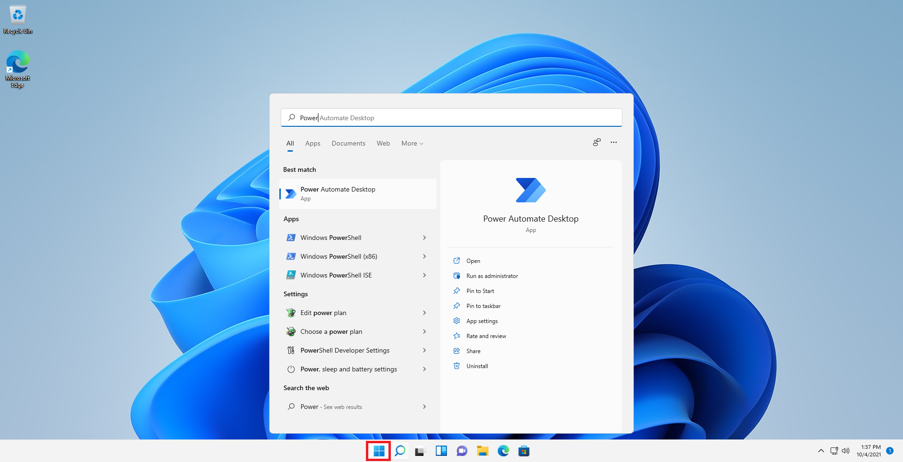
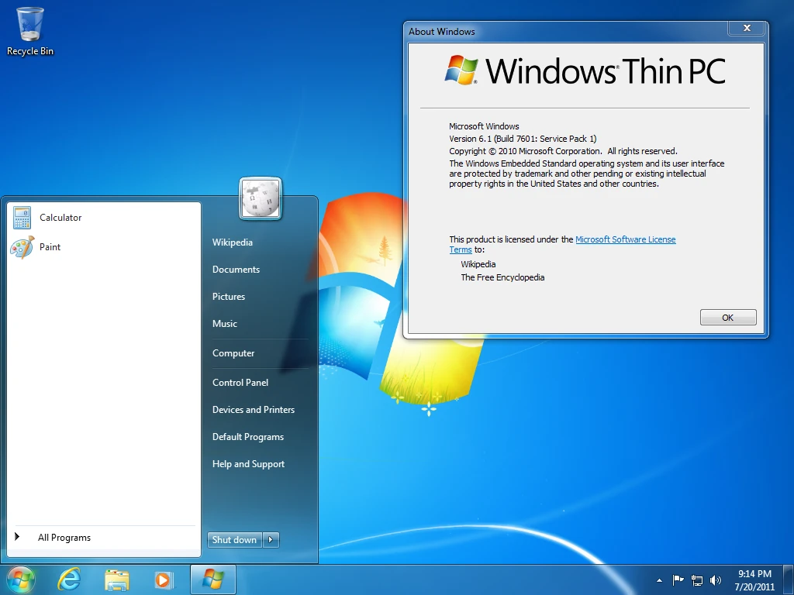

## 2.1 常见操作系统

### 2.1.1 操作系统的定义

操作系统 (Operating System, OS) 是连接电脑硬件和用户所用软件的系统层软件，兼有管理硬件资源、提供用户交互接口、运行应用程序等作用。

市面上常见的操作系统有Windows, macOS, Linux等。其市场份额占比约为70%, 15%与5%。

### 2.1.2 Windows

Windows是由微软 (Microsoft) 发布的桌面操作系统，目前在市场占有率上有绝对优势。

市面上的几乎所有不是苹果的电脑都预装Windows，其市占率之大可见一斑。

与macOS和Linux相比，其优势有：

- 极强的软硬件兼容性
- 高自由度
- 丰富的软件生态，体现在：
    - 绝大部分游戏在Windows上运行
    - 部分政企办公、工业工程软件只能在Windows上运行

劣势有：

- 用户多，成为病毒或恶意软件的主要目标，需安装**合适的**防护软件
- 盗版泛滥（不推荐使用，有安全风险）

### 2.1.3 macOS

macOS是由苹果 (Apple) 发布的桌面操作系统，内置在苹果自己的桌面端产品，如MacBook, iMac, Mac mini, Mac Pro, Mac Studio等中，其余途径获取均为盗版，一般称“黑苹果”，获取难度大，不推荐使用。

许多创意工作者（平面设计、音乐制作、视频剪辑）与办公用户使用macOS。

macOS优势有：
- 安全、稳定、流畅
- 界面与iOS, iPadOS风格统一，灵动美观
- 生态良好，和iPhone, iPad间可以使用苹果的Handoff与AirDrop服务快速同步文件与工作进度
- MacBook便携性与性能良好

劣势有：
- 自由度低
- 游戏、高级工程工业用软件支持少

### 2.1.4 Linux

 

Linux并不特指某一款操作系统，而是一款开源的系统内核，正因此，Linux有上百种发行版，个性化空间大。Ubuntu是Linux最常用的发行版之一。

全球90%以上的服务器使用Linux，后端开发者也有很多使用Linux。

Linux优势有：
- 免费开源、轻量化
- 安全性强
- 熟练的用户几乎完全掌握系统

劣势有：
- 学习成本很高
- 不太适合开发以外的工作

### 2.1.5 识别操作系统

由于本教程针对Windows10 & Windows11编写，因此首先需要学会识别你使用的是什么操作系统。

首先，识别是否是Windows系统。所有Windows系统左下角都会有一个窗户形状的标志。

 

如果你看到这些标志的其中一个，那么你的系统就是Windows系统。此外，Mac系统的桌面是这样的（具体图标会有差异）。

其特色就是左上角有一个苹果LOGO，下方有一个名叫“程序坞”的工具栏。如果你使用iPhone或者iPad，你会发现它们的桌面和Mac桌面很相似。Mac系统一般只装在苹果电脑上，如果你的电脑是苹果电脑，那么它的系统桌面应该就是这样。

本教程不包括Mac系统的教学，若你的系统是Mac，那么本教程不适合你。

至于Linux，一般人通常不会接触到，因此不作说明。

接下来，识别是否是Windows10或Windows11。

以下两张图片分别是Windows10和Windows11的图标。

这两个像窗户的图案会出现在屏幕下方的任务栏，如下图中红框圈出的部分。

如果你的桌面是这样的，那么你的电脑系统符合本教材的要求。

顺带一提，另一个比较常见的Windows版本是Windows7，其桌面如下。

它的大部分操作和本教程所介绍的是一样的，但由于年代久远（2009年发布），所以本教程不用它来演示。实际上，你如果会使用一个版本的Windows系统，那么你大概率会使用其他同系列的系统。

>[!TIP]
> Windows系列始于1985年的Windows1.0，它首次尝试为个人电脑引入图形用户界面（否则你将不能使用鼠标点击屏幕上的图案来使用电脑，而是要背诵并输入指令！）。它后来又发展出3.0、95、XP、Vista和Windows7、Windows8、Windows10、Windows11等版本。这个系列不包括Windows9，比较可信的说法是微软公司认为10作为第一个整十数比较有里程碑意义，所以跳过了编号9。Windows10也确实是一个划时代的版本。