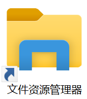
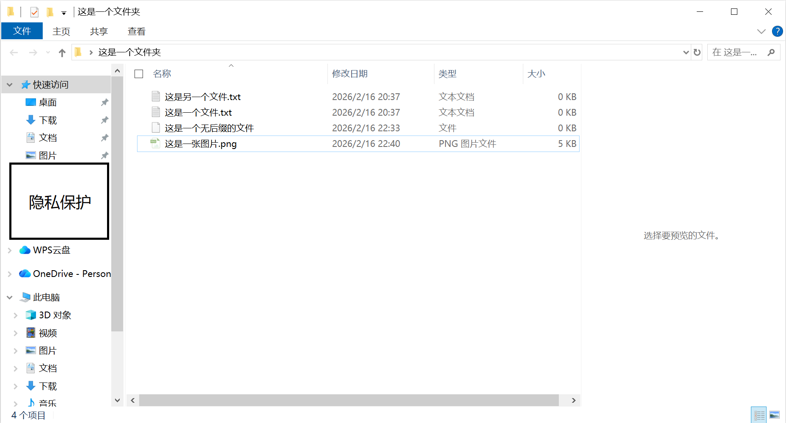
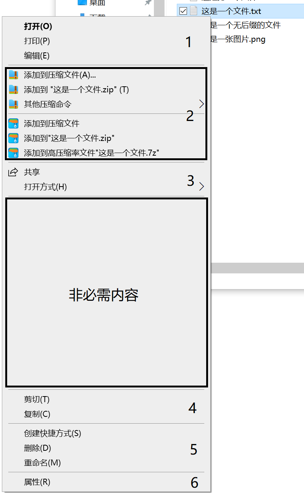
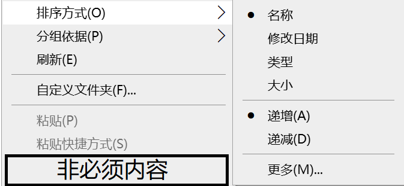
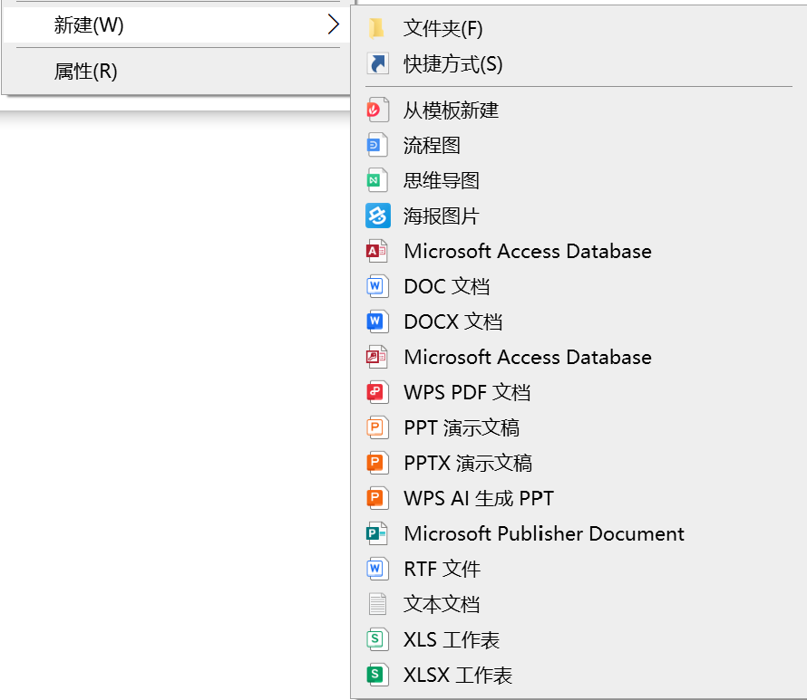
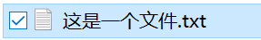
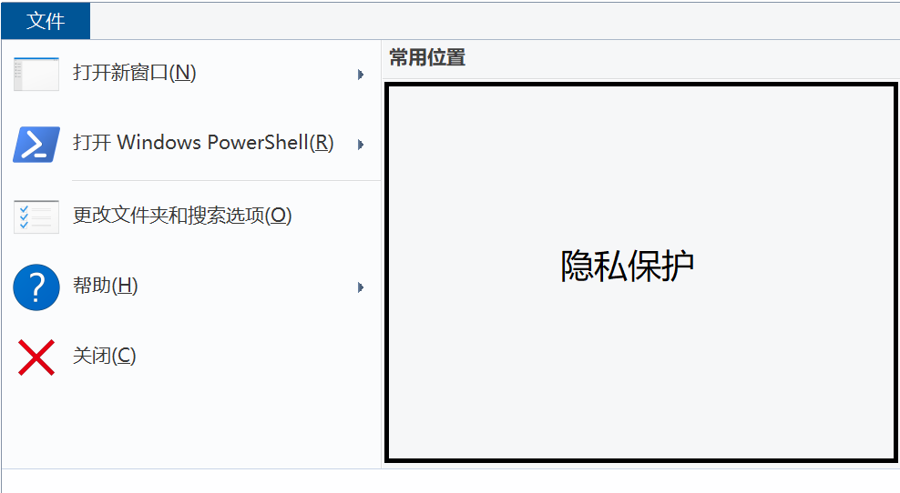
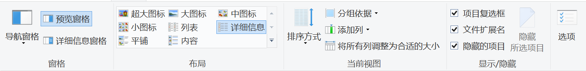
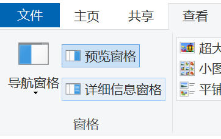

## 2.3 文件资源管理器

2.2-桌面常用操作中我们提到，此电脑、回收站、文件夹的页面都是“文件资源管理器”的页面。这个神通广大的程序帮助你管理电脑里的文件。

窗口示例如下：

如果要关闭这个窗口，单击右上角的叉号。

>[!IMPORTANT]
>在学习本章内容时，我们建议你用一台电脑配合教程。本章结束后，也可以自行作一些探索。
>本章某些内容后会附上对应快捷键或键盘按键，这用于在对系统使用方法基本了解后，查阅使用。如果你第一次学习这一部分，不用关心，在2.5-常用快捷键中会介绍。

### 2.3.1 文件操作

#### 2.3.1.2 双击左键

对一个文件或程序双击左键即可打开它。一般情况下，系统会运行程序，或自动用合适的程序打开文件。如下图，双击文本文档，系统会用记事本打开。

>[!IMPORTANT]
>如果鼠标对准文件名的位置左键双击，会进入重命名文件模式。

双击程序就会运行它，在此不做示例。

#### 2.3.1.3 单击右键

对一个文件单击右键会出现一个列表，如下：

我们这个列表分为6个部分介绍（如上），没有标号的部分不常用或不重要。
各个选项后括号中的字母是快捷键。在此列表出现时，按下对应字母就会执行对应的选项。

##### 2.3.1.3.1 打开、打印与编辑

选择“打开”相当于双击文件用最合适的程序打开。
选择“打印”会打印文件内容。
选择“编辑”会出现编辑选项，可以选择用于编辑文件的程序，并使用程序编辑文件。

##### 2.3.1.3.2 解压缩软件

此处可以快速地启动解压缩软件对文件进行操作，详见常用软件-解压缩软件。

##### 2.3.1.3.3 打开方式

“共享”不常用。
选择“打开方式”会显示电脑中可用于打开此文件的程序的列表，如下。如果你对某个程序打开此文件的方式不满意，可以在此选择另一个程序。

##### 2.3.1.3.4 剪切与复制

这两个选项是最常用的文件操作，可以用于移动和复制文件。
选择“剪切”（Ctrl+X），可以将文件保存在剪贴板。此时在移动目标位置空白区单击右键选择“粘贴”就可以将文件移动到目标位置（见2.3.2-），而本来的位置的文件会被删除。
选择“复制”（Ctrl+C），可以将文件复制到目标位置。此时在移动目标位置空白区单击右键选择“粘贴”就可以将文件复制到目标位置（见2.3.2-），但本来的文件不会被删除。

##### 2.3.1.3.5 创建快捷方式、删除与重命名

选择“创建快捷方式”可以在当前位置创建一个此文件的快捷方式。再将快捷方式“剪切”到别的地方，就可以通过快捷方式访问这个文件。
选择“删除”（Del）会将文件移至回收站。
选择“重命名”（F2/Fn+F2）会进入重命名模式，此时文件名会变成输入框，你可以输入你想要更改的文件名。

##### 2.3.1.3.6 属性

选择“属性”可以查看文件大小、位置、修改时间、过去版本等属性，也可以更改文件为只读和隐藏等模式，详见2.3.7-高级文件操作。

### 2.3.2 空白区右键操作

在文件以外的任意空白区域单击右键会出现一个列表，如下。

我们逐个介绍每个选项。

#### 2.3.2.1 查看

选择“查看”会显示一系列图标排布方式，详见2.3.4.4-查看。

#### 2.3.2.2 排序方式

选择“排序方式”可以设置此文件夹中文件的排序方式，如下。

其中，“名称”表示按首字母（拼音首字母）排序；“类型”表示按文件类型排序；“大小”表示按文件大小排序。
“更多”中有更多选项，但不常用。

#### 2.3.2.3 分组依据

选择“分组依据”可以设置此文件夹中文件的分组方式，如下。

具体内容同上，不做赘述。

#### 2.3.2.4 刷新

选择“刷新”可以重新加载当前窗口的图形界面数据，解决如新文件未显示、图标未更新等问题，一般情况下无需频繁手动刷新。
这无法清理内存或加速系统，只是更新界面显示。

>[!TIP]
>有种说法是，在桌面反复刷新会提高电脑速度，但实际上可能适得其反。

#### 2.3.2.5 自定义文件夹

选择“自定义文件夹”可以修改文件夹属性，例如文件夹图标、夹在图标内的文件图标、文件夹特化等，详见2.3.7-高级文件操作。

#### 2.3.2.6 粘贴

选择“粘贴”（Ctrl+V）可以将剪贴板上的文件粘贴在此位置，与2.3.1.3.4-剪切与复制相链接。
如果剪贴板上没有任何东西，那么这个选项会变灰，无法选择。

#### 2.3.2.7 粘贴快捷方式

选择“粘贴快捷方式”可以在此位置生成一个所复制文件的快捷方式。
如果剪贴板上没有任何东西，那么这个选项会变灰，无法选择。

#### 2.3.2.8 撤销

选择“撤销”（Ctrl+Z）可以撤销在文件资源管理器中执行的上一个操作。这个操作会显示在“撤销”两个字后面。

#### 2.3.2.9 授予访问权限

选择“授予访问权限”可以设置其他用户对此文件的访问权限，不常用。

#### 2.3.2.10 新建

选择“新建”可以选择在此位置新建的文件类型，会显示为如下列表（具体文件类型根据电脑上拥有的软件不同而不同）：

点击想要新建的文件类型或文件夹即可，选择后自动进入命名模式。

#### 2.3.2.11 属性

详见2.3.7-高级文件操作。

### 2.3.3 选择文件

#### 2.3.3.1 选择单个文件

单击一个文件即可选中单个文件，系统会把被选中的文件用蓝框标示。选中后，可以移动文件，详见2.3.7-移动文件。

#### 2.3.3.2 选择多个文件

最简单的选择多个文件方式是按住鼠标左键不动，拉出一个矩形。所有被这个矩形触碰的文件都会被选中并显示为蓝框，如下：

也可以用文件复选框一个个勾选文件，即下图最左侧的的勾。

你可以对选中的文件进行批量操作。此时在文件上右键，所执行的操作会对全部被选中的文件有效；也可以批量移动或复制文件，详见2.3.7-移动文件。

### 2.3.4 导航栏

在桌面常用操作中已经介绍，最左侧的栏目叫作导航栏。其中上半部分叫作“快速访问”，显示了一些常用文件夹、系统默认文件夹和你最近常访问的文件夹，单击即可访问。

### 2.3.5 上方栏

此处可以设置文件资源管理器。

#### 2.3.5.1 文件

单击“文件”会显示如下列表：

右侧显示了最近访问的位置。

左侧“打开新窗口”会打开一个新的文件资源管理器窗口。
“打开Windows PowerShell”详见系统工具。
“更改文件夹和搜索选项”可以更改查看文件的方式等，但我们建议使用默认方式。
“帮助”可以显示当前系统信息和寻求Windows帮助，但一般不常用。
“关闭”会关闭当前文件资源管理器窗口。

#### 2.3.5.2 主页

这里显示了一些常用操作，例如删除、移动、复制、重命名、选择等，但一般不用此界面对文件执行操作，而是直接对文件单击右键或使用快捷键。

#### 2.3.5.3 共享（不常用）

这里可以设置文件的访问权限和安全选项。

#### 2.3.5.4 查看

这个页面十分常用。

左起第一个部分“查看”可以设置导航窗格和右侧窗格的显示格式。这部分可以在对电脑的基础操作熟悉之后自行探索，现不作介绍。

第二个部分“布局”可以调整显示文件的格式。以下是它们的效果和适用场景。（提示：可以尝试在电脑上点击这些格式，更为直观地看出他们的效果）

|格式|效果|适用场景|
|------------|------------|------------|
|超大图标|显示超大的文件图标，如果文件为图片则显示图片内容。|有大量图片的文件夹|
|大图标|显示大的文件图标，如果文件为图片则显示图片内容。|有大量图片的文件夹|
|中图标|显示中等的文件图标，如果文件为图片则显示图片内容。|有大量图片的文件夹|
|小图标|显示小的文件图标，如果文件为图片则显示图片内容。|有大量图片的文件夹|
|列表|用列表形式显示文件图标和名称，略去其他信息，文件可以一列列列出。|有大量文件的文件夹，或想要快速按文件名查找文件时。|
|详细信息|把文件的名称、修改日期、类型、大小全部显示出来。|较常用；本章此上的所有图片里，均采用此格式。|
|平铺|在图标右侧标明文件名称、类型和大小。|同时想要按名称和类型查找文件时（图标可以快速地识别图片类型）。|
|内容|在图标旁边标明文件名称、类型和大小，并用明显的线分割各文件。|2.3.6-搜索中常用的格式。|

>[!TIP]
>用超大图标、大图标、中图标或小图标查看文件时，如果文件夹里的图片数量过多，可能导致卡顿。

第三个部分“当前视图”可以调整当前页面的格式下的具体显示方式。
“排序方式”和“分组依据”选项作用同2.3.2.2-排序方式和2.3.2.3-分组依据。
“添加列”选项只在“详细信息”布局下有用，能够在已有的信息后加一列其他信息。
“将所有列调整为合适的大小”只在“详细信息”布局下有用，能够将各列的宽度调整到既能显示信息又不会冗余的大小。

第四个部分“显示/隐藏”可以调整文件的显示或隐藏。
选中一个文件并点击“隐藏所选项目”可以将文件调为“隐藏”模式。当左侧第三个选项“隐藏的项目”没有被勾选时，这样的文件将不会被显示。
“项目复选框”可以设置复选框是否显示。复选框会显示在文件图标前，这能让我们一个个勾选文件，详见2.3.5-选择文件。
“文件扩展名”可以设置文件扩展名（后缀名）是否显示，详见2.4-后缀名。

第五个部分详见2.3.9-高级文件操作

### 2.3.6 搜索

如果想要在一个文件夹中找到特定文件，除了手动寻找以外，也可以让系统帮你。在右上角有“放大镜”图标的输入框中输入文件名、文件名中的一部分或后缀名，系统会查找当前文件夹（包括子文件夹）中所有符合条件的文件并以“内容”布局显示。

搜索进度显示在正上方，用绿色进度条表示。

但是，我们建议不要在特别大的文件夹（例如整张磁盘）中使用它。有时，进度条会卡在最后几个像素处，几个小时后才会有结果（就像拼多多砍一刀一样）。

### 2.3.7 移动文件

2.3.1.3.4-剪切与复制中介绍的剪切、复制方法对单个文件和被选中的多个文件有效，可用于移动或复制文件。

此外，也可以拖动，如下。这同样对单个文件和被选中的多个文件有效。

### 2.3.8 预览

在窗口右侧，有一个区域会展示缩略版的文件内容，如下：

这样，你不用打开文件就可以大概知道文件的内容。但是，如果文件很大，加载预览可能需要很长的时间并导致卡顿，这时可以把预览功能关闭，在查看-窗格中可以设置让此处展示详细信息或什么都不展示，点击预览窗格/详细信息窗格即可。

### 2.3.9 拖动窗口

将鼠标放在窗口最上端如图区域，按住左键拖动，可以改变窗口位置。

这一方法对大部分程序窗口，不止文件资源管理器窗口也有用。如果这对某个窗口无效，那么这是由这个程序设置决定的，通常无法更改。

### 2.3.10 调整窗口大小

窗口右上角的三个按钮中，叉号用于关闭窗口，剩下两个则用于调整窗口大小。其中，单击减号会把窗口缩小到任务栏，这称为“最小化”，此时单击任务栏图标可以召回这个窗口。单击方形符号会把窗口全屏，这称为“最大化”，此后这个位置会变成两个叠起来的方形符号，单击会把窗口恢复到全屏前的大小。

将鼠标放在窗口边缘或角上，光标会变成箭头形状；此时按住左键拖动，窗口大小会跟着变化。

你也可以将窗口拖动到屏幕上端中心，背景会出现一个透明的矩形，此时松开左键，窗口会全屏。拖动到屏幕的其他边缘，这个矩形的大小会变化，这提示了松开左键后窗口的大小。你可以利用这个功能组合不同的程序和文件资源管理器页面，如下：

组合完成后，你可以方便地按2.3.7-移动文件中一样拖动文件。

### 2.3.11 路径

### 2.3.12 特殊的文件资源管理器页面

除了普通的文件夹外，此电脑、回收站甚至桌面都基本适用上述文件资源管理器所述的使用方法。但是，它们各有一些特殊之处。虽然在2.2-桌面常用操作中已经介绍过，但在学完上述文件资源管理器内容后会更容易理解在这些页面的其他操作。

#### 2.3.12.1 此电脑

在这个页面，你可以查看磁盘、网盘和库。但是，你不能将文件粘贴在这个位置。

#### 2.3.12.2 回收站

回收站页面是用于决定是否要保留文件的地方，所以你只能选择删除或还原文件，而不能查看它们的内容。如果想要查看，需要先把它们还原到删除前的位置，再查看。你也不能将文件粘贴到这里。

#### 2.3.12.3 桌面

桌面同样适用文件资源管理器里对文件的操作，你也可以在这里执行文件的复制、粘贴、删除等操作。（但显然不能调整窗口的大小）

但是，在桌面空白区右键，会出现三个新选项，如下红框所示。

选择它们可以更改电脑的显示设置（通常不用设置）或者桌面背景（根据使用者而定，如果你正在使用其他人的电脑，不要更改），目前暂时不用学习。

### 2.3.13 高级文件操作

如果你是初学者，这部分暂时不需要掌握，可以先学习之后的内容。

