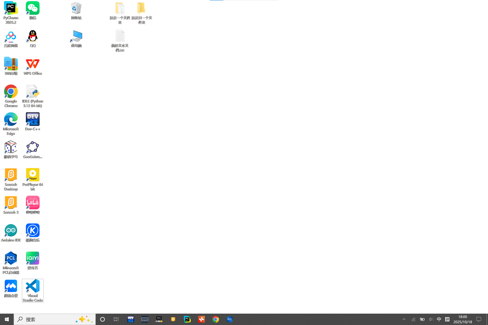
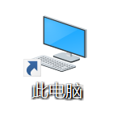
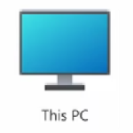
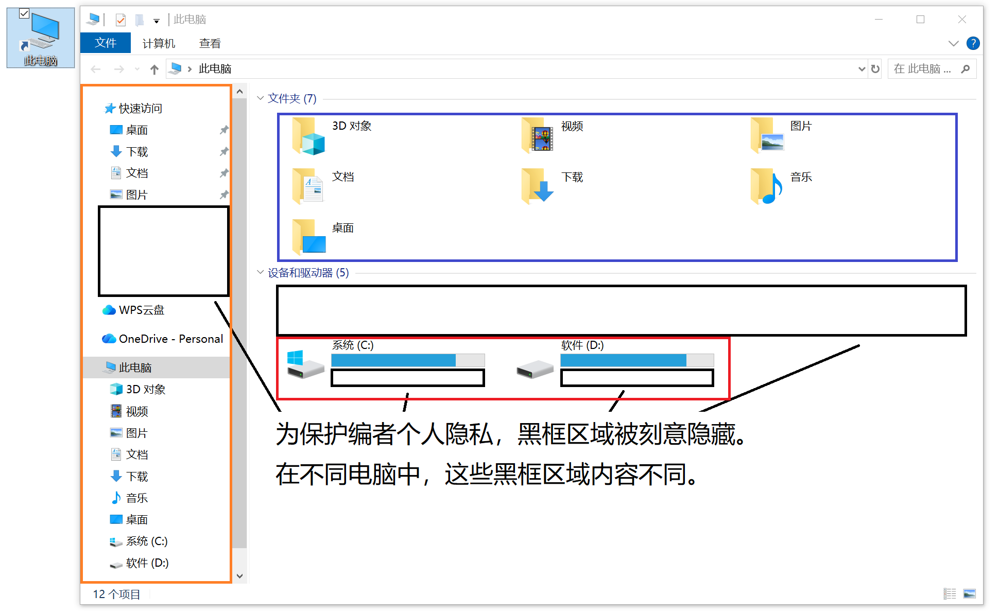

## 2.6 桌面常用操作

打开电脑后，你会进入一个这样的界面（背景图片采用全白）：

上图是Windows10桌面，下图是Windows11桌面。

由于两系统差不多，这里选择Windows10来演示。将桌面操作分为以下几个部分：

（这是一个图片占位符 @ALAN-yichihann）

### 2.6.1 此电脑

通常，电脑桌面上会有如下图标（Windows10）：

（Windows11）：

鼠标左键双击它，会出现如下界面：

在这张图片中，红框部分显示了所有可操作的驱动器，双击即可打开驱动器浏览和管理文件。它们包括电脑自带的硬盘、插入电脑的U盘和移动硬盘等，双击即可打开。其上方的黑框会显示可用的网盘（如百度网盘等）。

蓝框部分显示了一些系统默认的文件夹，可双击访问。在使用一些软件时，文件会默认保存在其中一些文件夹里（例如，使用浏览器下载文件时，通常默认保存在“下载”文件夹里）。

橙框部分叫作“快速访问”，其中显示了一些常用文件夹和系统默认文件夹，单击即可访问。其中的黑框部分会显示你最近常访问的文件夹，这也是为什么“快速访问”十分个性化而上图中具体内容被隐去。

点击右上角的红叉即可关闭该页面。

### 2.6.2 回收站

桌面上另一个常用程序的图标是这个（Windows10）:

（Windows11）:

鼠标左键双击它，会出现如下界面：

蓝框中包含了你最近删除的文件。“回收站”的作用相当于手机相册的“最近删除”，当你在电脑上删除文件后，系统会将文件移到这里，给你一个三思的机会。如果确定要删除，对文件单击右键，再左键“删除”即可将其彻底删除；如果想恢复文件，对文件单击右键，再左键“还原”即可将文件恢复到被删除前的位置。有的系统里设置了文件的保存期限，到期自动删除。

>[!IMPORTANT]
>在回收站里删除文件时要三思而行，此操作通常不可逆。

同“此电脑”一样，橙框是“快速访问”。

“此电脑”和“回收站”界面实际上都是一个叫作“文件资源管理器”的系统工具，在文件资源管理器部分会详细讲到它的各种操作。

>[!TIP]
>如果回收站里没有任何文件，桌面上显示的垃圾桶图标就是空的；如果有，垃圾桶图标就会装满废纸。