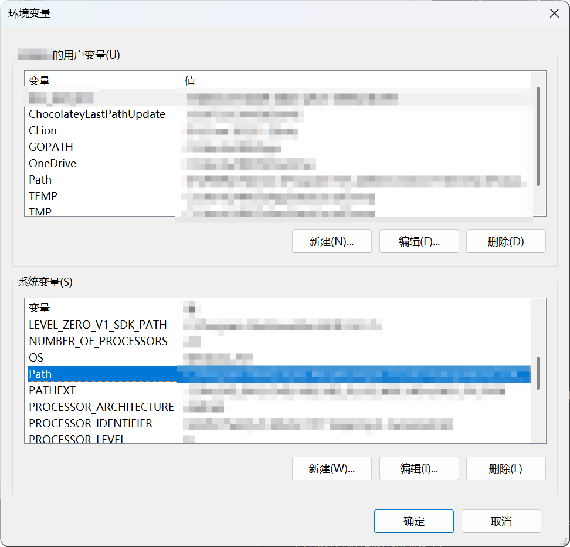
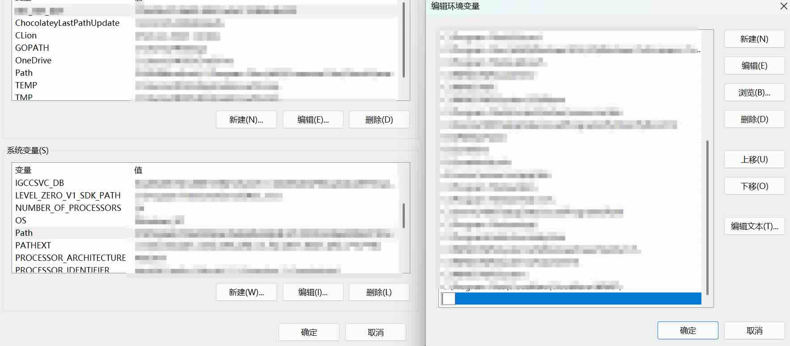

## 2.5 环境变量

### 2.5.1 什么是环境变量


环境变量是操作系统中用来存储系统设置和路径信息的一种机制。

简单来说，环境变量就像一个通讯录，将简写的名称转化为完整的文件路径。

例如，当你在CMD中输入`python`时，系统就会查看环境变量，找到Python安装在哪里，然后运行它。

### 2.5.2 为什么需要环境变量


想象一下，如果没有环境变量，每次运行一个程序，你都需要输入完整的路径，比如:

```text
C:\Program Files\Python\python.exe
```

而有了环境变量，你只需要输入:

```text
python
```

系统会自动在环境变量记录的路径中寻找这个程序。

### 2.5.3 如何查看环境变量


#### 2.5.3.1 通过系统设置查看

Windows 10 & 11的操作方法:

1. 在系统搜索框（单击`Win`键）中输入`环境变量`
2. 选择`编辑系统环境变量`
3. 在打开的窗口中，点击下方的`环境变量`按钮



你会看到两个区域:
- **用户变量**: 只对当前登录的用户生效
- **系统变量**: 对所有用户生效

#### 2.5.3.2 通过命令行查看

快捷键`Win`+`R`，输入`cmd`，然后在命令行中输入:

```powershell
echo %PATH%
```

这会显示当前的PATH环境变量内容。

>[!TIP]
> PATH是最常用的环境变量，它存储了系统查找可执行文件的所有路径。一般情况下，CMD只会在PATH中查找文件简写名。

### 2.5.4 常见的环境变量


以下是一些你可能会遇到的常见环境变量:

| 变量名        | 作用            |
|------------|---------------|
| PATH       | 存储可执行文件的搜索路径  |
| TEMP / TMP | 临时文件存储位置      |
| USERNAME   | 当前用户名         |
| WINDIR     | Windows系统目录路径 |

### 2.5.5 如何添加环境变量


#### 2.5.5.1 添加新的环境变量（不常用）

1. 按照[2.5.3.1节](#2531-通过系统设置查看)的方法打开环境变量窗口
2. 在用户变量或系统变量区域，点击`新建`按钮
3. 输入变量名和变量值
4. 点击`确定`保存

#### 2.5.5.2 修改PATH变量（最常用）

当你安装了新软件（如Python、Node.js等），需要在命令行中直接使用时，通常需要将其安装路径添加到PATH中。

**操作步骤:**

1. 打开环境变量窗口
2. 在用户变量或系统变量（管理员账户推荐修改系统变量）中找到`Path`
3. 选中后点击`编辑`（或者双击`Path`条目）
4. 进入新窗口，点击`新建`，输入新的路径（例如: `C:\Program Files\Python311`），必须是绝对路径（即从盘符开始写到最后一个文件夹！）
5. 点击`确定`保存所有窗口



>[!TIP]
> Windows 10及以上版本提供了更友好的编辑界面，可以逐行查看和编辑PATH中的每个路径。

>[!TIP]
> 如果安装程序提供了"Add ... to PATH"选项，**强烈建议勾选**，这样就不用手动配置了。

>[!WARNING]
> 路径应当为绝对路径，且不同层级文件夹之间使用单个反斜杠`\`进行连接。不建议在目录名中出现中文。

>[!CAUTION]
> 不要删除PATH中原有的路径，否则可能导致系统或某些软件无法正常运行!

#### 2.5.5.3 其他变量

不推荐修改或者删除其他的任何环境变量，尤其是系统变量，更尤其的是几个全大写的系统变量，删改可能导致系统异常。

### 2.5.6 环境变量何时生效


修改环境变量后，**已经打开的程序不会立即生效**。

你需要:
- 关闭并重新打开命令行窗口（CMD、PowerShell等）
- 重新启动你的应用程序
- 某些情况下需要重启电脑（较少见）

### 2.5.7 验证环境变量是否生效


以Python为例，添加Python到PATH后:

1. 打开新的命令行窗口（`Win`+`R`，输入`cmd`）
2. 输入 `python --version`
3. 如果显示Python版本号，说明环境变量配置成功
4. 如果提示"不是内部或外部命令"，说明配置未生效，需要检查路径是否正确

大部分需要单独配置环境变量的软件属于专业软件，基本支持命令行调用和version命令。另外，如果输入`--version`之后弹出了一大堆东西，且不属于以上3、4两点提到的内容，那么意味着配置依然成功，只是该软件可能依赖其他命令获取版本号。

### 2.5.8 常见问题与解决


#### 2.5.8.1 添加了环境变量但是不生效

可能的原因：
- 路径输入错误（多了空格、斜杠方向错误等）
- 没有重新打开命令行窗口
- 添加到了错误的位置（用户变量 or 系统变量）

请仔细检查路径是否正确。如果还不行，尝试重启电脑。

>[!TIP]
> 还有一种极特殊的情况：如果在CMD内进行了环境变量的设置，则任意一条环境变量内容的长度不得超过1024个字节。如果你的电脑环境变量很长，请不要通过CMD设置。

#### 2.5.8.2 多个版本的同一软件

如果你安装了多个版本的同一软件（如Python 3.9和3.11），`Path`中**靠前的路径**会优先被使用。

你可以通过调整PATH中路径的顺序来改变优先级:
- 在环境变量编辑窗口中，选中要调整的路径
- 使用`上移`或`下移`按钮调整顺序

#### 2.5.8.3 误删了重要的环境变量

>[!CAUTION]
> 这种情况可能导致系统部分功能失效!

不要慌，先不要关闭环境变量窗口，点击`取消`放弃修改。如果已经保存了，可以尝试查看其他正常的电脑上的环境变量作为参考。

实在不行的话，重装软件也可以。
