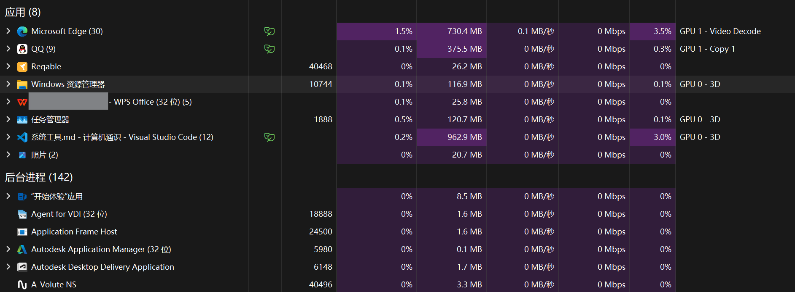
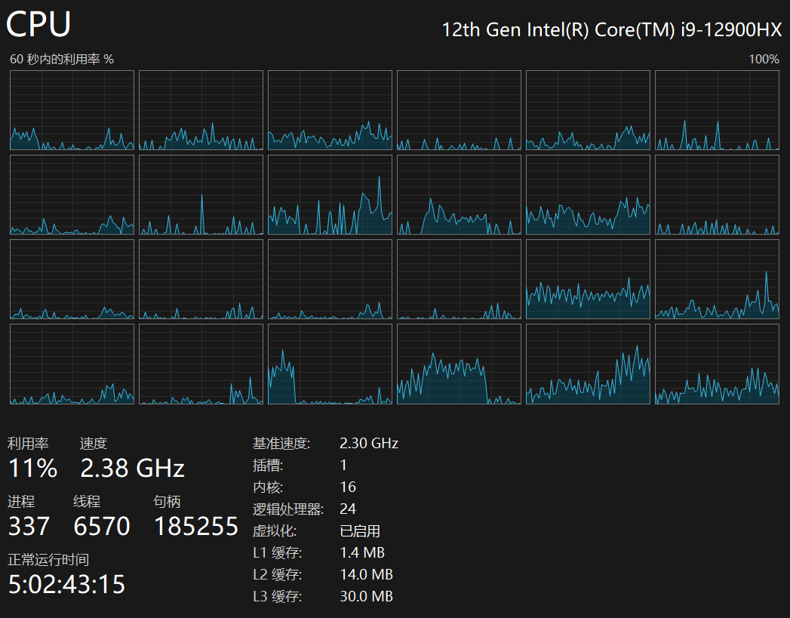
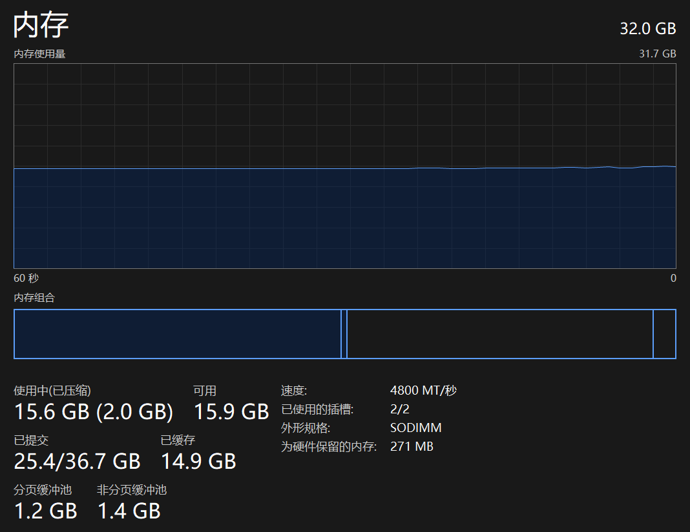
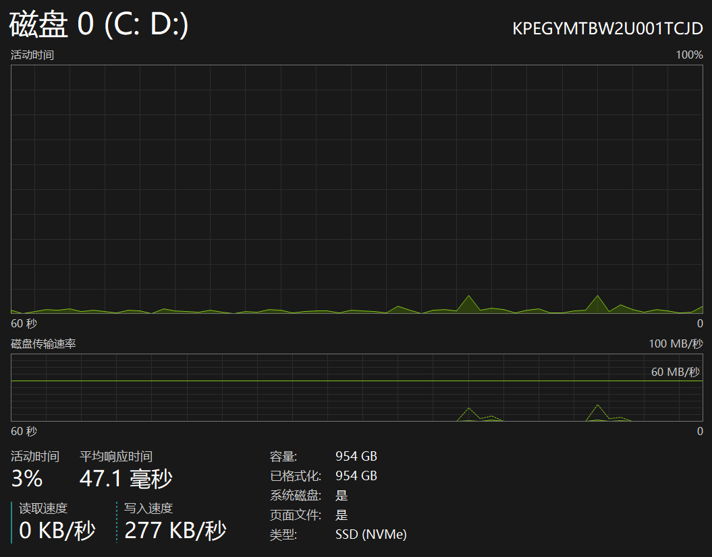
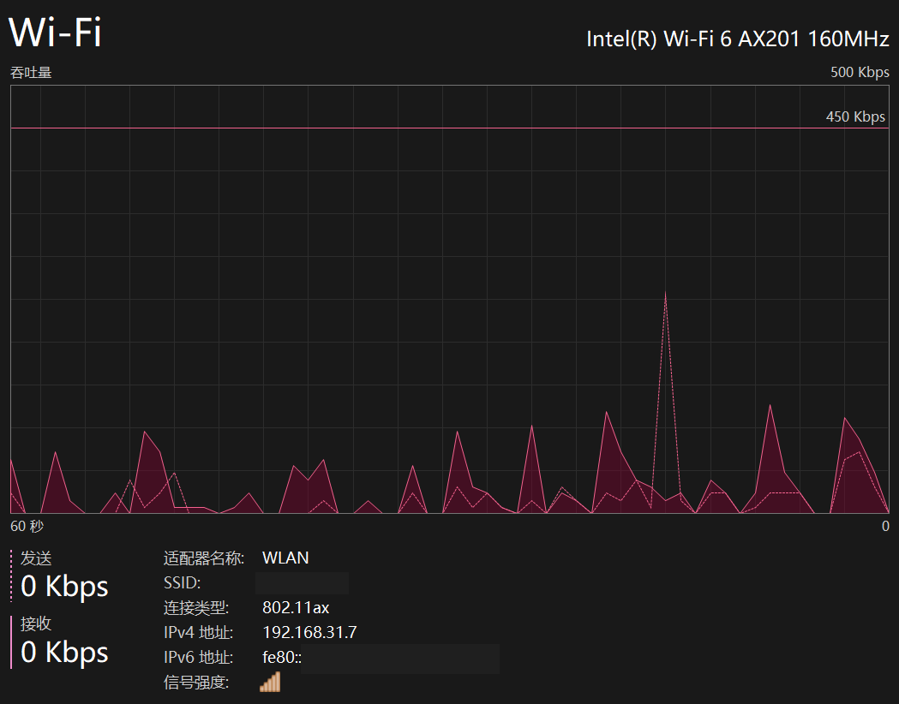
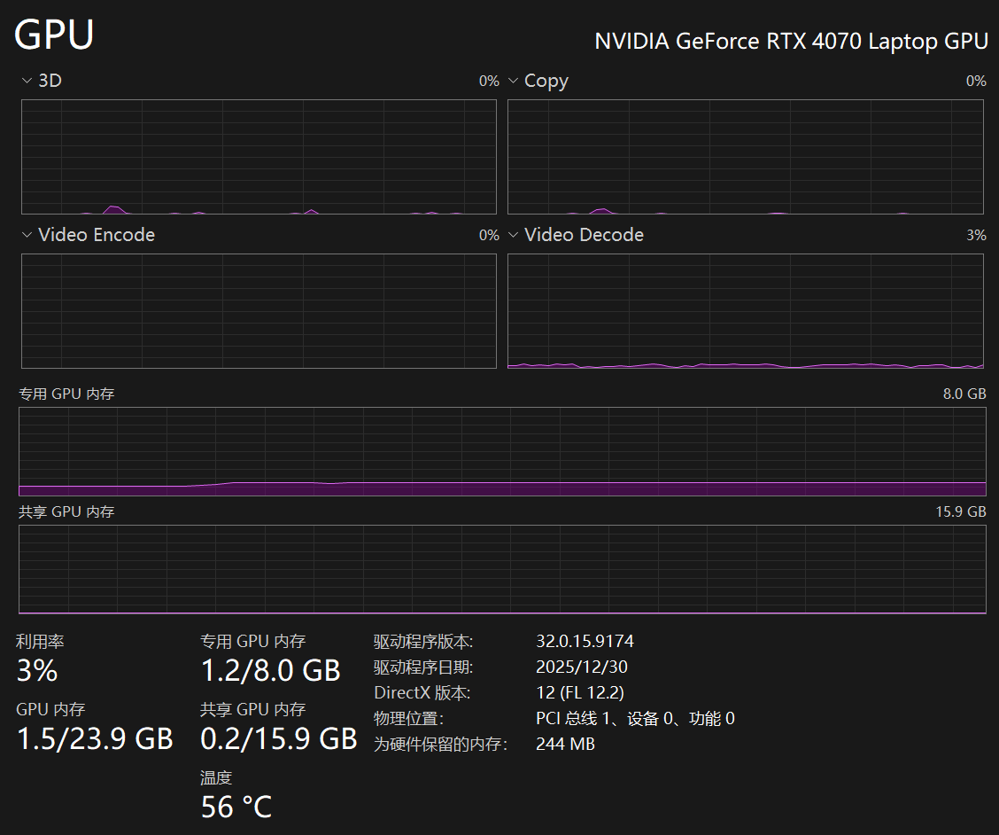

## 2.7 系统工具

### 2.7.1 任务管理器

任务管理器是Windows系统自带的系统监控工具，用于查看和管理当前运行的程序、进程以及系统资源使用情况。

以上是任务管理器常见功能区的总览。对于一般用户，重点认识`进程`、`性能`和`启动应用`三大部分即可。

#### 2.7.1.1 打开任务管理器

有以下几种常用方式：
- 快捷键 `Ctrl`+`Shift`+`Esc` 直接打开
- 快捷键 `Ctrl`+`Alt`+`Del` 后选择"任务管理器"
- 右键点击任务栏空白处，选择"任务管理器"
- 右键点击开始菜单，选择"任务管理器"

#### 2.7.1.2 查看运行中的程序

任务管理器通常会显示"进程"选项卡（也可能停留在你上次查看的页面），其中列出了当前正在运行的应用程序和后台进程，以及它们占用的CPU、内存、磁盘、网络资源。

>[!TIP]
> 在Windows 10下，如果任务管理器界面过于简化，点击左下角的"详细信息"按钮可展开完整视图。

#### 2.7.1.3 结束任务

当某个程序无响应，或你需要手动结束某个进程时：
1. 在任务管理器中找到该程序
2. 选中后点击右下角（Windows 11在右上角）的"结束任务"按钮
3. 或直接右键选择"结束任务"

>[!CAUTION]
> 结束任务会导致该程序未保存的数据丢失。请优先尝试正常关闭程序。

#### 2.7.1.4 查看系统性能

切换到"性能"选项卡，可以查看CPU、内存、磁盘、网络、GPU等硬件的实时运行状态。

##### CPU

**型号信息**：如"12th Gen Intel Core i9-12900HX"表示第12代英特尔酷睿i9处理器，12900HX是具体型号。

**关键指标**：
- **利用率**：CPU当前被占用的百分比，100%表示满载
- **速度**：当前运行频率（如2.38 GHz），基准速度是参考频率（如2.30 GHz）。**购买时常见的宣传频率多为最高加速频率，通常是在特定条件下由少数核心达到的峰值频率，不等于所有核心长期稳定运行频率。**
- **进程**：当前运行的程序数量（并不等于你打开的软件数量，甚至于远多，因为一个软件往往有多个进程，而且还有很多后台进程。）
- **线程**：程序执行的最小单元，数量越多并行处理能力越强
- **句柄**：系统资源的引用标识
- **正常运行时间**：电脑自开机以来的持续运行时间
- **内核**：物理核心数，如16核
- **逻辑处理器**：包含超线程后的总线程数，如24个
- **虚拟化**：是否启用了硬件虚拟化技术
- **L1/L2/L3缓存**：CPU内置的高速缓存，L1通常最快且最小，L3通常更大但延迟更高；缓存大小会影响性能，但需结合架构和实际负载综合判断。

##### 内存

**容量信息**：如"32.0 GB"表示总物理内存容量。

**关键指标**：
- **使用中**：当前被占用的内存容量，括号内为压缩内存量
- **可用**：剩余可用内存
- **已提交**：系统承诺分配（但不一定实际使用）给程序的内存总量/上限（包括物理内存+虚拟内存）
- **已缓存**：用于缓存近期数据和文件的内存（数据通常来自磁盘-虚拟内存）
- **速度**：内存运行频率（如4800 MT/秒），频率越高通常带来更高带宽；实际体验还会受时序、延迟和平台配置影响。
- **插槽**：已使用的内存插槽数/总插槽数（如2/2表示两个插槽都已使用）
- **分页缓冲池/非分页缓冲池**：系统内核使用的内存区域，分页表示可以被移动到磁盘上，非分页表示不可以。

##### 磁盘

**设备信息**：如"磁盘 0 (C: D:)"表示第一块硬盘，包含C盘和D盘两个分区。

**关键指标**：
- **活动时间**：磁盘处于活动状态的百分比，100%表示磁盘满载
- **平均响应时间**：磁盘响应请求的平均时间，越低越好
- **读取速度/写入速度**：当前数据传输速率
- **容量**：硬盘总容量
- **类型**：如"SSD (NVMe)"表示固态硬盘，采用NVMe协议，速度比传统机械硬盘(HDD)快得多

##### 网络

**适配器信息**：如"Intel Wi-Fi 6 AX201"表示英特尔Wi-Fi 6无线网卡。

**关键指标**：
- **发送/接收**：当前上传和下载的实时速度（默认为bps，注意8 bps = 1 B/s）
- **SSID**：连接的Wi-Fi网络名称
- **连接类型**：无线标准，如802.11ax即Wi-Fi 6，为IEEE标准号
- **IPv4地址/IPv6地址**：设备在网络中的地址（本地地址）
- **信号强度**：Wi-Fi信号质量，满格表示信号良好

##### GPU

**型号信息**：如"NVIDIA GeForce RTX 4070 Laptop GPU"表示英伟达RTX 4070笔记本显卡。

**关键指标**：
- **利用率**：GPU当前负载百分比，分为3D（3D性能，打游戏耗的是这个）、Copy（简单理解为显存带宽占用）、Video Encode（视频编码）、Video Decode（视频解码）等不同类型
- **专用GPU内存**：显卡自带的显存（如8GB），仅供显卡使用，**重点看这个**
- **共享GPU内存**：借用系统内存作为显存使用，性能很弱（如15.9GB）
- **GPU内存**：专用+共享的总和
- **温度**：显卡当前温度，过高可能导致降频
- **驱动程序版本**：显卡驱动版本号，影响性能和兼容性

#### 2.7.1.5 管理启动项

切换到"启动应用"选项卡，可以查看开机时自动启动的程序：
- 右键点击可禁用或启用启动项
- 禁用不必要的启动项可加快开机速度

>[!TIP]
> 部分软件的自启动并不会在该选项卡中展示出来。这是由不同的自启动策略导致的，如果想要关闭自启动的软件不在该列表里，建议到对应软件的设置项当中进行设置。

