## 2.8 设置与个性化

此部分将介绍如何使用设置与个性化电脑。

### 2.8.1 个性化


严谨来说，这个部分也应当归入设置中。之所以先介绍个性化部分，是因为它相较设置更为简单，且更为常用，这里专门列一节先介绍。

#### 2.8.1.1 设置桌面背景

**方法一：** 任选一张 **JPG、JPEG、PNG、DIB、BMP** 或 **GIF** 格式的图片，右键单击，在出现的菜单里选择 **“设置为桌面背景”** 即可将其设置为桌面背景。

**方法二：** 在桌面空白区单击右键，在弹出菜单中选择 **“个性化”**，这会打开一个设置页面，如下。

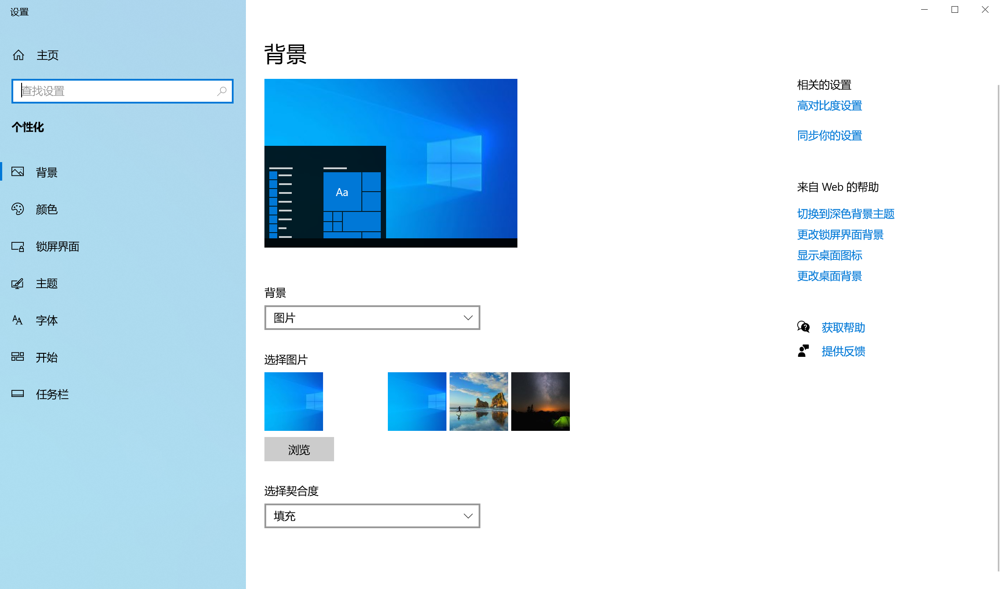

其中，最上方的图片是当前的系统样式预览。

**“背景”** 选项可以设置用哪种类型的背景。比如，示例使用的是图片背景。这一栏中的其他选项包括：

**1、“纯色”**，表示用纯色填充充当背景，可以选择颜色。

**2、“幻灯片放映”** 会轮换展示一个文件夹里的图片。

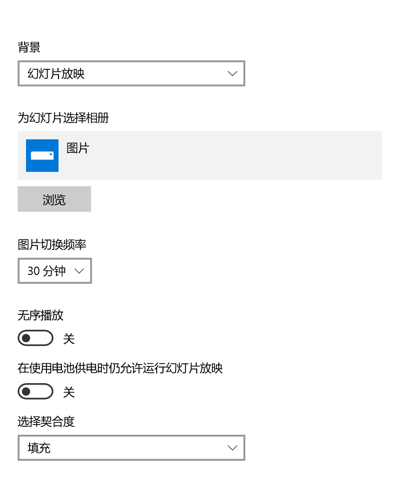

这个文件夹在 **“为幻灯片选择相册”** 中选择，按下 **“浏览”** 键可以选择文件夹。你可以在某个位置新建一个文件夹，把想作为背景的图片全部放进去，然后在这里选择该文件夹。

字如其意，**“图片切换频率”** 可以改变切换图片的频率。

**“无序播放”** 开启后，系统会以随机顺序播放文件夹里的图片。

**“在使用电池供电时仍允许运行幻灯片放映”** 用于省电。切换背景耗电，打开此开关后，在没有接通电源而使用自带电池时系统也会正常切换图片，但耗电量会增大。

**“选择契合度”** 设置图片的契合模式。图片的分辨率和屏幕的不一定相同（链接），这时系统会根据这里的契合模式让图片适应屏幕大小。

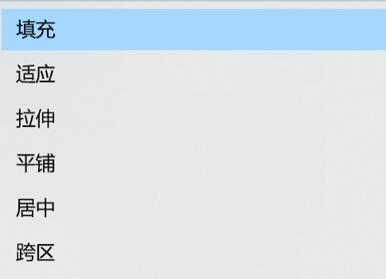

**3、“Windows聚焦”** 会轮流把由Windows提供的内容，包括世界美景胜地和野生动物的图片，作为背景。

**4、“图片”** 是上述示例中正在使用的背景模式。

**“选择图片”** 一栏可以从系统提供的图片中选择一张作为背景图片，或者选择 **“浏览”** 来选择自己想用的图片。

>[!TIP]
>如果你想知道的话，系统默认的桌面壁纸位于如下路径：
>
>```
>C:\Windows\Web\Wallpaper
>```

**“选择契合度”** 已经介绍过，不做赘述。

>[!TIP]
>无法更改桌面背景？可能是因为你的Windows尚未激活。想要激活，参见

#### 2.8.1.2 显示管理

在桌面空白区右键，在弹出菜单中选择 **“显示管理”** 会打开如下页面：

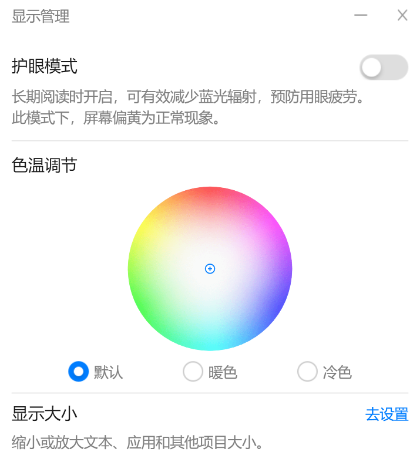

其中 **“去设置”** 会跳转到设置文本大小和分辨率的页面，详见[2.8.1.3 - 显示设置](#2813-显示设置)，其余选项字如其意，不做赘述。

#### 2.8.1.3 显示设置

在桌面空白区右键，在弹出的菜单中选择 **“显示设置”** 会跳转到设置中的有关页面，如下。


我们将重点介绍 **“缩放与布局”** 部分。

**“更改文本、应用等项目的大小”** 可以改变文本、应用等项目的大小，只有在感觉当前大小不合适时才需要调整，否则会导致桌面混乱。

**“显示器分辨率”** 中，系统会自动计算最适合当前显示器的分辨率，并用 **“（推荐）”** 标示出来，选择该项即可。最好不要改动，否则也会导致混乱。

**“显示方向”** 会调整显示方向，如果你的电脑固定是横向显示，最好不要更改，否则电脑会变得像平板一样。

此外，**“多显示器”** 部分可以将屏幕连接到更多显示器上。

### 2.8.2 设置与控制面板


在 **“开始”** 页面中，左键单击电源上方的齿轮按钮可以打开如下的 **“设置”** 页面。

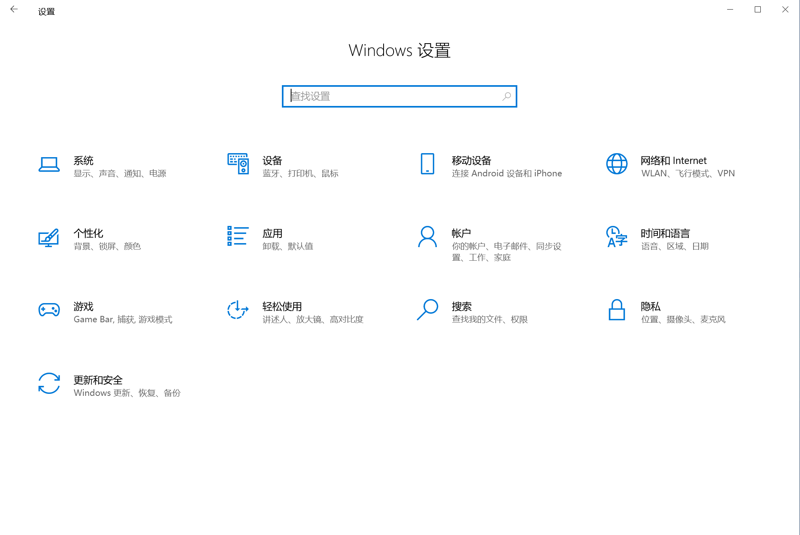

在 **“开始”** 页面的W字母区，点开 **“Windows系统”** 文件夹，选择 **“控制面板”** 可以打开如下的控制面板页面。

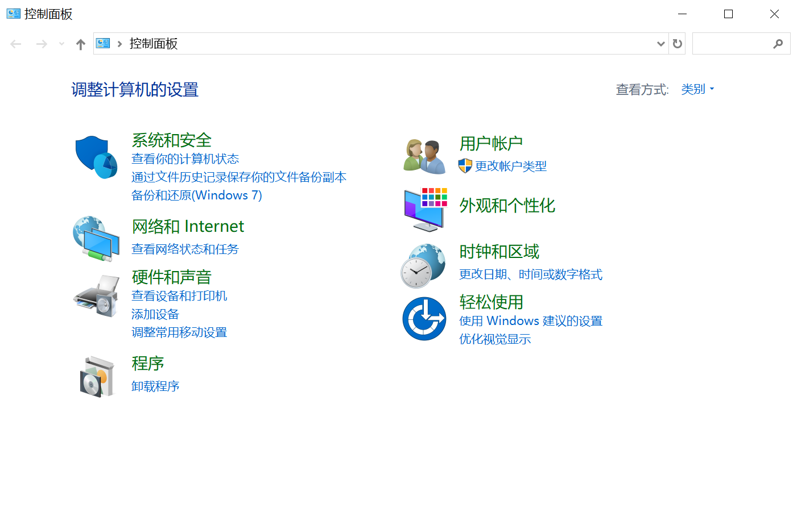

这两个页面都用于对系统进行基础设置。

>[!TIP]
>你可能会发现，这两个页面的很多内容是重复的，事实也确实是这样。它们目前的“管辖范围”区分模糊，非常混乱，是一个历史问题。大体上，“控制面板”更适用于鼠标操作，而“设置”更适用于触摸操作（适配移动端产品）。
>
>“控制面板”在Windows初代版本开始就一直存在，而“设置”是Windows8加入的。之后，微软不断把“控制面板”中的功能整合到“设置”中，这是大的趋势。但是，由于“控制面板”兼容一些程序的设置（第三方软件厂商可以制作小程序放入“控制面板”中来让用户在“控制面板”上方便地设置软件），如果直接把其功能全部放到“设置”中，会引发兼容性问题；此外，考虑到Windows老用户的使用习惯，以及“控制面板”的布局更适合鼠标操作，这个整合迟迟没有完成。对于某些设置项，它们会互相跳转；对于另一些设置项，“设置”和“控制面板”甚至有“两班人马”，例如“日期和时间”部分（图中右下两个窗口是“控制面板”，最大的窗口是“设置”）。
>
>
>
>对新手来说，打开“设置”页面更为容易，因此本节主要介绍“设置”的使用，只有在必要的时候会使用“控制面板”。

由于这里的内容太多，而且不同电脑之间也有不同，我们将不会详细介绍所有内容。事实上，如果想改变某项设置，只要上网查找这项设置在 **“设置”** 或 **“控制面板”** 的哪个部分即可，没必要全部记住。系统中，不同部分也有链接到设置中对应页面的选项，就像[2.6 - 任务栏](任务栏.md)中的一些选项一样。

这里主要介绍应用、时间和语言、更新三个部分。个性化已经在[2.8.1 - 个性化](#281-个性化)中涉及过了。

>[!TIP]
>如果你的“控制面板”主页面和上述图片不一样，把主页右上角的“查看方式”选项调为“类别”即可。

#### 2.8.2.1 应用

以下两个红框分别是“设置”和“控制面板”中涉及程序部分的入口。

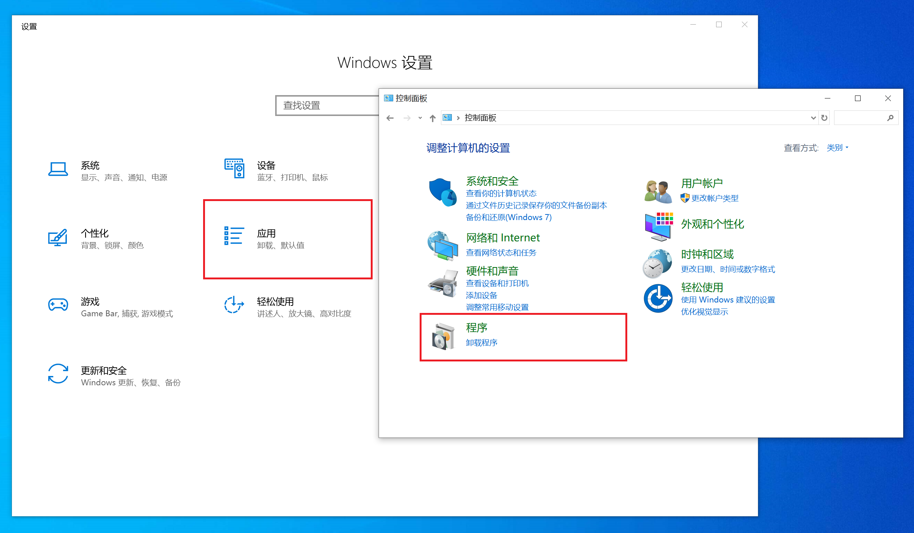

##### 2.8.2.1.1 查看和调整默认应用

对于一个文件，系统可能有很多种打开方式。例如，对一个后缀名为.mp4的视频文件，在右键列表中选择 **“打开方式”** 可能会出现这些应用：

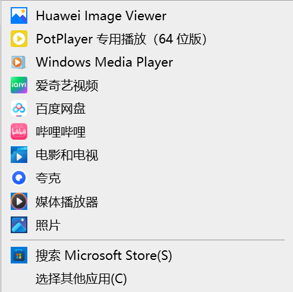

而如果左键双击一个文件，系统会固定从这些应用中选择特定的一个用来打开文件，这个应用称为 **“默认应用”**。

但是，有时这个默认应用不能正常打开文件，或者用户想改用别的应用打开。这时固然可以在右键列表中选择应用，但对于每个应用都要右键操作很繁琐。此时，我们可以调整默认应用，让系统自动用我们想使用的应用打开文件。

在 **设置->应用** 页面中的右侧列表中选择 **“默认应用”** 一项，会打开如下页面：

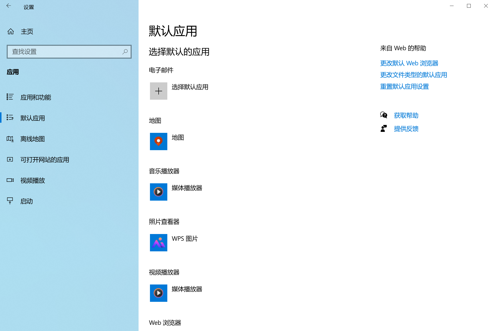

这里列出了一些常用文件的默认打开应用。如果要更改，左键单击对应应用，在弹出列表中选择即可。待选择的应用必须已经安装在电脑中。确认后，电脑可能会卡顿一下，略微等待即可。

>[!TIP]
>某些应用，例如WPS，在下载后会自动更改一些文件的默认应用。如果不想要这种更改，在这里设置即可。

将这个页面向下滚动，还会看到这几个选项：

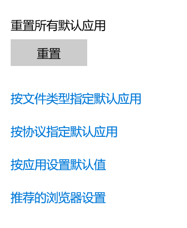

其中， **“重置所有默认应用”** 会将所有文件的打开方式重置为原来的系统应用。

**“按文件类型指定默认应用”** 选项，可以设置某个类型的文件全部由某个应用打开。单击打开的页面中会有一个很长的按后缀名字母排序的列表，滚动到想修改的文件类型，选择即可。

**“按协议指定默认应用”** 选项中，能够设置某种协议包括的文件全部由某个应用打开，通常无需更改。

**“按应用设置默认值”** 选项中，能设置某个应用支持打开的文件类型全部由此应用打开。

**“推荐的浏览器设置”** 选项中，可以设置Microsoft Edge为默认浏览器。如果你有其他想使用的浏览器，不用修改。

##### 2.8.2.1.2 彻底删除应用

之前，我们提到桌面上的程序图标是指向应用程序的快捷方式，而非程序本体。通常，一个程序在本体之外还有很多附属文件，存储程序的一些设置项，要彻底删除某个应用，应该把这个应用和它的所有附属文件删除。但这些程序和文件在访问很繁琐的位置，难以直接从文件资源管理器删除。

这时，可以通过系统提供的程序管理页面删除。按照如下路径打开： **控制面板->程序与功能->卸载程序** 。在 **“设置”** 的 **“应用”** 页面右侧也提供了到这个页面的链接。两种打开方式分别如下图两个红框所示。

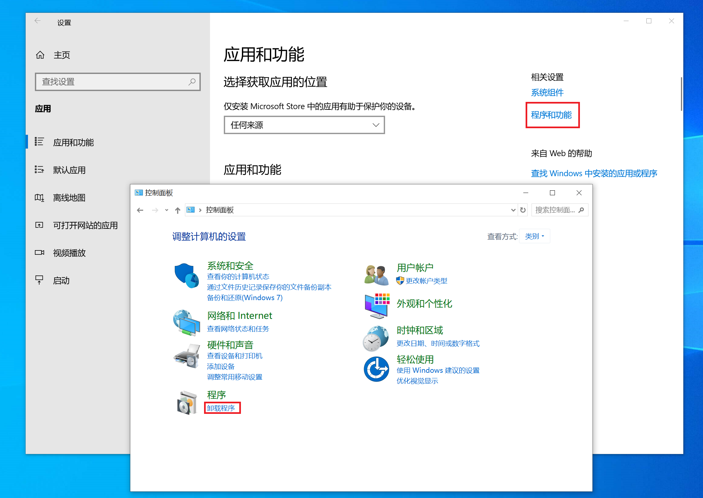

打开后，进入如下页面：

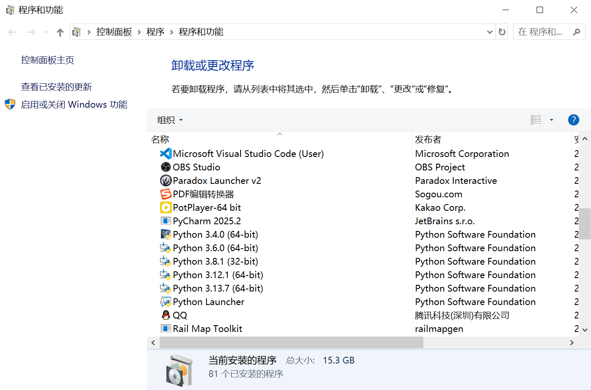

这里显示了所有在系统注册过的应用。找到想卸载的应用，单击右键，选择 **“卸载”**，并选择允许 **“卸载和更改应用程序”** 修改设备，即可进入软件内置的卸载页面。

>[!TIP]
>某些程序为了劝阻你卸载，在卸载页面会询问卸载理由，并把真正的卸载按钮做得很小，或者用按钮颜色误导选择。对于这种情况，随意选一个卸载理由，并找到真正的卸载按钮即可。
>
>在这里卸载程序后，可能仍有一些残留的文件，需要用其他方式删除，比如利用安全软件彻底卸载。

#### 2.8.2.2 时间和语言

在 **“设置”** 主页选择 **“时间和语言”**，即可打开如下页面。

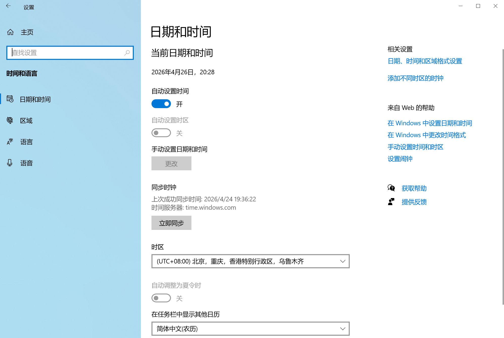

##### 2.8.2.2.1 时间

没什么好说的，除非你在国外，全部调成中国、北京时区即可。

##### 2.8.2.2.2 语言

在左侧列表选择 **“语言”** 一项，会打开如下页面。

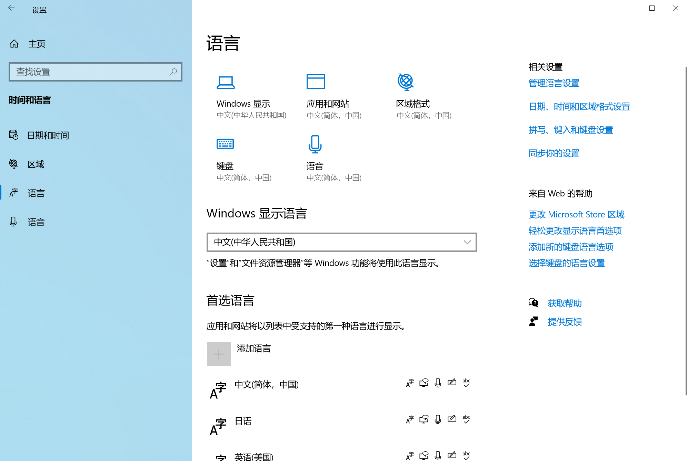

上方显示了当前系统默认的语言显示方式。除非你想在使用电脑时练习外语，全部选择中文简体即可。

下方 **“首选语言”** 可以调整应用和网站使用的语言优先级。选择 **“添加语言”** 可以打开一个Windows支持的语言列表，在其中选择要添加的语言，点击 **“下一页”** 和 **“安装”** 即可。如果你有多个语言，要调整优先级，单击这个语言并选择上移或下移即可。

>[!TIP]
>如何下载某个语言的输入法？
>
>微软开发了一系列不同语言的输入法，例如微软拼音输入法等，它们都能在这里快速下载。要下载某个语言的微软输入法，先在 **“添加语言”** 列表中把语言添加到 **“首选语言”** 列表中（注意勾选 **“安装语言包”**），再单击这个语言，选择 **“选项”**，在打开的页面中滚动到最下方 **“键盘”** 项，如图。如果这里显示了 **“微软输入法”**，就表示输入法已经下载成功，可以在任务栏切出来使用了。
>
>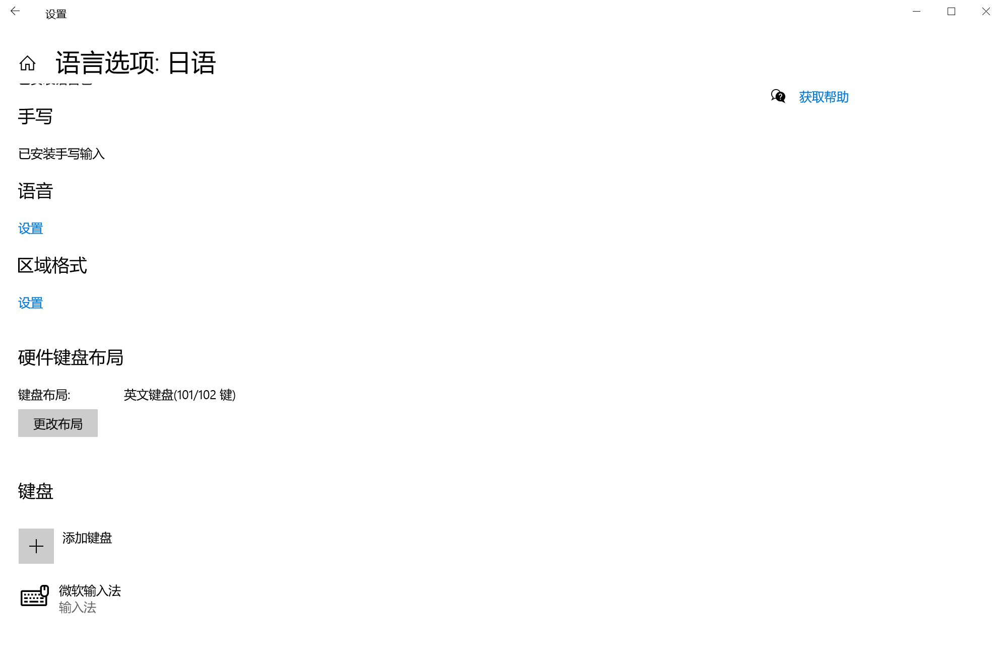

#### 2.8.2.3 更新

在 **“设置”** 主页中，选择 **“更新和安全”** 即可进入更新页面。由于微软终止了对Windows10的支持，使用Windows10的设备将不会接收安全更新。

### 2.8.3 激活Windows


你的设备右下角是否一直有这个水印？

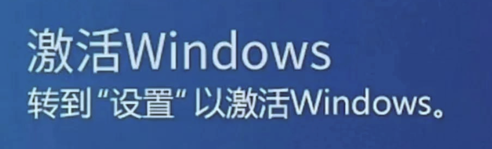

这说明你没有正确激活Windows。Windows需要通过数字许可证或激活秘钥激活才能正常使用。

>[!TIP]
>冷知识，Windows是收费的。写到这里时，笔者查看了京东的微软官方店，Windows11专业版（Windows10已经停止支持）售价¥1750。
>
>通常，联想、惠普、戴尔等品牌电脑是自带正版系统的，联网后即可自动激活。

你当然也可以在淘宝花¥10左右购买非官方的激活秘钥，但接下来介绍一种免费的方法。

按下 `Win` + `R` 打开 **“运行”**，如下：

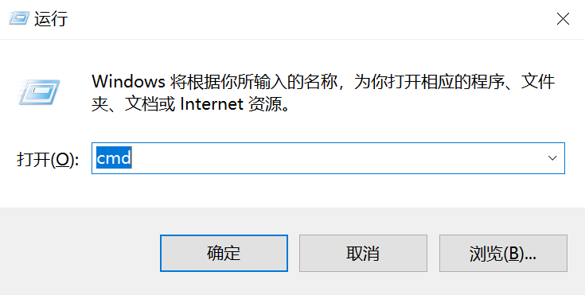

在中间的输入框输入 `powershell` 后，点击 **“确定”**，打开如下窗口：

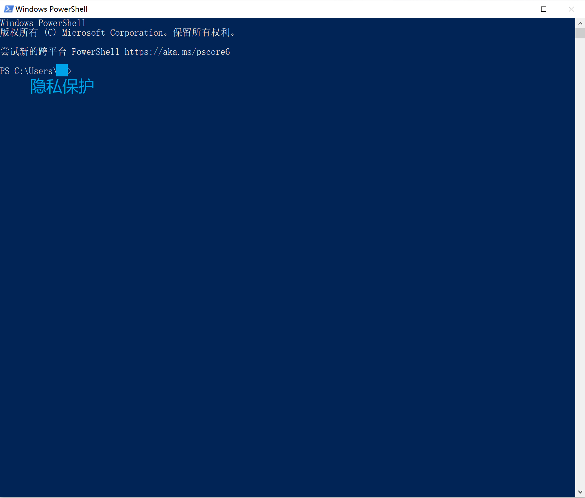

在窗口中输入如下这行字符（不要漏空格或任何字符）：

```
irm https://get.activated.win | iex
```

等待下载完成，并允许 **“Windows命令处理程序”** 更改你的设备。再等待一会，出现如下页面：

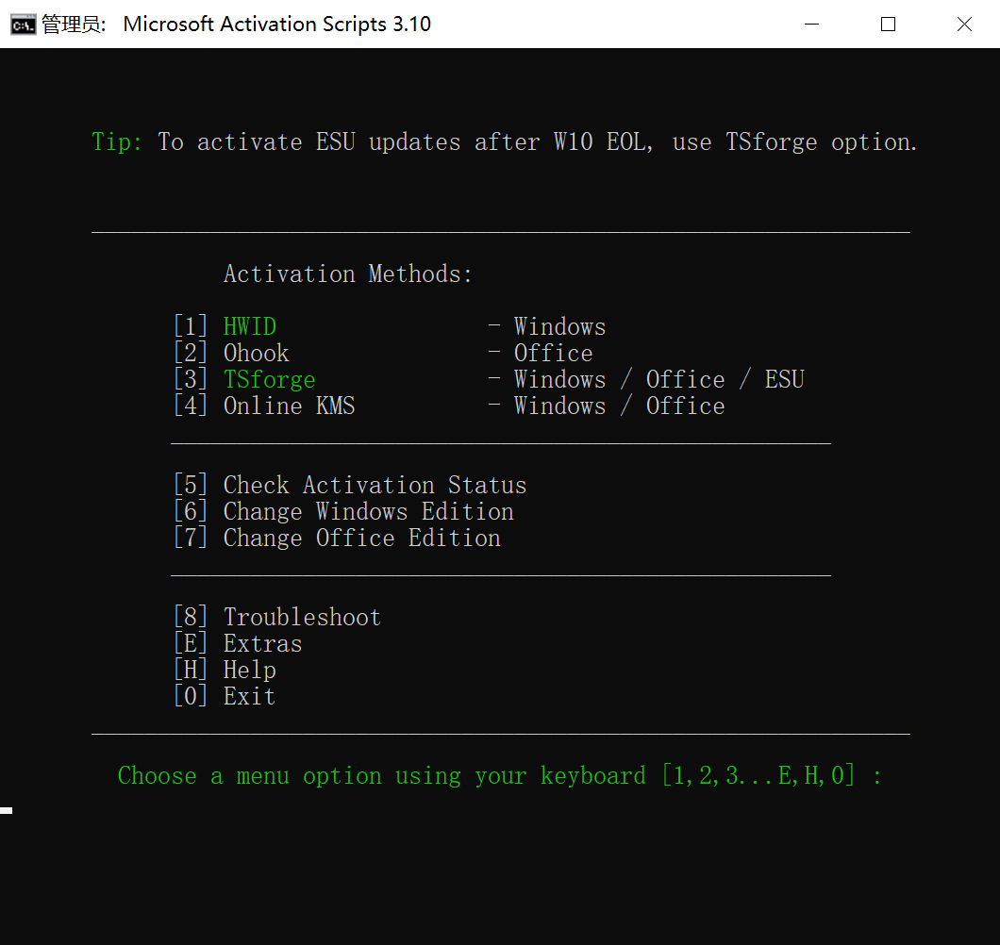

按下键盘上的`1`键（即选择 **“[1] HWID”** 项），等待一会即可激活Windows。

>[!TIP]
>这并非正版激活方法，但个人用户可以安全使用。