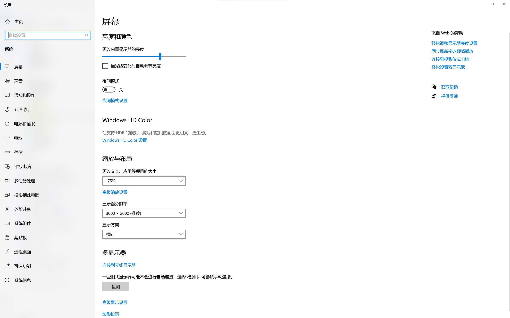
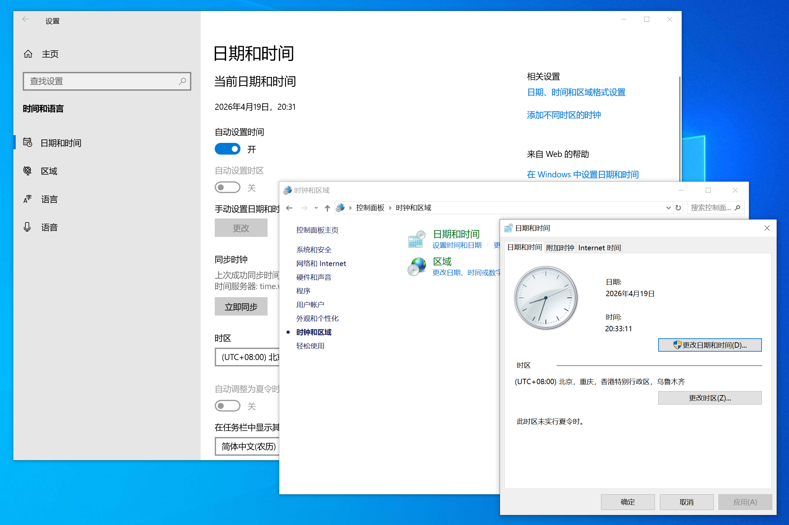

## 2.8 设置与个性化

此部分将介绍如何使用设置与个性化电脑。

### 2.8.1 个性化


严谨来说，这个部分也应当归入设置中。之所以先介绍个性化部分，是因为它相较设置更为简单，且更为常用，这里专门列一节先介绍。

#### 2.8.1.1 设置桌面背景

**方法一：** 任选一张 **JPG、JPEG、PNG、DIB、BMP** 或 **GIF** 格式的图片，右键单击，在出现的菜单里选择 **“设置为桌面背景”** 即可将其设置为桌面背景。

**方法二：** 在桌面空白区单击右键，在弹出菜单中选择 **“个性化”**，这会打开一个设置页面，如下。


其中，最上方的图片是当前的系统样式预览。

**“背景”** 选项可以设置用哪种类型的背景。比如，示例使用的是图片背景。这一栏中的其他选项包括：

**1、“纯色”**，表示用纯色填充充当背景，可以选择颜色。

**2、“幻灯片放映”** 会轮换展示一个文件夹里的图片。


这个文件夹在 **“为幻灯片选择相册”** 中选择，按下 **“浏览”** 键可以选择文件夹。你可以在某个位置新建一个文件夹，把想作为背景的图片全部放进去，然后在这里选择该文件夹。

字如其意，**“图片切换频率”** 可以改变切换图片的频率。

**“无序播放”** 开启后，系统会以随机顺序播放文件夹里的图片。

**“在使用电池供电时仍允许运行幻灯片放映”** 用于省电。切换背景耗电，打开此开关后，在没有接通电源而使用自带电池时系统也会正常切换图片，但耗电量会增大。

**“选择契合度”** 设置图片的契合模式。图片的分辨率和屏幕的不一定相同（链接），这时系统会根据这里的契合模式让图片适应屏幕大小。


**3、“Windows聚焦”** 会轮流把由Windows提供的内容，包括世界美景胜地和野生动物的图片，作为背景。

**4、“图片”** 是上述示例中正在使用的背景模式。

**“选择图片”** 一栏可以从系统提供的图片中选择一张作为背景图片，或者选择 **“浏览”** 来选择自己想用的图片。

>[!TIP]
>如果你想知道的话，系统默认的桌面壁纸位于如下路径：
>
>```
>C:\Windows\Web\Wallpaper
>```

**“选择契合度”** 已经介绍过，不做赘述。

>[!TIP]
>无法更改桌面背景？可能是因为你的Windows尚未激活。想要激活，参见[2.8.2.4 激活Windows](#2824-激活windows)。

### 2.8.1.2 显示管理

在桌面空白区右键，在弹出菜单中选择 **“显示管理”** 会打开如下页面：


其中 **“去设置”** 会跳转到设置文本大小和分辨率的页面，详见[2.8.1.3 - 显示设置](#2813-显示设置)，其余选项字如其意，不做赘述。

### 2.8.1.3 显示设置

在桌面空白区右键，在弹出的菜单中选择 **“显示设置”** 会跳转到设置中的有关页面，如下。



我们将重点介绍 **“缩放与布局”** 部分。

**“更改文本、应用等项目的大小”** 可以改变文本、应用等项目的大小，只有在感觉当前大小不合适时才需要调整，否则会导致桌面混乱。

**“显示器分辨率”** 中，系统会自动计算最适合当前显示器的分辨率，并用 **“（推荐）”** 标示出来，选择该项即可。最好不要改动，否则也会导致混乱。

**“显示方向”** 会调整显示方向，如果你的电脑固定是横向显示，最好不要更改，否则电脑会变得像平板一样。

此外，**“多显示器”** 部分可以将屏幕连接到更多显示器上。

### 2.8.2 设置与控制面板


在 **“开始”** 页面中，左键单击电源上方的齿轮按钮可以打开如下的设置页面。


在 **“开始”** 页面的W字母区，点开 **“Windows系统”** 文件夹，选择 **“控制面板”** 可以打开如下的控制面板页面。


这两个页面都用于对系统进行基础设置。

>[!TIP]
>你可能会发现，这两个页面的很多内容是重复的，事实也确实是这样。它们目前的“管辖范围”区分模糊，非常混乱，是一个历史问题。大体上，“控制面板”更适用于鼠标操作，而“设置”更适用于触摸操作（适配移动端产品）。
>
>“控制面板”在Windows初代版本开始就一直存在，而“设置”是Windows8加入的。之后，微软不断把“控制面板”中的功能整合到“设置”中，这是大的趋势。但是，由于“控制面板”兼容一些程序的设置（第三方软件厂商可以制作小程序放入“控制面板”中来让用户在“控制面板”上方便地设置软件），如果直接把其功能全部放到“设置”中，会引发兼容性问题；此外，考虑到Windows老用户的使用习惯，以及“控制面板”的布局更适合鼠标操作，这个整合迟迟没有完成。对于某些设置项，它们会互相跳转；对于另一些设置项，“设置”和“控制面板”甚至有“两班人马”，例如“日期和时间”部分（图中右下两个窗口是“控制面板”，最大的窗口是“设置”）。
>
>
>
>对新手来说，打开“设置”页面更为容易，因此本节主要介绍“设置”的使用，只有在必要的时候会使用“控制面板”。

由于这里的内容太多，而且不同电脑之间也有不同，我们将不会详细介绍所有内容。事实上，如果想改变某项设置，只要上网查找这项设置在 **“设置”** 或 **“控制面板”** 的哪个部分即可，没必要全部记住。系统中，不同部分也有链接到设置中对应页面的选项，就像[2.6 - 任务栏](任务栏.md)中的一些选项一样。

这里主要介绍应用、语言、更新和激活四个部分。个性化已经在[2.8.1 - 个性化](#281-个性化)中涉及过了。

### 2.8.2.1 应用

在 **“设置”** 的主页面中选择 **“应用”**，即可进入应用管理页面。

这个页面主要用来管理程序的默认打开方式，以及查看和卸载已安装的应用。

其中最常用的是 **“默认应用”**。打开后，系统会显示一些常见应用和文件类型，你可以：
 
1. 选择某个应用，然后设置该应用可打开的文件类型；
2. 直接按文件类型搜索，选择某个后缀名对应的默认应用；
3. 按协议设置默认应用，例如 `mailto:`、`http:` 等协议所使用的应用。

如果你希望某类文件统一用某个程序打开，建议按文件类型设置默认应用。只要该程序已经安装在电脑里，就可以在列表中选中并应用。

在 Windows11 中，默认应用页面通常会显示一个 **“重置为 Microsoft 推荐默认值”** 的按钮。这个按钮可以用于把所有默认应用恢复到系统推荐状态。


在应用管理页面中，还可以看到一个 **“已安装的应用”** 或 **“已安装的应用程序”** 的入口。进入后，系统会列出当前电脑上安装的应用。要卸载某个应用，找到它后点击右侧的三个点（或 **“卸载”** 按钮），按照提示完成操作。


>[!TIP]
>如果只是想禁用某个程序的自动启动或通知，不必卸载它。可以先在 **“应用”** 页面的其他选项里查看 **“启动应用”**、**“通知”** 等设置。

### 2.8.2.2 语言

在 **“设置”** 的主页面中选择 **“时间和语言”**，即可进入语言相关页面。

这个页面通常会分成两个部分：**“日期和时间”** 和 **“语言和地区”**。

在 **“日期和时间”** 部分，可以调整：
- 当前时区；
- 是否自动设置时间；
- 是否自动调整夏令时；
- 时间同步状态。

对于大多数用户，推荐把时区设置为自己所在的地区，并开启 **“自动设置时间”**。这样系统会自动同步网络时间，避免时钟跑偏。


在 **“语言和地区”** 部分，可以添加新的显示语言、输入语言以及地区格式。常见操作有：

- 通过 **“添加语言”** 安装新的语言包；
- 在已安装语言中选择 **“选项”**，添加或删除输入法；
- 设置系统显示语言和键盘布局的优先顺序。

如果你需要使用中文输入法，应该先把“中文（简体）”添加到语言列表，再在其 **“选项”** 中添加 Microsoft 拼音或其他输入法。


>[!TIP]
>如果你只是想更改键盘输入法，优先在 **“语言和地区”** 中添加对应语言，再在该语言项里选择 **“输入法”**；这样可以避免语言包和输入法混淆。

### 2.8.2.3 更新

在 **“设置”** 的主页面中选择 **“Windows 更新”**，即可进入更新页面。

Windows11 仍然会收到微软发布的安全和功能更新。建议保持电脑联网，并定期检查更新。

在更新页面中，你会看到当前更新状态、上次检查时间，以及是否有待安装的补丁。通常页面上会有 **“检查更新”** 按钮，点击即可让系统立即查询最新更新。

如果有更新准备就绪，系统会提示你重启电脑。因为某些更新需要重启后才会生效，遇到这种情况请按提示保存工作并重启。


如果你想查看历史更新或更改更新设置，可以选择页面中的 **“更新历史记录”**、**“高级选项”** 等链接。

### 2.8.2.4 激活Windows

在 Windows11 中，激活页面一般位于 **“设置” > “系统” > “激活”**。

打开后，你可以看到当前系统的激活状态：

- 如果电脑已激活，会显示“Windows 已激活”；
- 如果没有激活，会显示“Windows 未激活”或“找不到有效的数字许可证”。

如果你的电脑是品牌机，且预装正版 Windows，通常只要连接网络就会自动激活。

如果需要手动激活，可以点击页面中的 **“更改产品密钥”**，输入微软官方购买的正版密钥进行激活。


>[!TIP]
>建议通过微软官方商店、授权经销商或设备厂商购买正版许可证。不要使用来路不明的激活工具、盗版密钥或可疑脚本，这些方法可能会影响系统安全、导致更新失败，甚至引发法律问题。

如果你的硬件曾经更换过，例如主板更换，激活失败时可以尝试页面中的 **“激活疑难解答”**，系统会根据你的数字许可证自动尝试重新激活。
