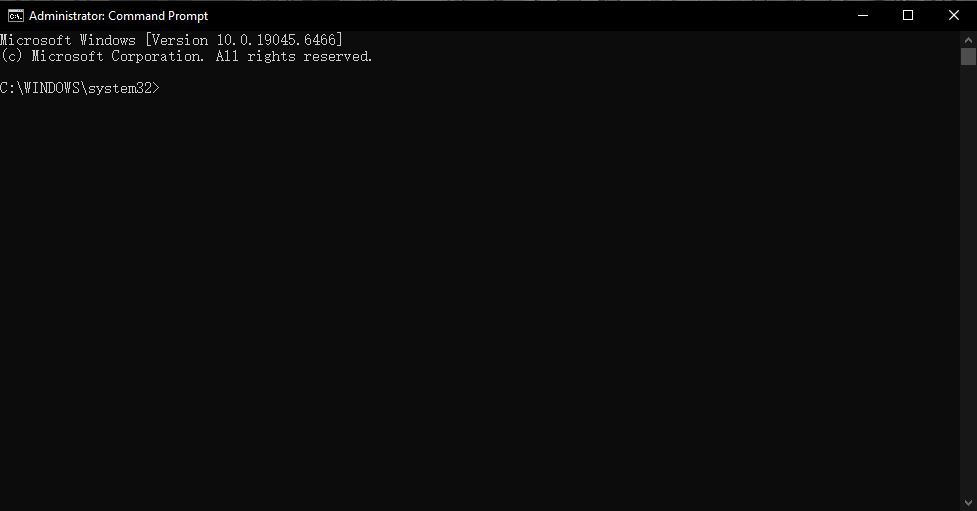

## 4.4 网络检查和修复

本章提供系统化的网络排查思路和常用修复方法，让你能够快速判断问题发生在哪个环节，并采取合适的步骤修复。

### 4.4.1 先确认问题范围

遇到网络故障时，先判断问题属于哪一类：

- 仅当前电脑无法上网，其他设备可以正常上网；
- 所有设备都无法上网；
- 只有某个网站打不开，其他网站可以访问；
- Wi-Fi 信号差，但实际网速正常。

明确范围后，排查会更有针对性。

### 4.4.2 物理检查与基础排查

1. 查看路由器、电源和网线是否正常；
2. 确认电脑的网络开关已打开；
3. 对于有线网络，检查网线两端是否插牢；
4. 对于无线网络，确认 Wi-Fi 开关没有被关闭。

如果电脑上显示“已连接但无网络”，说明电脑已经进入局域网，但还没有成功访问互联网。

### 4.4.3 Windows 网络状态检查

打开 **“设置” > “网络和 Internet”**，查看当前网络状态：

- 当前是否显示已连接；
- 是否显示“无 Internet 访问”；
- 当前连接的是 Wi-Fi、以太网还是移动网络。

Windows 会显示一些常见问题提示，例如 DNS 解析失败、限制访问等。根据提示执行对应操作。

### 4.4.4 使用系统诊断工具

Windows 自带网络疑难解答工具，可以自动检测并尝试修复网络问题。

1. 打开 **“设置” > “网络和 Internet”**；
2. 找到 **“网络疑难解答”** 或 **“状态”** 页面中的“网络疑难解答”；
3. 运行诊断程序并按照提示操作。

该工具会检查网络适配器、IP 地址、DNS 和连接状态，适合初学者快速定位问题。

### 4.4.5 常用网络命令

如果你愿意进行更详细的检查，可以使用命令提示符。详细操作请参见[2.7.2 命令提示符](../系统/系统工具.md#272-命令提示符)。

#### 常用命令说明

- `ipconfig /all`：显示当前计算机的网络配置，包括接口名称、物理地址（MAC）、IP 地址、子网掩码、默认网关和 DNS 服务器。它是判断本机是否成功获取网络参数的第一条命令。
- `ping <地址>`：向指定地址发送网络请求包，测试网络连通性。常用示例：
  - `ping www.baidu.com`：测试与互联网的连通性；
  - `ping 192.168.1.1`：测试与路由器的本地连接；
  - `ping 8.8.8.8`：测试与公网 DNS 服务器的连通性。
  如果 ping 成功，说明该地址可达；如果失败，说明该段连接或地址存在问题。
- `tracert <地址>`：跟踪数据包经过的路径，显示从你的电脑到目标服务器经过的每一跳。它可以帮助你判断问题是出在本地网络、路由器、运营商，还是目标服务器。
- `nslookup <域名>`：查询 DNS 解析结果，显示域名对应的 IP 地址。它适用于确认 DNS 是否正确工作。
- `ipconfig /release`：释放当前分配到本机的 IP 地址，适用于重新获取 IP 之前的准备工作。
- `ipconfig /renew`：向 DHCP 服务器请求新的 IP 地址。它常用于修复 IP 地址冲突或重新连接网络时。
- `ipconfig /flushdns`：清除本机的 DNS 缓存，解决 DNS 解析错误或域名改变后仍旧访问旧 IP 的问题。
- `netsh winsock reset`：重置 Windows 网络套接字目录。它可以解决网络应用无法访问互联网、浏览器 DNS 错误或网络协议栈异常的问题。
- `netsh int ip reset`：重置 TCP/IP 协议栈，恢复网络协议相关的默认设置。执行后通常需要重启电脑。
- `netstat -an`：显示当前网络连接和监听端口，适合判断是否有异常连接或端口占用情况。

#### 运行示例

1. 在命令提示符中输入 `ipconfig /all`，查看是否存在 IPv4 地址、默认网关和 DNS 服务器；
2. 如果没有 IPv4 地址，先运行 `ipconfig /release`，再运行 `ipconfig /renew`；
3. 运行 `ipconfig /flushdns`，清除 DNS 缓存后再访问同一个网站；
4. 使用 `ping www.baidu.com` 检查互联网连通性；
5. 如果 `ping www.baidu.com` 失败，但 `ping 192.168.1.1` 成功，说明本机与路由器连接正常，问题可能在路由器或运营商；
6. 如果 `ping 192.168.1.1` 也失败，说明本机与局域网之间的连接存在问题；
7. 运行 `tracert www.baidu.com`，查看数据包在哪一跳停止或延迟较高；
8. 如果怀疑 DNS 问题，运行 `nslookup www.baidu.com`，检查是否能正确解析成 IP 地址；
9. 如果网络问题仍未解决，按需执行 `netsh winsock reset` 或 `netsh int ip reset`，然后重启电脑。

这些命令不仅适合排查网络故障，也能帮助你了解网络中“本机、路由器、运营商、互联网”之间的通信关系。
### 4.4.6 路由器和运营商排查

如果所有设备都无法上网，问题很可能在路由器或运营商：

- 重启路由器和光猫：断电 10 秒后再通电；
- 检查路由器指示灯是否正常；
- 查看运营商是否有故障公告；
- 如果是拨号宽带，请确认账号和密码没有失效。

如果只有一台设备异常，通常先排查该设备本身；如果所有设备同时异常，再检查路由器和运营商。

### 4.4.7 DNS 和 IP 问题

DNS 解析失败会导致浏览器无法打开网站，即使网络本身可用。可以尝试：

- 在路由器或电脑上修改 DNS 为公共 DNS，例如 `114.114.114.114`、`8.8.8.8`；
- 执行 `ipconfig /flushdns` 清除 DNS 缓存；
- 确认 DHCP 未关闭，电脑仍能自动获取 IP 地址。

### 4.4.8 重置网络设置

如果多次排查仍未能解决问题，可以重置网络设置。重置后，Windows 会清除当前网络配置，并重新安装网络适配器。

1. 打开 **“设置” > “网络和 Internet”**；
2. 进入 **“状态”** 页面；
3. 向下找到 **“网络重置”**，点击并确认；
4. 重启电脑。

> 重置后，你需要重新连接 Wi-Fi 并输入无线密码。建议先记录当前 Wi-Fi 名称、密码和其他重要设置。

### 4.4.9 常见故障快速排查表

- 电脑未连接：检查 Wi-Fi 开关或网线插头；
- 已连接但无网络：重启路由器，检查运营商状态；
- 某个网站打不开：尝试使用其他浏览器或清除 DNS；
- 网络慢：检查是否有其他设备占用带宽，或网络正在进行更新、下载。

>[!TIP]
>遇到网络问题时，先不要同时改动太多设置。先记录当前状态，再按“先简单后复杂”的顺序排查。
